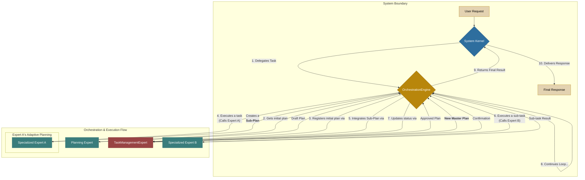

# ADR-001: 적응형 오케스트레이션 아키텍처

**상태**: 제안됨 (Proposed)
**날짜**: 2025-08-08

## 컨텍스트 (Context)

현재 시스템의 핵심 로직을 정의하는 `brain.yaml` 파일은 시스템의 모든 상태, 규칙, 전문가 목록을 포함하는 거대하고 단일화된 구조(Monolithic)를 가지고 있다. 이로 인해 다음과 같은 문제점이 발생한다.

-   **복잡성 및 가독성 저하**: 시스템의 전체 구조를 한눈에 파악하기 어렵고, 새로운 기능 추가 및 수정 시 많은 부분을 함께 고려해야 한다.
-   **경직성 및 확장성 한계**: 새로운 전문가나 규칙을 추가할 때마다 거대한 `brain.yaml` 파일을 직접 수정해야 하므로, 시스템 확장이 어렵고 오류 발생 가능성이 높다.
-   **불명확한 역할**: '커널'이 너무 많은 역할을 수행하여, 시스템의 안정성을 책임지는 최상위 계층과 실제 작업을 조율하는 '지휘자'의 역할이 혼재되어 있다.

## 결정 (Decision)

이러한 문제를 해결하기 위해, 시스템의 아키텍처를 **'적응형 오케스트레이션 모델'** 로 전면 재설계한다. 이 모델의 핵심 원칙은 다음과 같다.

1.  **역할의 완벽한 분리**: 시스템을 `System Kernel`, `OrchestrationEngineExpert`, `Specialized Experts`, `Tools` 라는 4개의 명확한 계층으로 분리한다.
2.  **커널의 역할 최소화**: `System Kernel`은 시스템의 생명주기(`BOOTING`, `FAILED`)와 안정성만 책임지는 '무대 감독' 역할을 수행하며, 모든 작업 처리는 `OrchestrationEngineExpert`에게 위임한다.
3.  **오케스트레이션 엔진 도입**: `OrchestrationEngineExpert`가 '지휘자'가 되어, 계획 수립, 작업 실행, 상태 업데이트, 결과 종합 등 요청 처리의 전 과정을 총괄한다.
4.  **적응형 계획 (Adaptive Planning)**: 전문가가 자신의 임무를 수행하던 중, 더 상세한 실행 계획이 필요하다고 판단되면, 그 세부 계획(`Sub-Plan`)을 동적으로 생성하여 `OrchestrationEngine`에게 다시 제출한다. 엔진은 이 세부 계획을 기존 마스터 플랜에 통합하여, 계획을 점진적으로 진화시킨다.

## 최종 마스터 아키텍처

## 결과 (Consequences)

### 긍정적

-   **명확성 및 유지보수성**: 각 컴포넌트의 역할과 책임이 명확해져, 시스템을 이해하고 수정하기가 매우 쉬워진다.
-   **유연성 및 확장성**: `brain.yaml`은 최소한의 커널 정의만 남게 되며, 새로운 전문가나 규칙을 추가할 때 다른 부분에 영향을 주지 않고 독립적으로 파일을 추가/수정할 수 있다.
-   **안정성**: 커널의 역할이 최소화되고 오류 처리 경로가 명확해져, 시스템 전체의 안정성이 극대화된다.
-   **지능적 작업 처리**: '적응형 계획' 모델을 통해, 복잡하고 예측 불가능한 문제에 대해 시스템이 스스로 계획을 상세화하며 점진적으로 해결해 나갈 수 있는 능력을 갖추게 된다.

### 부정적

-   초기 아키텍처 설정의 복잡성이 다소 증가할 수 있다. 하지만 장기적인 유지보수 비용 감소로 상쇄된다.

이 문서는 우리가 함께 수립한 아키텍처의 공식적인 청사진 역할을 할 것입니다.
