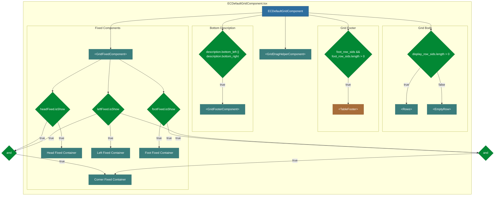
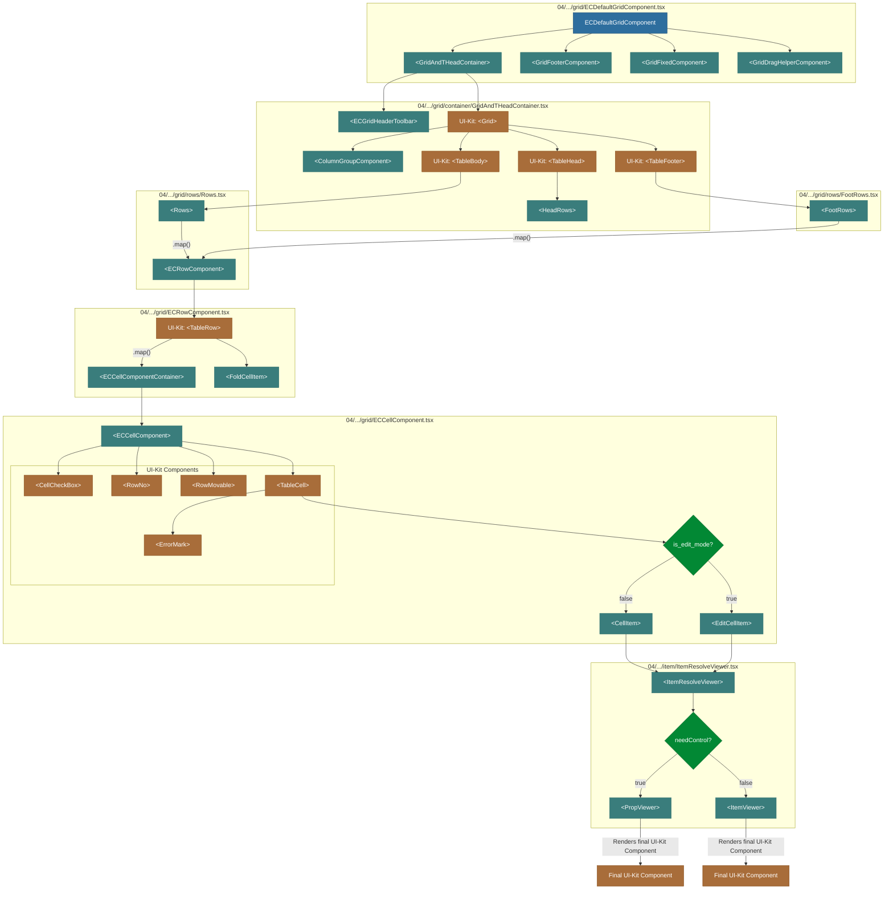
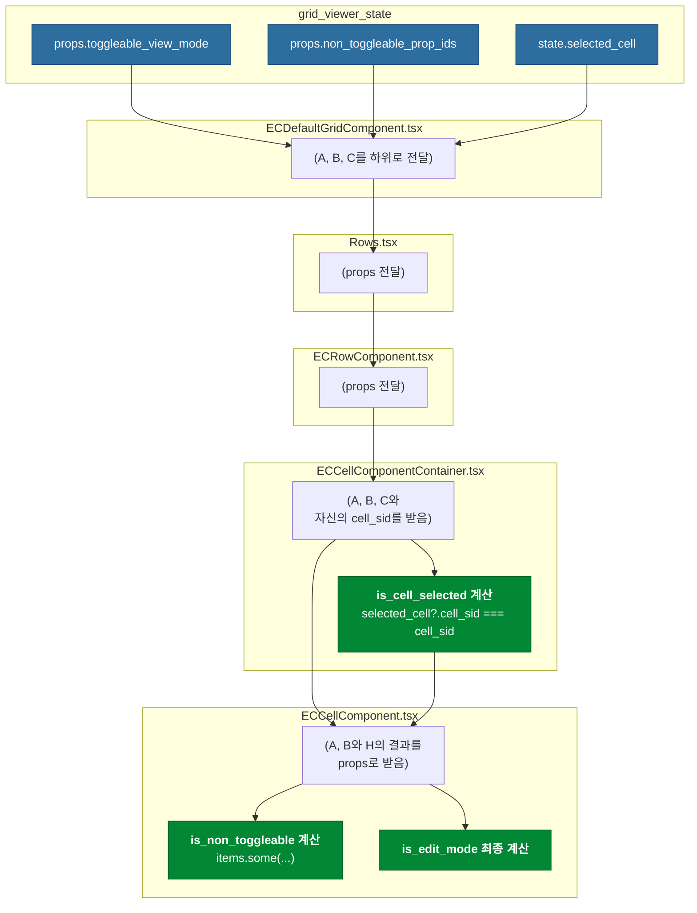

# ECDefaultGridComponent 종합 분석

## 1. 개요

`ECDefaultGridComponent`는 ecount 5.0 UI의 핵심인 그리드(Grid)를 렌더링하는 최상위 컴포넌트입니다. 이 문서는 해당 컴포넌트의 전체적인 구조, 자식 컴포넌트와의 관계, 그리고 조건부 렌더링 로직을 심층적으로 분석하고 시각화합니다.

## 2. 주요 조건부 렌더링 흐름

`ECDefaultGridComponent`는 다양한 조건에 따라 동적으로 자식 컴포넌트를 렌더링합니다. 아래 다이어그램은 최상위 레벨에서 어떤 조건들이 주요 컴포넌트들의 렌더링 여부를 결정하는지 보여줍니다. 이를 통해 그리드의 전체적인 구조가 어떻게 동적으로 변화하는지 한눈에 파악할 수 있습니다.

## 3. 상세 컴포넌트 계층 구조

위의 조건부 렌더링에 따라 실제 렌더링되는 각 컴포넌트의 상세한 내부 계층 구조는 아래와 같습니다. 특히 `is_edit_mode`나 `needControl`과 같은 내부 상태나 prop에 따라 최종적으로 어떤 UI 컴포넌트가 렌더링되는지 추적할 수 있습니다.

## 4. 핵심 분석 내용

### 4.1. 주요 컴포넌트 역할

-   **ECDefaultGridComponent**: 그리드 렌더링의 진입점. `GridAndTHeadContainer`, `GridFooterComponent` 등 그리드의 주요 골격 컴포넌트를 렌더링하며, 대부분의 사용자 인터랙션과 상태 관리 로직이 이 컴포넌트와 관련된 훅(hook)에 집중되어 있습니다.
-   **GridAndTHeadContainer**: 그리드의 헤더와 실제 내용(children)을 감싸는 핵심 컨테이너입니다. 틀 고정(Fixed) 기능이 활성화될 경우, 이 컨테이너는 여러 번 재사용되어 각 고정 영역을 독립적으로 렌더링합니다.
-   **Rows / FootRows**: `.map()` 루프를 통해 `ECRowComponent`를 여러 개 렌더링하여 실제 데이터 행들을 구성하는 역할을 합니다. `Rows`는 본문을, `FootRows`는 합계 등을 표시하는 푸터 부분을 담당합니다.
-   **ECRowComponent**: 테이블의 한 행(`<TableRow>`)을 나타내며, 셀들의 컨테이너 역할을 합니다. 또한, 행 단위의 이벤트(클릭, 드래그 등)를 처리합니다.
-   **ECCellComponent**: 테이블의 한 셀(`<TableCell>`)을 나타내며, 셀 내부 아이템들을 렌더링하는 가장 기본적인 단위입니다. 셀의 편집 모드 여부에 따라 다른 컴포넌트를 렌더링하는 중요한 분기점이기도 합니다.
-   **ItemResolveViewer / PropViewer / ItemViewer**: 셀 내부에 표시될 최종 데이터를 결정하고, 데이터의 종류(prop_id 등)에 따라 적절한 UI-Kit 컴포넌트(`PropViewer`, `ItemViewer`)를 선택하여 렌더링하는 최하위 로직을 담당합니다.

### 4.2. 주요 렌더링 로직 상세 설명

-   **데이터 행 렌더링 (Body/Empty)**:

    -   **조건**: `display_row_sids.length > 0`
    -   **설명**: 그리드에 표시할 데이터가 있는지 확인합니다. 데이터가 하나라도 있으면 `Rows` 컴포넌트를 통해 실제 행들을 렌더링하고, 데이터가 없으면 `EmptyRow` 컴포넌트를 통해 "데이터가 없습니다"와 같은 메시지를 표시합니다. 이는 사용자에게 현재 데이터 상태를 명확하게 알려주는 역할을 합니다.

-   **푸터 행 렌더링 (Footer)**:

    -   **조건**: `foot_row_sids && foot_row_sids.length > 0`
    -   **설명**: 합계나 평균 등을 표시하는 푸터 행 데이터가 `viewerViewModel`에 존재하는지 확인합니다. 데이터가 있을 경우에만 `TableFooter`와 그 자식인 `FootRows`를 렌더링하여 불필요한 DOM 생성을 방지합니다.

-   **하단 설명 영역 (Bottom Description)**:

    -   **조건**: `sectionViewModel.description?.bottom_left || sectionViewModel.description?.bottom_right`
    -   **설명**: 그리드 하단에 추가적인 정보(예: 총 개수, 참고 사항)를 표시할 필요가 있는지 확인합니다. `description` 객체에 해당 내용이 있을 때만 `GridFooterComponent`를 렌더링합니다.

-   **틀 고정 (Fixed Components)**:

    -   **조건**: `headFixed.isShow`, `leftFixed.isShow`, `footFixed.isShow` 등
    -   **설명**: `useGridFixed` 훅의 결과에 따라 상단, 좌측, 하단, 그리고 코너(상단+좌측, 하단+좌측)의 틀 고정 UI를 렌더링할지 결정합니다. 각 조건은 `GridFixedContainer`라는 별도의 컴포넌트 렌더링을 트리거하며, 이를 통해 사용자는 스크롤과 상관없이 특정 행과 열을 계속 볼 수 있게 됩니다. 이는 복잡한 데이터를 다룰 때 매우 중요한 사용성을 제공합니다.

### 4.3. is_edit_mode 상세 분석

`ECCellComponent`의 핵심 로직 중 하나인 `is_edit_mode`는 여러 상위 컴포넌트에 걸쳐있는 `props`와 상태의 조합으로 결정됩니다.

-   **최종 결정 위치:** `ECCellComponent.tsx`
-   **계산식:** `toggleable_view_mode && is_cell_selected && !is_non_toggleable`
-   **설명:** 그리드가 편집 가능 모드이고(`toggleable_view_mode`), 현재 셀이 선택되었으며(`is_cell_selected`), 편집 불가능한 셀이 아닐 때(`!is_non_toggleable`) `is_edit_mode`는 `true`가 됩니다.

아래 다이어그램은 각 `prop`이 어떤 컴포넌트에서 관리되고 어떻게 하위로 전파되어 최종 `is_edit_mode`를 결정하는지 상세히 보여줍니다.

## 5. 결론 및 제언

`ECDefaultGridComponent`는 여러 단계의 자식 컴포넌트와 `.map()` 루프, 그리고 다양한 조건부 렌더링이 복합적으로 얽혀있는 **매우 유연하고 확장 가능한 구조**를 가지고 있습니다. 데이터의 존재 여부, 그리드 설정(틀 고정, 푸터 등), 그리고 내부 상태(`is_edit_mode`)에 따라 동적으로 다른 컴포넌트 트리를 구성하여 최종 UI를 완성합니다.

**개발자를 위한 제언:**

-   **유지보수 시**: 새로운 기능을 추가하거나 버그를 수정할 때, **상위 레벨의 조건부 렌더링(데이터, 푸터, 틀고정)과 하위 레벨의 조건부 렌더링(편집모드, 아이템뷰어)을 구분하여 분석**하는 것이 효과적입니다.
-   **성능 최적화 시**: 대부분의 렌더링은 `memo`와 `useMemo` 등을 통해 최적화되어 있으나, 새로운 prop을 추가할 경우 의도치 않은 리렌더링이 발생할 수 있습니다. 특히 `useGridFixed`와 같이 여러 상태를 조합하여 사용하는 훅의 의존성 배열을 주의 깊게 살펴야 합니다.
-   **확장 시**: 새로운 종류의 셀이나 아이템 뷰어를 추가해야 할 경우, `ItemResolveViewer`와 같은 **최하위 분기점의 로직을 확장**하는 것을 권장합니다. 이는 시스템의 다른 부분에 미치는 영향을 최소화할 수 있습니다.
