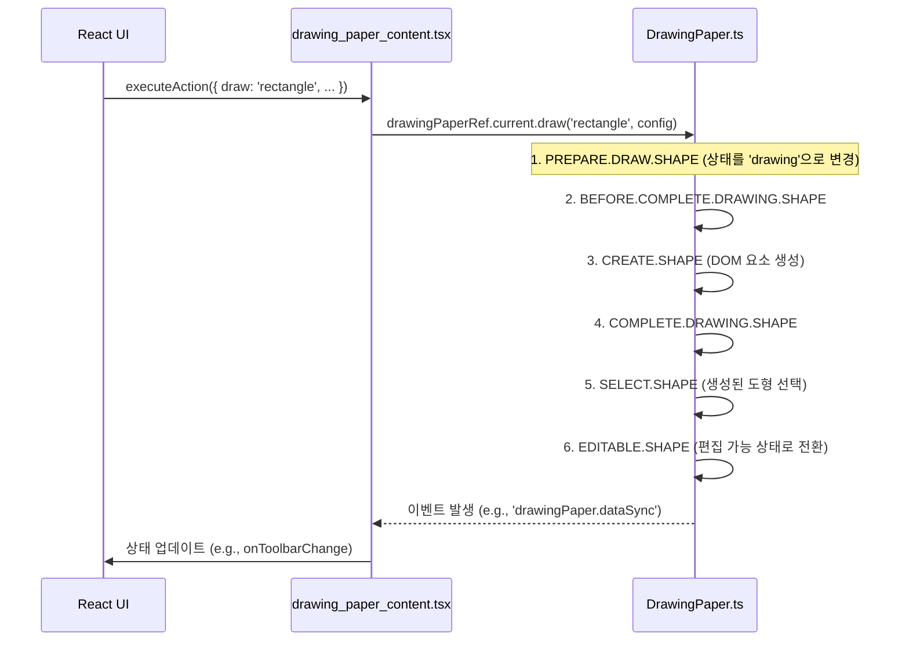

# Drawing Editor Architecture

이 문서는 ECOUNT v5의 핵심 UI 컴포넌트인 `DrawingPaper` 에디터의 아키텍처, 주요 구성 요소, 그리고 데이터 흐름을 상세히 설명합니다.

## 1. 개요 (Overview)

`DrawingPaper` 에디터는 두 개의 핵심 파일로 구성되어 있습니다.

-   **`DrawingPaper.ts`**: jQuery와 순수 JavaScript(Vanila JS)로 작성된 **명령형(Imperative) 드로잉 엔진**입니다. 실제 DOM 조작, 이벤트 처리, 도형(Shape) 렌더링 등 에디터의 모든 핵심 로직을 포함하고 있습니다.
-   **`drawing_paper_content.tsx`**: `DrawingPaper.ts`를 감싸는 **React 컴포넌트**입니다. React의 선언적(Declarative) 환경과 `DrawingPaper`의 명령형 코드를 연결하는 **어댑터(Adapter)** 역할을 수행합니다.

## 2. 핵심 아키텍처: 어댑터 패턴 (Adapter Pattern)

`drawing_paper_content.tsx`는 레거시 `DrawingPaper` 엔진을 최신 React 환경에서 재사용하기 위해 어댑터 패턴을 사용합니다. 이를 통해 레거시 코드의 변경을 최소화하면서 React 생태계에 통합합니다.

```mermaid
graph TD
    subgraph React World
        A[drawing_paper_content.tsx] -->|명령 전달| B(executeAction);
        A --|> C{useImperativeHandle};
    end

    subgraph Legacy World
        D[DrawingPaper.ts Engine]
    end

    B --> D;
    A -- "이벤트 수신" --> E(events.register);
    E --> D;

    style A fill:#61DAFB,stroke:#333,stroke-width:2px
    style D fill:#F7DF1E,stroke:#333,stroke-width:2px
```

### 2.1. 양방향 통신 (Two-way Communication)

-   **React → `DrawingPaper` (명령 전달)**

    -   React 컴포넌트에서 에디터 기능(e.g., 도형 추가, 스타일 변경)을 실행해야 할 때, `useImperativeHandle`을 통해 노출된 `executeAction` 메서드를 호출합니다.
    -   `executeAction`은 `action` 객체를 인자로 받아, 내부적으로 `DrawingPaper.ts`의 해당 API를 호출합니다. 이는 React의 상태나 속성을 `DrawingPaper`가 이해할 수 있는 명령으로 변환하는 과정입니다.

-   **`DrawingPaper` → React (이벤트 수신)**
    -   `DrawingPaper` 내부에서 사용자에 의한 변경(e.g., 도형 선택, 크기 조절)이 발생하면, 내장된 `Events` 모듈을 통해 특정 이벤트를 발생시킵니다.
    -   `drawing_paper_content.tsx`는 `useEffect` 훅 내부에서 이러한 이벤트들을 구독(`events.register`)하고 있습니다.
    -   이벤트가 발생하면 등록된 콜백 함수가 실행되어, 상위 컴포넌트의 상태를 업데이트(`onToolbarChange...` 등)하고 결과적으로 React UI가 리렌더링됩니다.

## 3. `DRAW.SHAPE` 프로세스 심층 분석

사용자가 UI에서 도형 추가 버튼을 클릭했을 때의 전체 데이터 흐름입니다.



1.  **React UI**: 사용자가 버튼을 클릭하면 `executeAction`이 도형 정보와 함께 호출됩니다.
2.  **`drawing_paper_content.tsx`**: `useImperativeHandle`을 통해 노출된 `executeAction`이 `drawingPaperRef.current.draw()`를 호출합니다.
3.  **`DrawingPaper.ts`**: `draw` 메서드 내부에서 여러 커맨드(`PREPARE`, `CREATE`, `COMPLETE` 등)가 순차적으로 실행되며 실제 DOM 요소를 생성하고 렌더링합니다.
4.  **이벤트 전파**: `DrawingPaper`는 작업 완료 후 `drawingPaper.dataSync`와 같은 이벤트를 발생시킵니다.
5.  **상태 업데이트**: `drawing_paper_content.tsx`는 이 이벤트를 수신하여 상위 컴포넌트의 상태를 업데이트하고, UI에 변경 사항을 반영합니다.

## 4. 기술 부채 및 리스크

-   **거대한 파일 크기**: `DrawingPaper.ts` 파일은 주석과 공백을 제외하고도 **23,000줄**이 넘습니다. 이는 단일 파일이 너무 많은 책임을 가지고 있다는 신호이며, 코드 파악 및 수정에 엄청난 인지 부하를 유발합니다.
-   **jQuery 종속성**: 코드베이스 전반에 걸쳐 jQuery (`$`)가 깊숙이 사용되고 있습니다. 이는 테스트, 성능 최적화, 현대적인 프론트엔드 라이브러리와의 통합을 매우 어렵게 만드는 심각한 기술 부채입니다.
-   **복잡한 내부 상태**: `config` 객체를 통해 수많은 상태 플래그(`isMoveable`, `isResizable` 등)를 관리하고 있어, 특정 동작이 어떤 조건에서 발생하는지 추적하기 어렵습니다.

이러한 문제들로 인해 `DrawingPaper`는 유지보수가 매우 어렵고 잠재적인 버그 발생 가능성이 높은 영역입니다. 장기적으로는 이 거대한 파일을 기능 단위로 분리하고 jQuery 의존성을 제거하는 리팩터링이 반드시 필요합니다.
