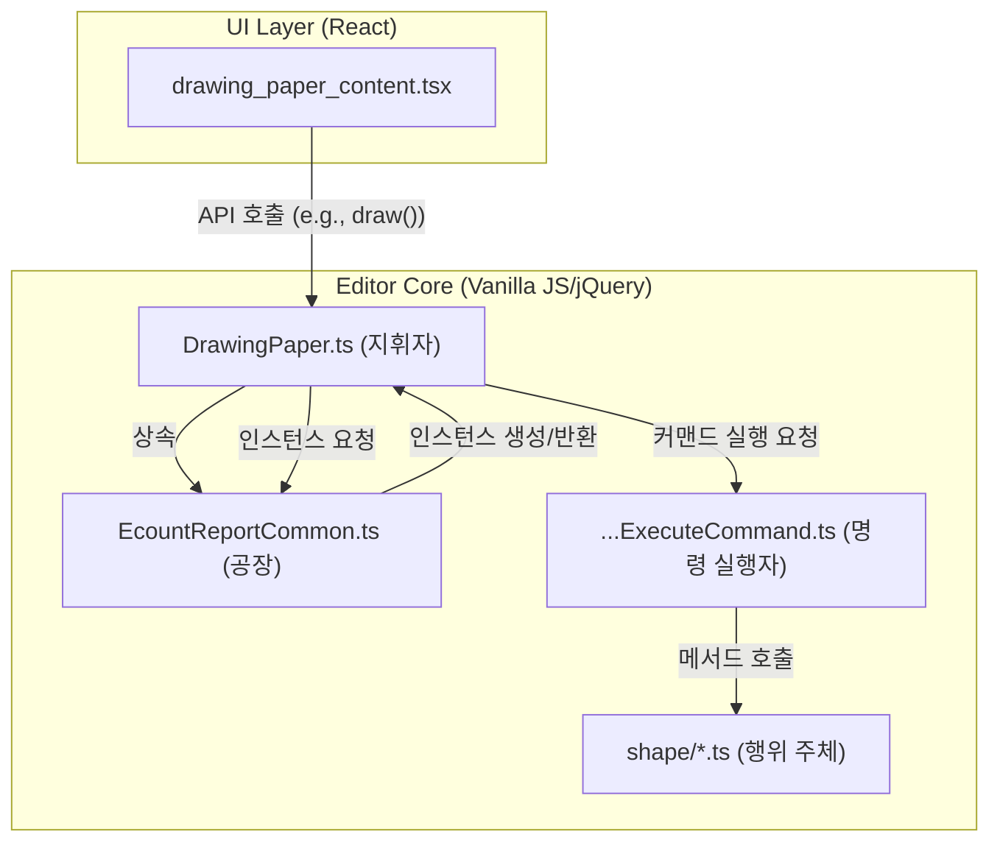
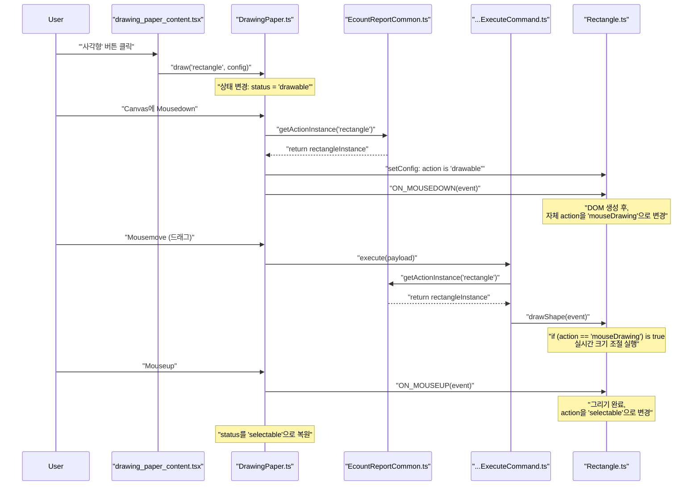

# 드로잉 에디터: 명령 실행 흐름 심층 분석

## 1. 개요 (Overview)

이 문서는 ECOUNT v5 드로잉 에디터 내부에서 사용자의 입력이 어떤 과정을 거쳐 실제 도형 렌더링으로 이어지는지, 그 명령 실행 흐름과 데이터 흐름을 심층적으로 분석합니다. 각 핵심 클래스의 명확한 역할과 상호작용을 정의하여 아키텍처에 대한 이해를 돕는 것을 목표로 합니다.

## 2. 핵심 컴포넌트와 역할 (The Cast: Core Components & Roles)

에디터의 기능은 명확히 책임이 분리된 여러 컴포넌트의 유기적인 상호작용으로 구현됩니다. 각 컴포넌트의 역할은 다음과 같습니다.

| 클래스/파일                 | 역할 비유                            | 핵심 책임                                                                                            |
| --------------------------- | ------------------------------------ | ---------------------------------------------------------------------------------------------------- |
| `drawing_paper_content.tsx` | **UI 어댑터 (Adapter)**              | React 컴포넌트 세계의 사용자 입력을 `DrawingPaper`가 이해할 수 있는 명령형 API 호출로 변환합니다.    |
| `EcountReportCommon.ts`     | **인스턴스 공장 (Instance Factory)** | `getActionInstance`를 통해 각종 행위 주체(`Rectangle` 등)를 생성하고 공통 의존성을 주입합니다.       |
| `DrawingPaper.ts`           | **총괄 지휘자 (Orchestrator)**       | 에디터의 전체 상태를 관리하고, 사용자 입력을 해석하여 적절한 '명령(Command)' 실행을 요청합니다.      |
| `...ExecuteCommand.ts`      | **명령 실행자 (Command Executor)**   | 지휘자의 요청(`Payload`)을 받아, 어떤 '행위 주체'의 어떤 '메서드'를 호출할지 연결하는 책임을 집니다. |
| `shape/Rectangle.ts`        | **행위 주체 (Actor / Handler)**      | 특정 도형('사각형')에 대한 모든 구체적인 로직(DOM 조작, 상태 관리 등)을 실제로 구현하고 실행합니다.  |

## 3. 아키텍처 관계 시각화 (Architecture Visualization)

각 컴포넌트 간의 정적인 관계는 아래와 같습니다. `DrawingPaper`가 중심에서 모든 흐름을 지휘하는 구조입니다.

## 4. 실행 흐름: 사각형 그리기 (Execution Flow: Drawing a Rectangle)

사용자가 '사각형' 버튼을 클릭하여 캔버스에 그리기까지의 전체 상호작용 흐름은 다음과 같습니다.

## 5. 주요 디자인 패턴 (Key Design Patterns)

이 아키텍처에는 다음과 같은 주요 디자인 패턴이 적용되어 있습니다.

-   **어댑터 패턴 (Adapter Pattern):** `drawing_paper_content.tsx`는 React의 선언적 UI와 `DrawingPaper`의 명령형 API 사이의 인터페이스 불일치를 해소합니다.
-   **팩토리 패턴 (Factory Pattern):** `EcountReportCommon.ts`의 `getActionInstance`는 객체 생성 로직을 캡슐화하여, `DrawingPaper`가 구체적인 생성 과정에 의존하지 않도록 합니다.
-   **커맨드 패턴 (Command Pattern):** `...ExecuteCommand` 클래스들은 요청(Command)과 수신자(Actor)를 분리하여 시스템의 유연성을 높이고 결합도를 낮춥니다.
