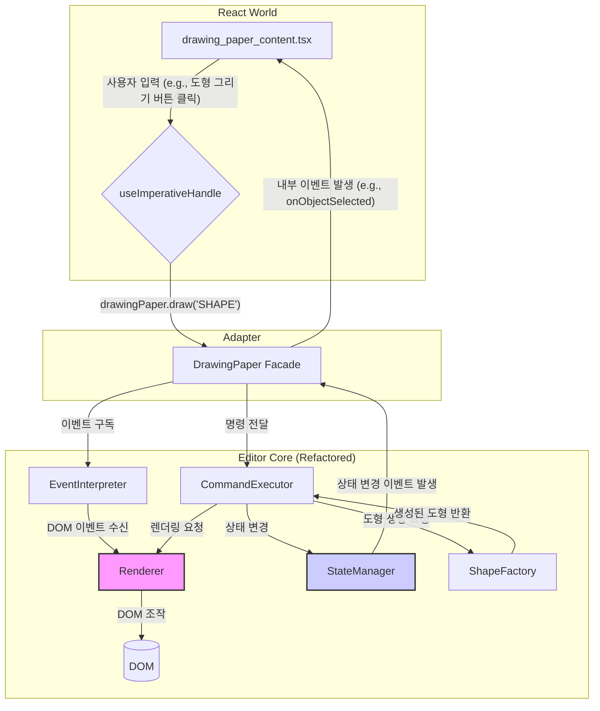

# `DrawingPaper.ts` 리팩터링 계획

`DrawingPaper.ts`의 리팩터링 계획의 주요 목표는 **복잡성 감소**, **jQuery 의존성 제거**, 그리고 **테스트 용이성 확보**입니다.

### 1. 현황 분석 및 문제점

-   **거대 클래스 (God Class):** 23,000줄이 넘는 코드가 하나의 클래스에 집중되어 있어 SRP(단일 책임 원칙)를 위반하고 코드 파악을 어렵게 합니다.
-   **강한 결합 (Tight Coupling):** jQuery와 직접적으로 결합되어 있어 DOM 조작 로직과 비즈니스 로직이 분리되지 않았습니다. 이로 인해 단위 테스트 작성이 거의 불가능합니다.
-   **명령형 프로그래밍:** UI 상태 변경이 대부분 직접적인 DOM 조작을 통해 이루어져, React와 같은 선언적 UI 라이브러리와의 통합이 부자연스럽고 양방향 통신 로직(어댑터)을 복잡하게 만듭니다.
-   **숨겨진 상태:** 많은 상태가 DOM 요소의 속성이나 jQuery 데이터 객체(`$.data`)에 저장되어 있어 상태 흐름을 추적하기 어렵습니다.

### 2. 리팩터링 목표 및 전략

리팩터링은 한 번에 모든 것을 바꾸는 '빅뱅' 방식 대신, 점진적으로 개선하는 전략을 사용합니다.

#### **1단계: 책임 분리 (Responsibility Separation)**

`DrawingPaper` 클래스가 가진 여러 책임을 별도의 모듈/클래스로 분리합니다.

-   **`CommandExecutor`:** 커맨드 실행 로직(`_execute`, `_prepare`, `_complete` 등)을 담당합니다.
-   **`EventInterpreter`:** 마우스, 키보드 등 사용자 입력을 해석하여 내부 이벤트(`DRAW.SHAPE` 등)로 변환하는 로직을 담당합니다.
-   **`Renderer`:** 실제 DOM에 도형이나 요소를 렌더링하는 책임을 가집니다. jQuery 종속적인 코드는 이 모듈에 집중시킵니다.
-   **`StateManager`:** `selection`, `clipboard`, `history` 등 에디터의 상태를 관리합니다.
-   **`ShapeFactory`:** 도형 객체(`Rectangle`, `Line` 등)를 생성하는 로직을 담당합니다.

#### **2단계: jQuery 의존성 추상화 및 제거**

-   **DOM 조작 추상화:** `Renderer` 모듈 내에서 jQuery를 사용하는 모든 DOM 조작 코드를 `createElement`, `setStyle`, `addClass` 와 같은 자체 유틸리티 함수로 감쌉니다.
-   **점진적 교체:** 추상화된 함수 내부를 jQuery 대신 순수 JavaScript(`document.createElement`, `element.style`, `element.classList.add` 등)로 점진적으로 교체합니다.
-   **이벤트 시스템 교체:** jQuery 이벤트 시스템을 `EventEmitter`나 `CustomEvent` 기반의 자체 이벤트 시스템으로 교체합니다.

### 3. 아키텍처 다이어그램 (목표)

