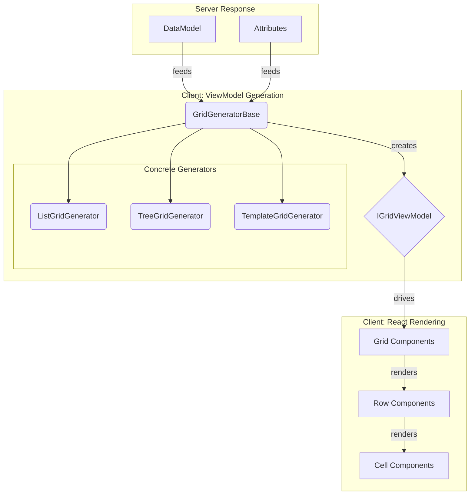

# UI 렌더링 패턴 (UI Rendering Patterns)

이 문서는 ECOUNT V5 프레임워크의 UI가 최종적으로 사용자에게 그려지는 과정과 생성 파이프라인을 상세히 설명합니다. 브라우저단의 문서는 이곳에 작성됩니다.

## 1. 그리드 생성 파이프라인 (Grid Generation Pipeline)

그리드는 서버로부터 받은 원본 데이터(Data Model)를 UI 컴포넌트가 이해할 수 있는 형태의 **뷰 모델(View Model)**로 가공하는 과정을 거쳐 생성됩니다. 이 핵심적인 변환 과정은 **`GridGenerator`**가 담당합니다.

### 핵심 역할: `GridGeneratorBase`

-   **파일 위치:** `ecount.application.view/viewer/generator/grid_base.ts`
-   **클래스:** `GridGeneratorBase`

이 추상 클래스는 모든 종류의 그리드 생성 로직에 대한 공통 기반을 제공하는 "엔진" 역할을 합니다. 주요 책임은 다음과 같습니다.

1.  **ViewModel 생성**: 서버 데이터와 각종 UI 속성(Attribute)을 조합하여 그리드 렌더링에 필요한 모든 정보를 담은 `IGridViewModel` 객체를 생성합니다.
2.  **구조화**: 헤더, 바디, 푸터 등 그리드의 기본 구조를 만들고, 각 구조에 포함될 행(Row)과 셀(Cell)을 생성합니다.
3.  **스타일 적용**: 글꼴, 정렬, 색상, 테두리 등 UI 스타일 속성을 계산하여 ViewModel에 적용합니다.
4.  **병합 로직 처리**: `rowSpan`, `colSpan` 등 복잡한 셀 병합 정보를 계산합니다.

### 구체적인 구현체 (Concrete Implementations)

`GridGeneratorBase`는 추상 클래스이므로 직접 사용되지 않습니다. 대신, 특정 목적에 맞는 구체적인 Generator 클래스들이 이를 상속받아 사용됩니다.

-   **`ListGridGenerator`**: 일반적인 목록 형태의 그리드를 생성합니다.
-   **`TreeGridGenerator`**: 계층 구조를 가진 트리 형태의 그리드를 생성합니다.
-   **`TemplateGridGenerator`**: 인쇄 양식처럼 복잡하고 정해진 레이아웃을 가진 그리드를 생성합니다.
-   **`SimpleGridGenerator`**: 단순한 형태의 그리드를 생성합니다.

### 렌더링 흐름 다이어그램

