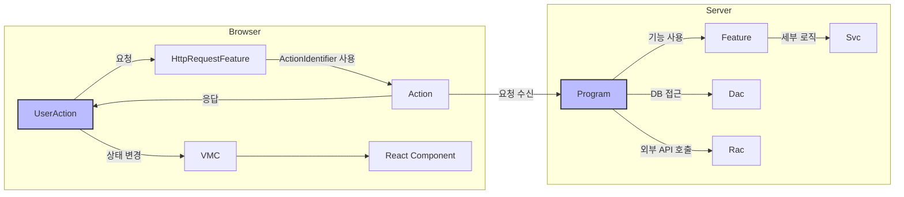
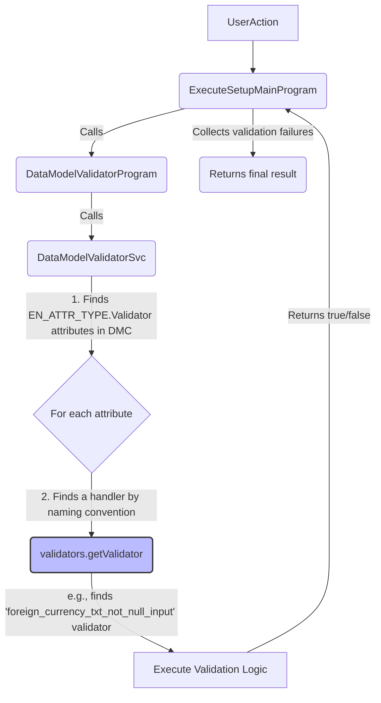
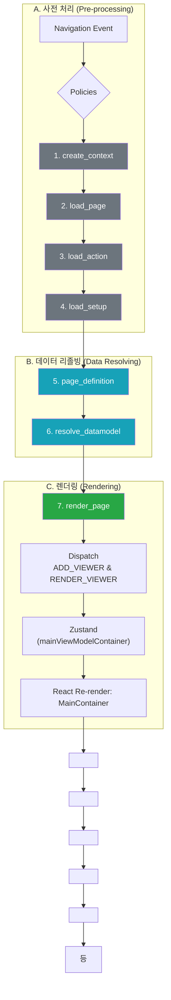

# System Patterns

이 문서는 ECOUNT v5 애플리케이션의 핵심 아키텍처 패턴과 주요 구성 요소 간의 상호작용을 설명합니다. 5.0 프레임워크의 핵심 철학은 **"격리, 경계, 주입(의존성), 통합, 테스트"** 이며, 이를 통해 개발자가 특정 기능 개발에만 집중할 수 있도록 복잡성을 낮추는 것을 목표로 합니다.

## 핵심 구성 요소 (Core Components)

프레임워크는 역할에 따라 명확하게 구분된 여러 구성 요소들의 조합으로 동작합니다.

### 1. 데이터 구조 (Data Structures)

-   **DataModel**: 실제 데이터 값을 담고 있는 Key-Value 형태의 객체입니다. (e.g. `{ title: '제목', writer: 'dknam' }`)
-   **DataModelDefinition**: `DataModel`을 설명하는 메타데이터 객체입니다. `data_model_id`를 통해 `DataModel`과 연결되며, `props`와 `attributes`로 구성됩니다.
    -   **`props`**: `DataModel`의 각 항목(`prop_id`)이 어떤 형태와 의미를 갖는지 명세합니다.
        -   **`prop_id`**: `DataModel` 내의 특정 데이터를 가리키는 고유한 키(key)입니다. (e.g. `title`)
        -   **`data_type`**: 해당 데이터의 기술적인 형태/구조를 정의합니다. (e.g. `$$txt`, `$$code`). 동일한 `attr_id`라도 `data_type`에 따라 `Attribute`의 `data` 구조가 달라질 수 있습니다.
        -   **`refer_type`**: 해당 데이터의 업무적인 의미를 정의합니다. (e.g. `title`, `user`)
        -   **`refer_group`**: 여러 `refer_type`을 묶는 그룹입니다. 이를 통해 여러 `refer_type`에 대한 공통 로직을 처리할 수 있습니다.
    -   **`attributes`**: 각 항목(`prop_id`)에 적용될 규칙(validation, rendering 등)을 정의합니다. (e.g. `{ prop_id: 'title', attr_id: 'max_length', data: 20 }`)
-   **DMC (DataModelContainer):** `DataModel`과 `DataModelDefinition`을 함께 감싸고 있는 데이터 관리의 핵심 엔진입니다. 데이터 조작을 위한 수많은 API를 제공합니다.
-   **Setup (ISetup):** 페이지 렌더링에 필요한 모든 명세(메뉴, 뷰 컨테이너, DMC 등)를 담고 있는 거대한 JSON 객체입니다.

-   **DataModel Template**: `DataModel`과 `DataModelDefinition`을 쉽게 만들기 위한 템플릿입니다. (e.g., `inventory_single`, `inventory_multi`) 코드 중복을 줄이고 생산성을 높입니다.

### 2. 실행 단위 (Execution Units)

-   **Program:** **하나의 독립된 로직 흐름(Process)**을 가지는 단위입니다. `execute`라는 단일 인터페이스를 제공하며, `ProgramIdentifier`를 통해 식별되고 `ProgramBuilder`로 생성됩니다.
-   **Feature:** **특정 목적을 위한 기능의 묶음(Strategy, Utility)**입니다. 여러 개의 메서드를 가질 수 있으며, `Program`의 일부 기능을 위임받거나, 의존성 주입(DI)을 통해 `Program`의 동작을 변경하는 데 사용됩니다.
-   **Svc (Service):** `Program`이나 `Feature` 내부에서 사용되는 더 작은 로직 단위입니다.
-   **Dac (Data Access Component):** **데이터베이스** 접근 로직(ESQL)을 캡슐화합니다.
-   **Rac (Remote Access Component):** **외부 시스템**과의 HTTP 통신 로직을 캡슐화합니다.

### 3. 통신 및 UI (Communication & UI)

-   **ActionIdentifier**: 브라우저와 서버 간의 **통신 명세(Contract)**입니다. 호출 URL, 요청/응답 DTO 타입을 정의하며, 하드코딩된 URL 대신 사용됩니다.
-   **Action**: 서버 측의 **API 엔드포인트**입니다. `ActionIdentifier`에 매핑되며, HTTP 요청을 받아 내부 `Program`을 실행시키는 게이트웨이 역할을 합니다.
-   **UserAction**: 브라우저 측에서 **UI 이벤트에 대한 응답**으로 실행되는 로직 단위입니다. 필요시 `IHttpRequestFeature`를 통해 서버의 `Action`을 호출합니다.
-   **VMC (ViewModelStateContainer):** Zustand 기반의 클라이언트 측 상태 저장소입니다. 서버에서 받은 데이터나 UI 상태를 저장하고 컴포넌트 리렌더링을 유발합니다.

### 4. 업무 표현 단위 (Business-Specific Definitions)

프레임워크는 실제 '업무'를 **Bizz > Menu > Object** 라는 계층적 정의(Definition)로 구체화합니다.

-   **Bizz Definition**: 프레임워크에서 **'업무'**를 식별하는 최상위 단위입니다. (e.g., 재고, 회계). 해당 업무의 타입(`EN_BIZZ_TYPE`), 프레임워크 버전, 그리고 하위에 속한 모든 `Menu`와 `Object` 정의를 포함합니다.
-   **Menu Definition**: 하나의 `Bizz` 내에서 사용자의 특정 목적(e.g., 입력, 조회)에 맞게 제공되는 **'기능'** 단위입니다. `menu_type`으로 역할을 구분하며, 이 메뉴에서 사용할 `Object`들을 지정하고, `Attribute`를 통해 "어떤 상황에 어떤 `Program`이나 `Action`을 실행할지" 동적으로 결정하는 핵심적인 역할을 합니다.
-   **Object Definition**: 특정 `Menu`의 맥락 안에서 의미를 가지는 **'데이터 모델의 구체적인 모습'**입니다. 여러 `DataModelDefinition`을 조합하고, `target_props`로 필요한 속성만 선택적으로 가져와 해당 `Menu`에 최적화된 최종 데이터 청사진을 만듭니다.

### 컴포넌트 상호작용 요약

---

## 서버 측 핵심 동작 패턴: The Orchestrator

서버 측의 많은 동작은 **`ExecuteSetupMainProgram`** 과 그 파생 프로그램들(`Delete...`, `New...` 등)을 통해 이루어집니다. 이 프로그램은 직접 비즈니스 로직을 수행하기보다는, **속성(Attribute) 기반의 동적 리졸버(Resolver) 호출**을 통해 전체 프로세스를 조율하는 **오케스트레이터(Orchestrator)** 역할을 합니다.

-   **핵심 아이디어:** 구체적인 기능 구현을 직접 호출하는 대신, `DMC`에 담긴 `Attribute`들을 해석하여, 그 `Attribute`를 처리할 수 있는 적절한 `Resolver` 또는 `Validator` 프로그램을 동적으로 찾아 실행합니다.
-   **장점:** 기능의 공통화와 추상화 수준을 높여, 서로 다른 비즈니스 로직(예: 재고 저장, 매출 저장)을 일관된 방식으로 처리할 수 있습니다.
-   **단점:** 모든 로직이 추상화 계층 뒤에 있어 직접적인 코드 추적이 어렵습니다. 개발자는 `Attribute`와 `Resolver`의 이름 규칙 및 연결 구조를 이해해야 전체 흐름을 파악할 수 있습니다.

### 동작 예시: Validator 실행 흐름

1.  사용자 액션(저장, 삭제 등)이 트리거되면 해당하는 **`ExecuteSetupMainProgram`** 이 실행됩니다.
2.  이 프로그램은 `DataModelValidatorProgram`을 호출하여 유효성 검사를 위임합니다.
3.  `DataModelValidatorProgram`은 다시 `DataModelValidatorSvc`를 호출합니다.
4.  `DataModelValidatorSvc`는 `DMC`를 순회하며 `EN_ATTR_TYPE.Validator` 타입의 속성을 모두 찾습니다.
5.  각 속성에 대해, `validators.getValidator` 함수는 **이름 규칙**에 따라 적절한 validator 구현체를 찾습니다.
    -   이름 규칙은 `bizz_type`, `data_type`, `attr_id`, `refer_type`, `menu_type` 등 여러 키의 조합으로 구성됩니다.
    -   예를 들어, `foreign_currency_txt_not_null_input` 와 같은 구체적인 validator 함수를 찾아냅니다.
6.  찾아낸 validator 함수가 실행되고, 결과를 반환합니다. `ExecuteSetupMainProgram`은 모든 validator의 결과를 취합하여 최종 결과를 결정합니다.

---

## 렌더링 및 데이터 흐름 (Page Loading Process)

Ecount v5의 페이지 로딩 및 렌더링은 여러 네비게이션 정책(Policy)들이 순차적으로 실행되는 파이프라인 구조를 따릅니다. 이 과정은 크게 **사전 처리**, **데이터 리졸빙**, **렌더링**의 3단계로 나뉩니다.

### 전체 흐름도

### 단계별 설명

1.  **`create_context`**: 서버에 페이지 정보를 요청하여 `jsPath`, `version` 등 페이지 로드에 필요한 기본 정보를 받아와 `pageRouteOptions`에 저장합니다.
2.  **`load_page`**: `pageRouteOptions.jsPath`를 이용해 페이지 컴포넌트의 JS 파일을 `$ECount.requireAsync`로 비동기 로드합니다. 로드가 완료되면, 렌더링할 컴포넌트(`ctor`) 정보가 **없는** 뷰어(Viewer) 껍데기를 `ADD_VIEWER` 액션을 통해 `mainViewModelContainer`에 먼저 추가합니다. 이로 인해 화면에 빈 페이지(팝업의 경우 프레임)가 먼저 나타나 UI 반응성을 높입니다.
3.  **`load_action`**: 페이지에서 사용할 `UserAction` 번들 JS 파일들(`app.common_user_action...js`, `app.inventory_user_action...js` 등)을 비동기적으로 로드하여 `globalThis` 전역 객체에 등록합니다.
4.  **`load_setup`**: 페이지 UI 구조와 데이터를 정의하는 `Setup`과 `DataModel` 원본을 서버로부터 가져옵니다. 페이지 컴포넌트에 정적 메서드 `onInitalizeSetup`이 정의되어 있다면, 이를 호출하여 서버에서 받은 `Setup`을 UI에서 사용하기 전에 마지막으로 수정할 기회를 줍니다.
5.  **`page_definition`**: **가장 핵심적인 단계**입니다. `SetupResolverProvider`를 통해 `setup` 원본을 UI가 이해할 수 있는 `page_viewmodel`과 `page_state`로 변환(Resolve)합니다. 이 과정에서 페이지 스코프의 상태 관리자인 `VMC(ViewModelStateContainer)`가 생성되고, 그 안에서 `DMManager(DataModelManager)`와 `UserActionExecutor` 등이 초기화됩니다.
6.  **`resolve_datamodel`**: `@page_impl()`의 `custom_data` 옵션이나 `trigger_resolve_value` 속성 등, 추가적인 데이터 처리를 수행합니다.
7.  **`render_page`**: 모든 데이터(`component`, `page_viewmodel`, `vmc` 등)가 준비된 **완전한** `viewer` 객체를 생성하고, `RENDER_VIEWER` 액션을 디스패치합니다. `mainViewModelContainer`는 `ADD_VIEWER` 때 추가했던 뷰어 껍데기를 이 완전한 뷰어 객체로 교체합니다.
8.  **React 렌더링**: `mainViewModelContainer`의 상태 변경을 구독하고 있던 `MainContainer` 컴포넌트가 리렌더링되면서, `<Viewer>`, `<BasePage>` 등을 거쳐 최종적으로 UI 컴포넌트를 화면에 그립니다.

UI 컴포넌트가 렌더링되는 상세 과정, 특히 `GridGeneratorBase`를 통한 그리드 생성 파이프라인과 관련된 내용은 다음 문서를 참조하십시오.

> -   **`.cursor/memory-bank/deep-dives/ui_rendering_patterns.md`**

`DrawingPaper` 에디터 아키텍처에 대한 자세한 내용은 다음 문서를 참조하십시오.

> -   **`.cursor/memory-bank/deep-dives/drawing_editor_architecture.md`**

---

## 비즈니스 로직 및 데이터 처리 패턴

### 1. 값 관련 설정 (ValueResolver)

-   항목의 값에 대한 모든 설정(초기값, 자동입력, 저장 시 값 변경)을 통칭하는 개념입니다. `ValueResolver`가 관련 로직을 처리하며, 실행 시점에 따라 다음과 같이 구분됩니다.
    -   **초기값**: 화면이 처음 로드될 때 값을 미리 보여주는 설정.
    -   **자동입력**: 특정 값 변경 시, 연관된 다른 항목의 값을 실시간으로 계산하고 변경하는 설정.
    -   **저장 시 값 변경**: 저장 시점에 특정 항목의 값을 최종적으로 결정하는 설정.

### 2. 조건부 속성 (Conditional Attribute)

-   입력 메뉴에서 특정 조건에 따라 `Attribute`의 `data`를 동적으로 변경하여 UI의 상태(e.g., `display_state`)나 동작을 바꾸는 패턴입니다. 조회 메뉴의 '조건부 서식'과 유사한 개념입니다.

### 3. 파생 업무 (Derive)

-   한 업무(e.g., 판매)에서 데이터 변경이 발생했을 때, 연관된 다른 업무(e.g., 출고)의 로직을 함께 실행하는 메커니즘입니다.
    ㅈㅈㅈㅈ

### 4. 데이터 변환 및 전송 (Transfer)

-   **불러오기/밀어주기/변경업무** 등, 한 업무(전표)에서 다른 업무(전표)로 데이터를 변환하고 전달하는 모든 기능을 통칭합니다. `SlipTransferProgram` 등이 관련 로직을 처리합니다.

### 5. 파생 데이터 모델 (Derived/Inherent Data Model)

-   원본 `DataModelDefinition`으로부터 특정 규칙에 따라 새로운 `DataModelDefinition`이 자동으로 생성되는 패턴입니다.
-   **Key-Derived (`K___`):** 원본 모델의 `is_key: true`인 속성들만 모아 키(Key) 모델을 파생합니다.
-   **Array-Derived (`A___`):** 원본 모델의 배열(목록) 형태를 나타내며, `$sum$`, `$avg$` 같은 집계 속성을 동적으로 사용할 수 있습니다.

### 6. 중첩 데이터 모델 (Nested Data Model)

-   `IPropDefinition`의 `prop_dm_def` 속성을 사용하여 데이터 모델 내부에 다른 데이터 모델을 포함시키는 패턴입니다.
-   이를 통해 단순한 1차원 구조를 넘어, 트리(Tree)와 같은 복잡한 계층 구조를 가진 데이터를 표현할 수 있습니다.

### 7. Object Definition을 통한 데이터 모델 조합

-   `Object Definition`은 단순히 데이터 모델을 정의하는 것을 넘어, 여러 `DataModelDefinition`을 재료로 삼아 특정 메뉴에 필요한 최종 데이터 모델을 '조립'하는 역할을 합니다.
-   `target_props` 옵션을 통해 원본 `DataModelDefinition`에서 필요한 속성만 선택적으로 가져오거나, `target_props_options`로 속성의 설정을 `Object` 레벨에서 재정의하는 등 데이터 모델의 재사용성과 유연성을 극대화합니다.

### 8. 모듈별 확장 패턴 (Customization)

-   **`custom_data_type`**: 특정 모듈에서만 사용되는 데이터 타입을 정의하고 렌더링하는 메커니즘입니다.
    -   개발자는 모듈 내에 `prop_resolver`와 `component(Provider)`를 구현하고 `CustomDataTypeRegistry`에 등록합니다.
    -   이를 통해 공통 모듈을 수정하지 않고도 모듈 특화적인 UI 컴포넌트와 로직을 캡슐화하고 확장할 수 있습니다.

### 9. 데이터 모델 매핑 (Mapping)

-   메뉴 정의(`IMenuDefinition`)나 객체 정의(`IObjectDefinition`)의 `mapping` 속성을 사용하여 서로 다른 데이터 모델의 속성 값을 연결하거나, 특정 값을 직접 주입할 수 있습니다. 데이터 모델 간의 관계 설정 및 데이터 흐름 제어에 사용됩니다.

### 심층 분석 (Deep Dives)

-   [UI 렌더링 파이프라인](./deep-dives/ui_rendering_patterns.md)
-   [Drawing Editor 아키텍처](./deep-dives/drawing_editor_architecture.md)
-   [Drawing Editor 리팩터링 계획](./deep-dives/drawing_paper_refactoring_plan.md)
-   [Drawing Editor 명령 실행 흐름](./deep-dives/drawing_editor_command_flow.md)
