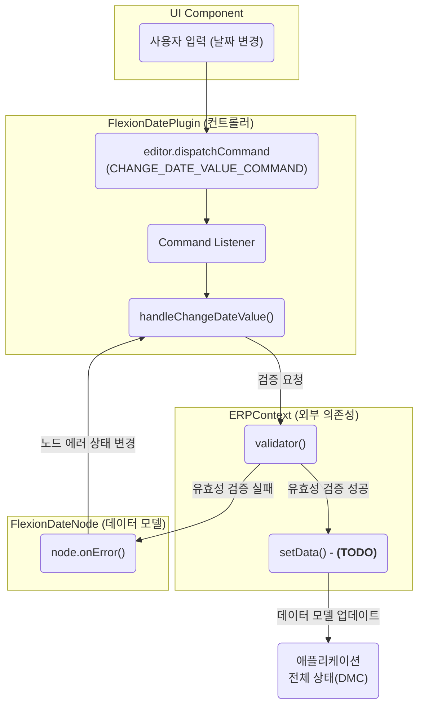

# FlexionDatePlugin.tsx 심층 분석

### 파일 요약 (Summary)

이 파일은 Lexical 에디터 내에서 **날짜 입력 필드(`FlexionDateNode`)의 동작을 제어하는 핵심 플러그인**입니다. 사용자의 날짜 값 변경, 키보드 입력, 유효성 검증 오류 처리 등 날짜와 관련된 모든 상호작용을 담당하는 컨트롤러 역할을 합니다.

### 주요 기능 및 로직 분석

#### 1. `FlexionDatePlugin` 컴포넌트

-   **역할**: 플러그인의 메인 컴포넌트입니다.
-   **`useFlexionComposerContext()`**: Lexical의 `editor` 객체를 가져옵니다. 이 객체를 통해 커맨드를 등록하고 에디터 상태에 접근합니다.
-   **`useERPContext()`**: 상위 `ERPContext`에서 `validator` 함수를 주입받습니다. 이는 날짜 유효성 검증 로직이 이 플러그인 자체에 있는 것이 아니라, ERP 애플리케이션의 비즈니스 로직에 의해 제공됨을 의미합니다. 이것은 `systemPatterns.md`에 정의된 **"의존성 역전 원칙(Dependency Inversion Principle)"** 을 잘 따른 예시입니다.

#### 2. 커맨드 처리 (Command Handling)

`useEffect` 훅 내부에서 3개의 주요 커맨드 리스너를 등록하여 특정 이벤트에 반응합니다.

1.  **`CHANGE_DATE_VALUE_COMMAND`**: 날짜 값이 변경될 때 실행됩니다.
    -   `handleChangeDateValue` 함수를 호출하여 비동기 유효성 검사를 수행합니다.
    -   검증 결과에 따라 `FlexionDateNode`의 오류 상태를 업데이트합니다. (`OutOfYearLimit` 또는 `ClearError`)
2.  **`KEYDOWN_DATE_COMMAND`**: 사용자가 키를 입력할 때 실행됩니다.
    -   `handleKeyDownDateValue` 함수를 호출하여 `Enter` 키 입력을 감지하고, `shortcutLocalHandler`를 호출하도록 되어 있습니다.
3.  **`ERROR_DATE_COMMAND`**: 외부에서 노드에 오류를 발생시켜야 할 때 사용됩니다.
    -   `handleErrorDateValue` 함수를 호출하여 특정 에러 코드(`code`)에 따른 처리를 수행합니다.

### 상호작용 흐름도 (Interaction Flow)

`CHANGE_DATE_VALUE_COMMAND`가 실행될 때의 데이터 흐름은 다음과 같습니다.

### 분석 요약 및 개선점 (TODO)

이 플러그인은 의존성 주입과 커맨드 패턴을 활용하여 잘 구조화되어 있지만, 주석에 명시된 `TODO` 항목들을 통해 아직 **미완성 상태**임을 알 수 있습니다.

1.  **데이터 동기화 (setData 처리)**
    -   `handleChangeDateValue` 함수 내에서 유효성 검증이 성공한 후, 변경된 값을 애플리케이션의 중앙 데이터 모델(주석의 "DMC")에 반영하는 `setData` 로직이 구현되어야 합니다. 이 함수는 `ERPContext`로부터 받아와야 합니다.
2.  **바로가기 키 처리 (shortcutLocalHandler 처리)**
    -   `handleKeyDownDateValue` 함수에서 사용되는 `dummy_shortcutLocalHandler`는 실제 동작하는 함수로 교체되어야 합니다. 예를 들어, `Enter` 키를 눌렀을 때 폼을 저장하거나 다음 필드로 포커스를 이동시키는 등의 실제 동작이 `ERPContext`를 통해 주입되어야 합니다.
3.  **에러 UI 처리 (setError 처리)**
    -   `handleErrorDateValue` 함수 내 주석(`// flexion에서는 에러를 어떻게 처리해야하지??`)은 이 프로젝트의 핵심적인 아키텍처 고민을 보여줍니다. 기존의 "vmc"를 직접 제어하던 방식에서 벗어나, Flexion 아키텍처에 맞는 새로운 에러 메시지 표시 방법(예: 별도의 에러 메시지 컴포넌트 상태 업데이트)을 설계하고 구현해야 합니다.

결론적으로, 이 플러그인은 Flexion의 확장성과 ERP 시스템의 비즈니스 로직을 연결하는 중요한 역할을 하지만, 완전한 기능을 위해서는 위 `TODO` 항목들이 반드시 해결되어야 합니다.
