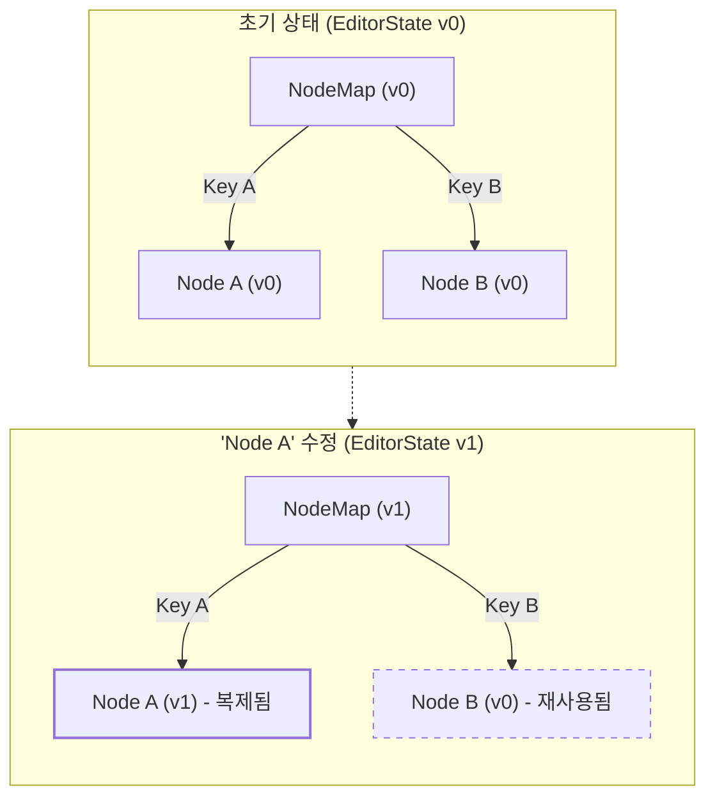

# ===============================================
# Lexical 노드 키(NodeKey) 관리 심층 분석
# ===============================================
# 이 문서는 Lexical의 모든 노드를 고유하게 식별하는 `NodeKey`의 역할,
# 생명주기, 올바른 사용법 및 흔한 오용 사례를 심층적으로 분석합니다.
# 원본: packages/lexical-website/docs/concepts/key-management.md
# ===============================================

## 1. 노드 키(NodeKey)란?

`NodeKey`(속성명: `__key`)는 Lexical 에디터 내의 모든 노드에 할당되는 **고유 식별자**입니다.

-   Lexical에 의해 자동으로 생성됩니다.
-   `EditorState` 내에서 특정 노드를 추적하는 데 사용됩니다.
-   Lexical의 효율적인 상태 관리와 업데이트의 핵심적인 역할을 담당합니다.
-   노드의 생명주기 동안 **절대 변경되지 않습니다.**

Lexical은 내부적으로 `Map<NodeKey, LexicalNode>` 자료구조를 사용하여 모든 노드를 관리하며, 이를 통해 특정 키를 가진 노드를 O(1) 시간 복잡도로 매우 빠르게 조회할 수 있습니다.

---

## 2. NodeKey의 올바른 사용법과 오용 사례

`NodeKey`는 Lexical이 내부적으로 상태를 관리하기 위해 사용하는 매우 중요한 값이므로, 개발자가 직접 조작해서는 안 됩니다.

### ✅ 올바른 사용 사례

오직 두 가지 경우에만 `__key`를 명시적으로 다루어야 합니다.

**1. 커스텀 노드의 생성자(Constructor)**: 부모 클래스의 생성자에 `key`를 전달해야 합니다.

```typescript
class MyCustomNode extends ElementNode {
  constructor(someData: string, key?: NodeKey) {
    super(key); // 부모 생성자에 key 전달
    this.__someData = someData;
  }
}
```

**2. 커스텀 노드의 `clone()` 정적 메서드**: 노드를 복제할 때, 기존 노드의 `__key`를 새 인스턴스에 전달해야 합니다.

```typescript
static clone(node: MyCustomNode): MyCustomNode {
  return new MyCustomNode(node.__someData, node.__key);
}
```

### ❌ 잘못된 사용 사례 (Anti-patterns)

**절대** 다음과 같이 키를 사용해서는 안 됩니다.

```typescript
// ❌ 다른 노드의 키를 재사용하여 새 노드 생성
const newNode = new MyCustomNode(existingNode.__key);

// ❌ 키 값을 직접 수정
node.__key = 'my-custom-key';

// ❌ 노드 교체 시 키 재사용
// { replace: OldNode, with: (node) => new NewNode(node.__key) }
```

이러한 오용은 예측할 수 없는 버그와 상태 불일치를 유발하는 주요 원인이 됩니다.

---

## 3. NodeKey의 생명주기와 특징

-   **휘발성(Ephemeral)**: `NodeKey`는 현재 `EditorState` 인스턴스 내에서만 의미를 가집니다.
-   **직렬화되지 않음**: `editorState.toJSON()`을 호출할 때, `NodeKey`는 **절대 직렬화되지 않습니다.** JSON으로부터 `EditorState`를 다시 생성하면, 모든 노드에 대해 **완전히 새로운 키가 생성됩니다.**
-   **고유성**: 하나의 `EditorState` 내에서 모든 키는 고유함이 보장됩니다.

이러한 특징 때문에, 노드를 외부(데이터베이스 등)에서 참조하기 위한 영구적인 ID로 `NodeKey`를 사용해서는 안 됩니다.

## 4. 핵심 원리: 키(Key)와 불변성(Immutability)

Lexical이 어떻게 효율적으로 상태를 업데이트하는지 이해하려면 키의 역할을 알아야 합니다.

`editor.update()`가 발생하면, Lexical은 새로운 `EditorState`를 생성합니다. 이때, 변경되지 않은 노드는 이전 `EditorState`의 인스턴스를 그대로 재사용(zero-copy)하고, 변경이 필요한 노드만 `clone`하여 새로운 인스턴스를 만듭니다.

`NodeKey`는 바로 이때 어떤 노드가 재사용되었고 어떤 노드가 새로 생성되었는지를 추적하는 **기준점** 역할을 합니다. 이를 통해 Lexical은 최소한의 연산으로 상태를 업데이트하고, React와 같은 UI 라이브러리가 DOM을 효율적으로 렌더링할 수 있도록 돕습니다.


*위 다이어그램에서 점선은 이전 상태의 노드 객체가 그대로 재사용되었음을 의미합니다.*

## 5. 모범 사례

### `$applyNodeReplacement` 사용

새로운 커스텀 노드를 생성할 때는, `new MyCustomNode()`를 직접 호출하는 대신 `$create...` 헬퍼 함수를 만들어 사용하는 것이 좋습니다. 이 헬퍼 함수 내부에서 `$applyNodeReplacement`를 호출하면, Lexical이 키 관리를 포함한 모든 내부 상태 처리를 알아서 담당해줍니다.

```typescript
import { $applyNodeReplacement } from 'lexical';

export function $createMyCustomNode(data: string): MyCustomNode {
  // $applyNodeReplacement가 키 할당 및 노드 등록을 처리합니다.
  return $applyNodeReplacement(new MyCustomNode(data));
}
```

### 나중에 노드를 참조해야 할 경우

`NodeKey`를 직접 저장하여 `$getNodeByKey(key)`로 나중에 다시 조회하는 것은 유효한 방법입니다.

```typescript
// update 밖에서 키 저장
let myNodeKey = null;
editor.update(() => {
  const node = $createMyCustomNode("hello");
  myNodeKey = node.getKey();
});

// 나중에 다른 update에서 사용
editor.update(() => {
  if (myNodeKey) {
    const node = $getNodeByKey(myNodeKey);
    // ...
  }
});
``` 