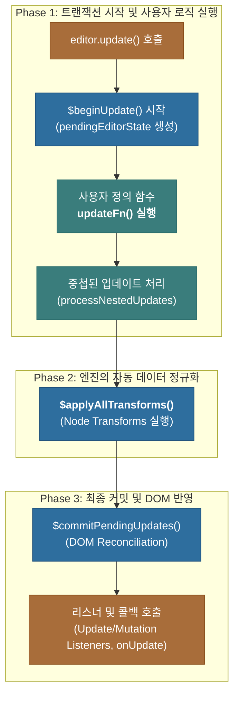

# 심층 분석 4.1: Lexical 업데이트 메커니즘 개요

**문서 상태**: `v1.0` (신규 생성)

이 문서는 Lexical의 업데이트 메커니즘을 이해하기 위한 가장 중요한 출발점입니다. 여러 문서에 흩어져 있던 핵심 개념들을 통합하여, Lexical이 어떻게 상태를 관리하고, 변경사항을 처리하며, 최종적으로 DOM에 반영하는지에 대한 전체적인 그림을 제공합니다.

- **핵심 관련 코드**: `packages/lexical/src/LexicalUpdates.ts`

---

## 1. 핵심 철학: 왜 DOM이 아닌 `EditorState`인가?

Lexical에서 **신뢰성의 원천(Source of Truth)은 DOM이 아니라, Lexical이 내부적으로 관리하는 `EditorState` 모델**입니다.

HTML은 리치 텍스트를 표현하는 데 뛰어나지만, 에디터의 상태를 관리하기엔 "지나치게 유연"합니다. 동일한 시각적 결과도 내부적으로는 다른 HTML 구조를 가질 수 있어 상태 관리를 예측 불가능하게 만듭니다.

`EditorState`는 항상 일관된(canonical) 트리 구조를 유지하여, 어떤 순서로 스타일이 적용되든 예측 가능한 상태를 보장합니다.

---

## 2. 이중 버퍼링(Double Buffering)과 트랜잭션

`EditorState`는 특정 시점의 에디터 상태를 담고 있는 **불변(immutable) 스냅샷**입니다. Lexical은 상태 업데이트 시 '이중 버퍼링' 기법을 사용하여 안전하고 효율적으로 변경을 처리합니다.

-   **`editor._editorState` (Current EditorState)**: 현재 DOM에 렌더링된, **변경 불가능한(immutable)** 공식 상태입니다.
-   **`editor._pendingEditorState` (Pending EditorState)**: `editor.update()`가 실행되는 동안 `Current EditorState`가 복제되어 생성되는 **변경 가능한(mutable)** '작업 중인' 상태입니다.

모든 변경 작업은 `pendingEditorState`에서 일어나며, 모든 작업이 완료된 후 새로운 `Current EditorState`가 되어 DOM에 한꺼번에 반영됩니다. 이 원자적(atomic)인 처리 단위를 **트랜잭션(Transaction)**이라고 부릅니다.

---

## 3. 전체 업데이트 흐름 (High-Level Overview)

Lexical의 업데이트는 "사용자 코드 실행 → 엔진의 자동 변환 → 최종 커밋" 이라는 명확한 단계를 따릅니다.

---

## 4. 개발자 업데이트 vs. 노드 변환: 결정적 차이

Lexical의 업데이트 로직은 크게 두 종류로 나뉩니다. 이 둘의 차이를 이해하는 것이 매우 중요합니다.

| 구분 | **개발자 업데이트 (`updateFn`)** | **노드 변환 (Node Transforms)** |
| :--- | :--- | :--- |
| **주체** | **개발자**가 명시적으로 호출 (`update`, `dispatchCommand`) | **Lexical 엔진**이 내부적으로 자동 실행 |
| **시점** | 트랜잭션의 **가장 처음**에 실행됨 | 모든 명시적 `update` 콜백 실행이 **끝난 후**, 커밋 직전에 실행됨 |
| **목적** | 사용자의 의도를 직접적으로 상태에 반영 | 데이터의 일관성 보장 및 특정 패턴의 자동 변환 (e.g. 마크다운, 링크) |

**요약**: 개발자는 `updateFn`을 통해 "무엇을 바꿀지"에 대한 **의도**를 표현하고, 그 후 Lexical 엔진이 `Node Transforms`를 통해 그 결과를 **안정적이고 일관된 상태로 자동 정제**한 뒤, 최종적으로 DOM에 반영합니다. 