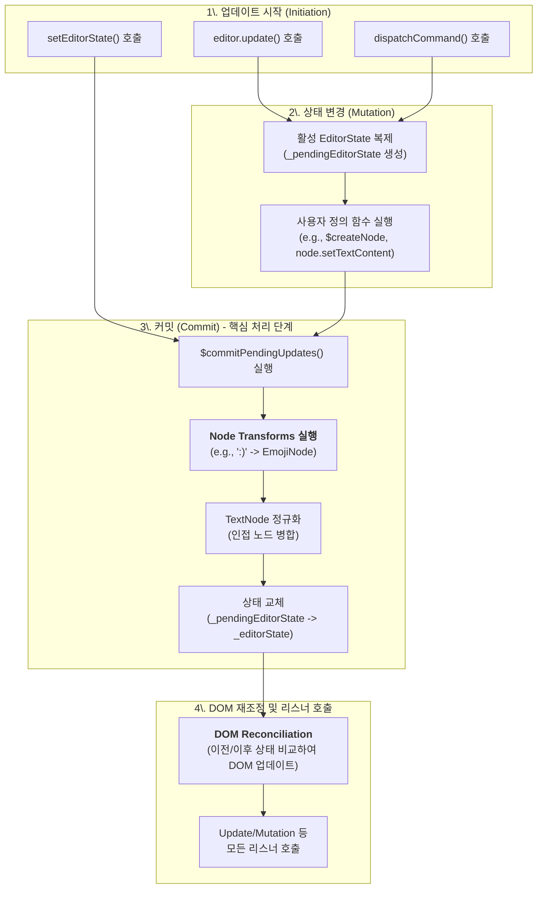

# 심층 분석 1: 업데이트 메커니즘 개요 - 전체 생명주기

**주제**: Lexical의 AST(EditorState) 처리 생명주기

이 문서는 `editor.update()` 호출부터 시작하여 변경된 상태가 최종적으로 DOM에 반영되기까지, Lexical의 AST가 처리되는 전체 생명주기를 다이어그램과 함께 단계별로 분석합니다. 이 흐름의 핵심 로직은 `packages/lexical/src/LexicalUpdates.ts` 파일에 구현되어 있습니다.

Lexical은 두 가지 상태, 즉 현재 사용자에게 보이는 **`_editorState`** 와 변경 작업이 일어나는 임시 복사본 **`_pendingEditorState`** 를 사용하여 업데이트의 안정성과 원자성을 보장합니다.

## AST 처리 전체 흐름도

## 단계별 심층 분석

### 1단계: 업데이트 시작 (Initiation)

모든 AST 변경은 다음 세 가지 진입점 중 하나를 통해 시작됩니다.

-   **`editor.update(updateFn)`**: 가장 일반적인 방법으로, 콜백 함수 내에서 AST를 직접 수정합니다. (상세 분석: **[업데이트 진입점 및 리스너](./02_entrypoints_and_listeners.md)**)
-   **`editor.setEditorState(newState)`**: 외부(DB, 히스토리)에서 생성된 `EditorState`를 주입하여 에디터 내용을 완전히 교체합니다. (상세 분석: **[에디터 초기화](../initialization/01_initialization_overview.md)**)
-   **`editor.dispatchCommand(COMMAND, payload)`**: 특정 커맨드를 실행하며, 내부적으로 `editor.update`를 호출합니다. (상세 분석: **[커맨드 시스템](../command_system/01_command_system_overview.md)**)

### 2단계: 상태 변경 (Mutation in `_pendingEditorState`)

`editor.update()`가 호출되면, Lexical은 현재 상태(`_editorState`)를 즉시 복제하여 쓰기 가능한 임시 '작업 공간'인 **`_pendingEditorState`** 를 생성합니다. 개발자가 `updateFn` 내에서 사용하는 모든 달러($) 함수는 이 `_pendingEditorState`를 변경합니다.

-   **핵심 로직**: `cloneEditorState` (in `LexicalEditorState.ts`), `$beginUpdate` (in `LexicalUpdates.ts`)
-   상세 분석: **[업데이트 트랜잭션 시작](./03_begin_update_transaction.md)**

### 3단계: 커밋 - AST 후처리 (Commit & Post-Processing)

`updateFn` 실행이 끝나면, 변경된 `_pendingEditorState`를 최종 확정하기 위한 **커밋(`$commitPendingUpdates`)** 단계가 시작됩니다. 이 단계에서 AST에 대한 가장 중요한 자동 처리들이 일어납니다.

1.  **노드 변환 (Node Transforms)**: `registerNodeTransform`으로 등록된 변환 규칙(e.g., Markdown 단축키)들이 실행됩니다. 이는 Lexical의 강력한 반응성(Reactivity)의 핵심입니다. (상세 분석: **[노드 변환](./06_node_transforms.md)**)
2.  **텍스트 노드 정규화 (TextNode Normalization)**: 일관성을 위해 인접한 `TextNode`를 병합하거나 빈 노드를 제거합니다.
3.  **가비지 컬렉션 (Garbage Collection)**: AST 트리에서 분리된 노드들을 메모리에서 제거합니다.
4.  **최종 상태 교체**: 모든 후처리가 끝난 `_pendingEditorState`가 공식적인 현재 상태 `_editorState`가 됩니다.

-   **핵심 로직**: `$commitPendingUpdates`, `$applyAllTransforms` (in `LexicalUpdates.ts`)
-   상세 분석: **[업데이트 커밋](./04_commit_pending_updates.md)**, **[더티 노드 마킹](./05_dirty_node_marking.md)**

### 4단계: DOM 재조정 및 리스너 호출

새로운 `_editorState`가 확정되면, 변경 사항을 실제 사용자 화면에 반영합니다.

1.  **DOM 재조정 (Reconciliation)**: 이전 `_editorState`와 새로운 `_editorState`를 비교하여 변경된 부분만 DOM에 효율적으로 업데이트합니다. React의 Virtual DOM과 유사한 방식입니다. (상세 분석: **[DOM 재조정 심층 분석](./09_dom_reconciliation_deep_dive.md)**, **[ElementNode와 재조정](./10_elementnode_and_reconciliation.md)**)
2.  **리스너 호출**: `onUpdate` 콜백, `registerUpdateListener`, `registerMutationListener` 등으로 등록된 모든 리스너들이 이때 호출되어, 개발자가 변경 사항에 반응할 수 있도록 합니다. (상세 분석: **[업데이트 진입점 및 리스너](./02_entrypoints_and_listeners.md)**)

## 결론

Lexical의 AST 처리는 단일 함수가 아닌, **`Update -> Commit -> Reconcile`** 이라는 명확한 생명주기를 통해 이루어집니다. 이 구조는 `LexicalUpdates.ts`를 중심으로 구현되어 있으며, 복잡한 상태 변경을 안전하고 예측 가능하게 만들어 Lexical의 높은 확장성과 안정성을 보장합니다. 