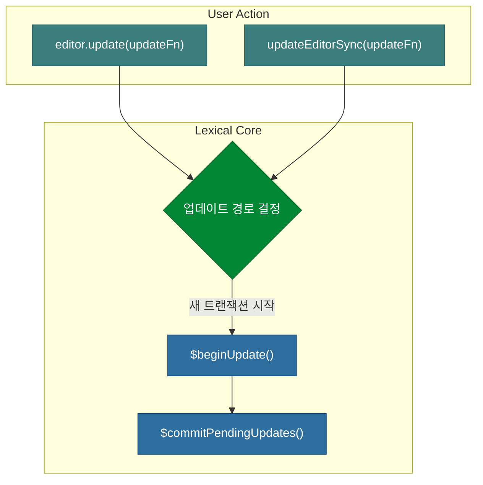
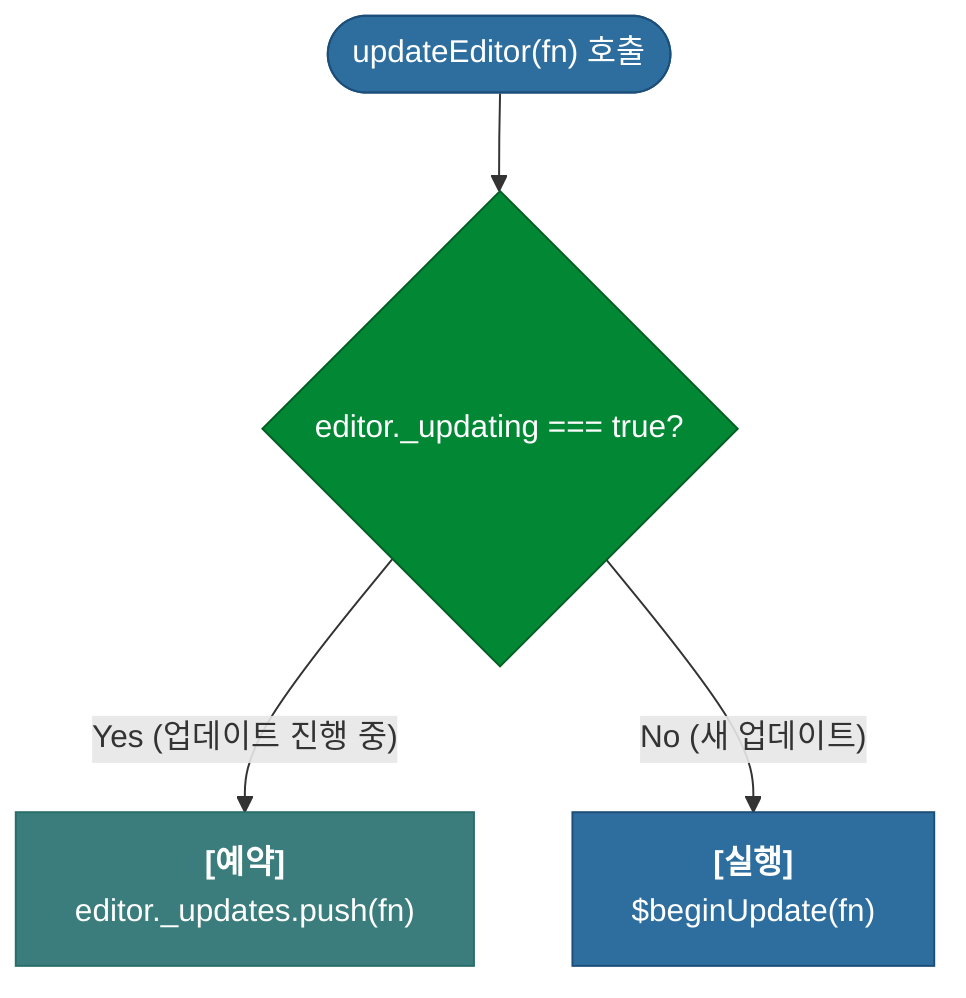
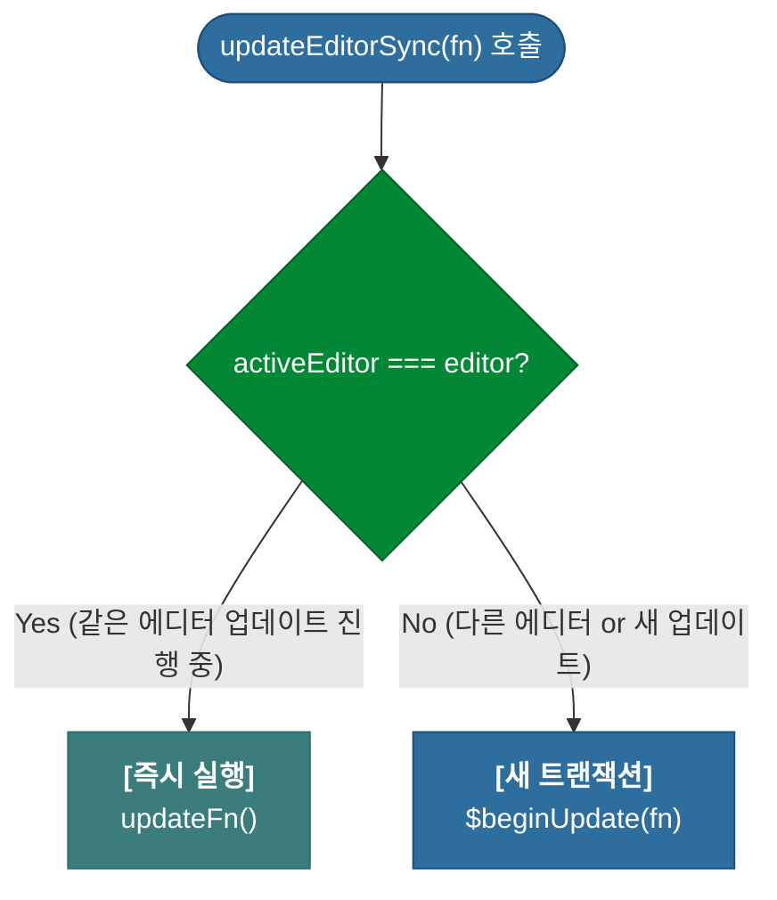

# 심층 분석 4.2: 업데이트 흐름과 진입점

**문서 상태**: `v1.0`

이 문서는 Lexical의 전체적인 업데이트 흐름과, 업데이트를 시작하는 두 가지 주요 진입점인 `updateEditor`와 `updateEditorSync`의 차이점을 상세히 분석합니다.

---

## 1. 전체 업데이트 흐름 (High-Level Overview)

Lexical의 업데이트는 `updateEditor` 또는 `updateEditorSync`로 시작하여, `$beginUpdate`가 트랜잭션을 관리하고, `$commitPendingUpdates`가 최종적으로 변경사항을 확정(Commit)하는 구조입니다.

### 1.1. Transform의 효율성: Update Listener와의 비교

`Transform`은 Lexical에서 상태 변경에 반응하는 가장 효율적인 메커니즘입니다. `UpdateListener` 내부에서 다시 `editor.update()`를 호출하여 비슷한 결과를 만들 수도 있지만, 이는 다음과 같은 이유로 **매우 비효율적이며 권장되지 않습니다.**

- **추가 렌더링 유발**: 리스너를 통한 업데이트는 별개의 업데이트 사이클을 트리거하여, DOM을 다시 렌더링(Reconciliation)하는 가장 비싼 작업을 불필요하게 한 번 더 실행합니다.
- **히스토리 오염**: 각 업데이트 사이클은 새로운 `EditorState` 객체를 생성합니다. 이는 사용자의 단일 행동이 여러 개의 히스토리로 기록되어, 실행 취소/다시 실행(Undo/Redo) 동작을 예기치 않게 만들 수 있습니다.

반면, `Transform`은 단일 업데이트 사이클 내에서, DOM 렌더링 **전에** 실행됩니다. 여러 `Transform`이 순차적으로 실행되더라도 최종적으로 단 한 번의 DOM 렌더링으로 이어지므로 성능상 매우 유리합니다.

### 1.2. 콜백 실행 순서

`editor.update()`가 트리거되면, 여러 종류의 콜백 함수들이 정해진 순서에 따라 실행됩니다. 이 순서를 이해하는 것은 디버깅과 예측 가능한 플러그인 개발에 매우 중요합니다.

| 콜백 종류 | 실행 시점 | 주요 특징 |
| :--- | :--- | :--- |
| **Command** | `dispatchCommand` 호출 즉시 | 암묵적인 `editor.update` 내에서 가장 먼저 실행됩니다. |
| **Node Transform** | `editor.update` 콜백 종료 후 | 'dirty'로 표시된 노드에 대해 실행되며, DOM 렌더링 전에 상태를 안정화시킵니다. |
| **Update Listener** | Reconciliation **후** | 모든 상태 변경이 DOM에 반영된 후에 최종적으로 호출됩니다. |
| **Mutation Listener** | Reconciliation **후** | 특정 노드 타입에 대한 변경(`created`, `updated`, `destroyed`)이 있을 때만 호출됩니다. |

---

## 2. 진입점 비교: `updateEditor` vs `updateEditorSync`

두 함수는 비슷해 보이지만, **"업데이트 중첩(Nested Update)"** 상황에서 다르게 동작하여 각기 다른 목적을 수행합니다.

### 2.1. `updateEditor` : 업데이트 묶음 처리(Batching)

-   **실제 코드 위치**: `packages/lexical/src/LexicalUpdates.ts`
-   **핵심 목적**: 여러 업데이트를 하나의 트랜잭션으로 묶어 비동기적으로 처리함으로써 성능을 최적화합니다.
-   **동기적 커밋**: `editor.update(fn, {discrete: true})`와 같이 `discrete` 옵션을 사용하면, 업데이트가 즉시 동기적으로 커밋되어 `editor.getEditorState()`로 바로 최신 상태를 조회할 수 있습니다. 이는 서버 사이드 렌더링이나 상태를 즉시 저장해야 할 때 유용합니다.

**상세 분석**: `editor._updating` 플래그는 `$beginUpdate`가 실행되는 동안 `true`가 됩니다. 만약 다른 업데이트가 이미 진행 중이라면(`true`), `updateEditor`는 `updateFn`을 즉시 실행하지 않고, `editor._updates`라는 **대기열(Queue)에 저장**만 합니다. 이렇게 대기열에 쌓인 업데이트들은, 현재 진행 중인 `$beginUpdate` 내부의 `processNestedUpdates()`에 의해 나중에 한꺼번에 처리됩니다.

### 2.2. `updateEditorSync` : 동기적 실행 우선

-   **실제 코드 위치**: `packages/lexical/src/LexicalUpdates.ts`
-   **핵심 목적**: 가능하면 현재 트랜잭션 내에서 작업을 즉시 실행하는 것을 우선합니다.

**상세 분석**: `activeEditor`는 현재 업데이트 트랜잭션을 실행 중인 에디터를 가리키는 전역 변수입니다. 만약 동일한 에디터에 대한 업데이트가 이미 진행 중이라면(`true`), `updateEditorSync`는 대기열에 넣지 않고 **`updateFn`을 즉시 실행**하여 현재 트랜잭션에 작업을 합칩니다.

### 2.3. Reconciliation 시점 (FAQ)

-   **기본 동작 (비동기)**: DOM 변경을 적용하는 Reconciliation 작업은 기본적으로 `queueMicrotask`를 사용하여 **비동기적으로** 스케줄링됩니다. 이는 여러 업데이트(e.g., 사용자 입력, 노드 변환 등)를 하나의 렌더링 사이클로 묶어(batching) 처리하여 성능을 최적화하기 위함입니다. `Promise.resolve().then(reconcile)`과 유사하게 동작하지만 약간 더 즉시성이 높습니다.
-   **동기적 실행**: `editor.update(fn, {discrete: true})` 옵션을 사용하면, Reconciliation이 즉시 **동기적으로** 실행됩니다. 테스트 코드에서 `await editor.update(...)` 구문이 동작하는 이유도, `await`이 동일한 마이크로태스크 큐를 사용하기 때문입니다. 하지만 애플리케이션 코드에서는 이 방식에 의존하기보다, 명시적으로 `discrete` 옵션을 사용하거나 `onUpdate` 콜백을 활용하는 것이 더 안전하고 예측 가능합니다. 