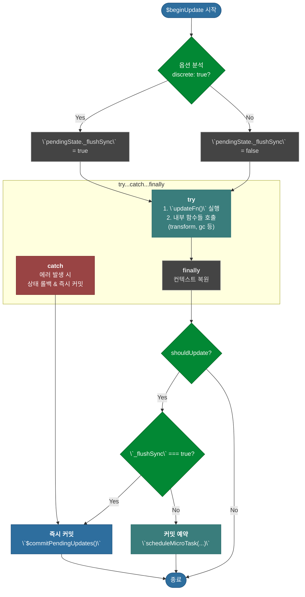
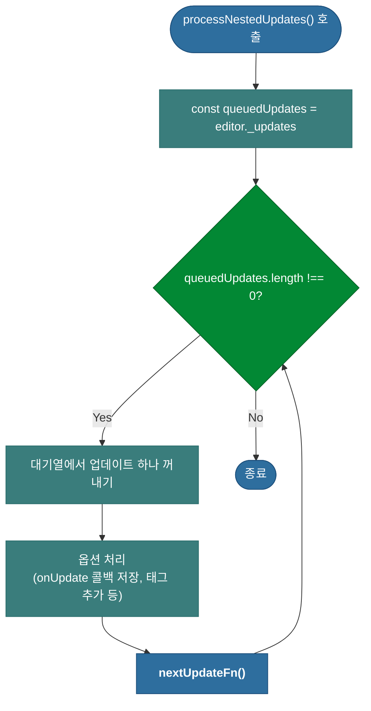
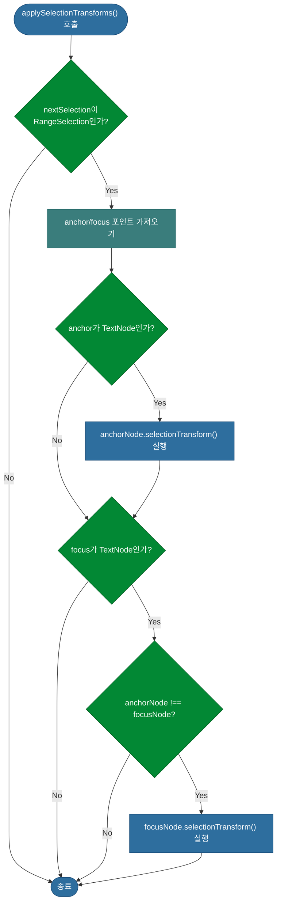
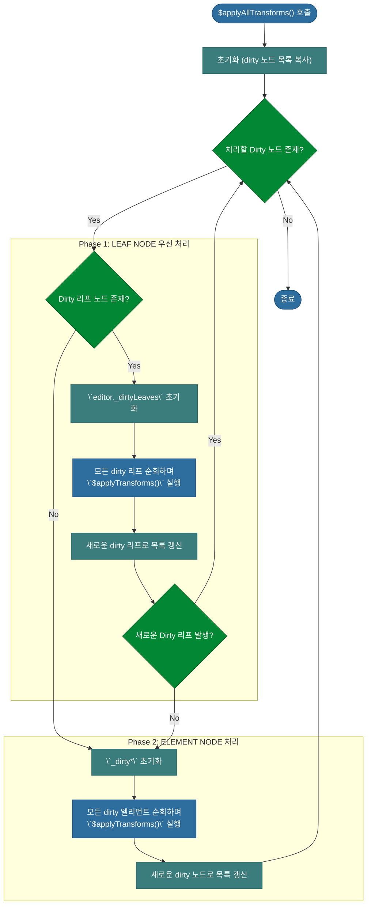
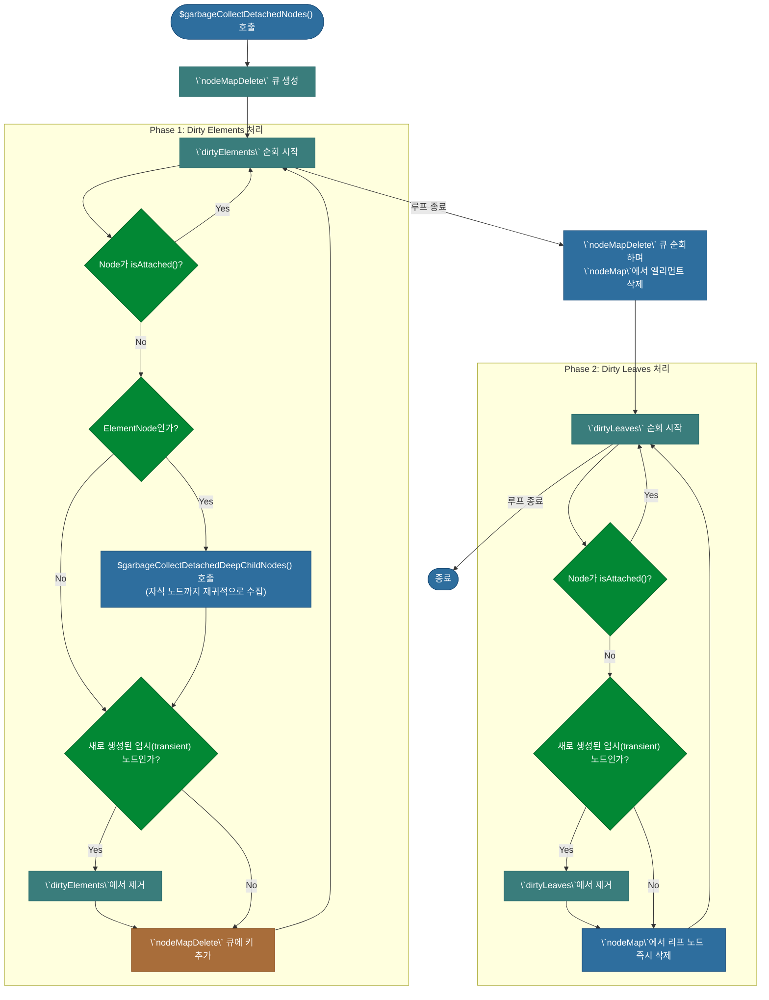

# 심층 분석 4.3: $beginUpdate 트랜잭션

**문서 상태**: `v1.0`

이 문서는 업데이트의 **트랜잭션을 관리**하고, 변경 사항을 적용하며, 최종 커밋 시점을 결정하는 컨트롤 타워인 `$beginUpdate` 함수와 그 내부에서 호출되는 핵심 함수들을 심층적으로 분석합니다.

-   **실제 코드 위치**: `packages/lexical/src/LexicalUpdates.ts`

---

## 1. 컨트롤러: `$beginUpdate`

**상세 분석**:

1.  **플래그 설정**: `options.discrete` 값을 `pendingEditorState._flushSync` 플래그에 저장하여 동기/비동기 커밋을 결정합니다.
2.  **`try` 블록**: `updateFn()`을 실행하여 **상태만 변경**하고, 이후 다양한 내부 함수를 호출하여 상태를 안정화시킵니다. (상세 내용은 섹션 2 참고)
3.  **`catch` 블록**: 에러 발생 시, 안전한 이전 상태로 롤백하고, 이 롤백된 상태를 DOM에 반영하기 위해 예외적으로 `$commitPendingUpdates`를 즉시 호출합니다.
4.  **최종 커밋 결정**: `finally` 이후, `_flushSync` 플래그 값을 확인하여 `$commitPendingUpdates()`를 즉시 호출할지(`true`), 마이크로태스크로 예약할지(`false`) 결정합니다.

---

## 2. `$beginUpdate`의 내부 핵심 함수 분석

`$beginUpdate`의 `try` 블록 내에서는 `updateFn` 실행 후, 상태를 안정시키고 정리하기 위해 여러 핵심 함수들이 특정 순서에 따라 호출됩니다.

### 2.1. `processNestedUpdates`

-   **역할**: `updateEditor`에 의해 `_updates` 대기열에 쌓인 중첩 업데이트들을 실행합니다.
-   **핵심 로직**: 대기열을 순회하며 각 `updateFn`을 **그 자리에서 직접 실행**하여 현재 트랜잭션에 병합합니다. **재귀적으로 `updateEditor`를 호출하지 않습니다.**

**상세 분석 (코드 기반)**:
- 함수가 시작되면, `editor._updates`에 저장된 대기열(배열)을 가져옵니다.
- `while` 루프를 통해 대기열에 항목이 없을 때까지 반복합니다.
- `queuedUpdates.shift()`를 사용하여 대기열의 가장 앞에 있는 업데이트(`[nextUpdateFn, options]`)를 꺼냅니다.
- `options`이 존재하면, `onUpdate` 콜백을 `editor._deferred` 배열에 추가하여 모든 업데이트가 끝난 후 실행되도록 예약합니다.
- **핵심**: `nextUpdateFn()`을 **직접 호출**하여, 큐에 있던 업데이트 로직을 현재 진행 중인 트랜잭션 내에서 즉시 실행합니다. 이로써 여러 업데이트가 하나의 큰 트랜잭션으로 합쳐지는 효과를 가집니다.

### 2.2. `applySelectionTransforms`

-   **역할**: 새로운 selection의 **anchor(시작점)와 focus(끝점)에 위치한 텍스트 노드**에 대해 `selectionTransform` 함수를 호출합니다.
-   **핵심 로직**: 선택된 모든 노드를 순회하는 것이 아니라, 오직 선택의 양 끝점에 있는 `TextNode`의 `selectionTransform()`을 호출하여 `MarkNode` 같은 특수 노드와의 상호작용을 처리합니다.

**상세 분석 (코드 기반)**:
- 새로운 에디터 상태(`nextEditorState`)와 이전 에디터 상태(`prevEditorState`)에서 각각의 선택(`selection`) 정보를 가져옵니다.
- 새로운 선택이 텍스트 범위를 나타내는 `$isRangeSelection`인지 확인합니다.
- 선택의 `anchor`(시작점)가 텍스트 노드 내부에 있다면(`.type === 'text'`), 해당 노드를 가져와 `.selectionTransform()` 메서드를 호출합니다.
- 선택의 `focus`(끝점)가 텍스트 노드 내부에 있고, anchor 노드와 다른 노드일 경우에만 focus 노드의 `.selectionTransform()`을 추가로 호출하여 중복 실행을 방지합니다.

### 2.3. `$applyAllTransforms`

-   **역할**: 'dirty'로 표시된 모든 노드에 등록된 변환 함수들을 더 이상 변경이 없을 때까지 반복적으로 적용하여 상태를 안정화(converge)시킵니다.
-   **핵심 로직**: **1. Leaf 노드 우선 처리 → 2. Element 노드 처리**의 2단계 우선순위를 가지며, 새로운 dirty leaf가 발생하면 즉시 1단계로 돌아가 리프 노드를 먼저 안정시킵니다.

#### Dirty Node의 종류와 전파

`$applyAllTransforms`의 동작을 이해하려면 'Dirty Node'의 두 가지 상태를 알아야 합니다.

-   **의도적으로 Dirty (Intentionally Dirty)**: `node.getWritable()` 또는 `node.markDirty()`가 직접 호출된 노드입니다. 이 상태는 연결 리스트 구조를 유지하기 위해 인접한 형제나 부모 노드로 전파될 수 있습니다.
-   **비의도적으로 Dirty (Unintentionally Dirty)**: Dirty 노드의 조상(ancestor)이지만, 직접 `markDirty`가 호출되지는 않은 `ElementNode`입니다. 리프 노드는 자식이 없으므로 이 상태가 될 수 없습니다.

#### 변환 휴리스틱 (Transform Heuristic)

Lexical은 더 이상 실행할 Transform이 없는 안정된 상태(고정점, fixed point)를 찾기 위해 다음의 휴리스틱을 사용합니다.

1.  **리프 노드 우선 처리**: 먼저 Dirty 리프 노드에 대한 모든 Transform을 실행합니다. 리프 노드를 수정하면 그 부모 엘리먼트들도 모두 Dirty 상태가 되기 때문에, 가장 말단의 노드부터 안정화시키는 것이 효율적입니다. 이 과정에서 새로운 Dirty 리프 노드가 발생하면, 다른 작업을 하기 전에 **이 단계를 다시 반복**합니다.
2.  **엘리먼트 노드 처리**: 더 이상 새로운 Dirty 리프가 발생하지 않으면, 의도적으로 Dirty 상태인 엘리먼트 노드들의 Transform을 실행합니다.
    -   만약 이 과정에서 새로운 Dirty **리프**가 발생하면, 즉시 **1단계로 돌아갑니다.**
    -   만약 새로운 Dirty **엘리먼트**만 발생하면, **2단계만 반복**합니다.

이러한 반복적인 과정을 통해 모든 노드 변환이 최종적으로 수렴되도록 보장합니다.

**상세 분석 (코드 기반)**:
- 함수가 시작되면, `editor._dirtyLeaves`와 `editor._dirtyElements`에 저장된 'dirty' 노드 목록을 가져와 `while` 루프를 시작합니다.
- **1단계 (리프 노드 처리)**: `untransformedDirtyLeaves` 목록을 순회하며 각 리프 노드에 대해 `$applyTransforms`를 실행합니다.
  - 이 과정에서 새롭게 dirty가 된 리프 노드는 `editor._dirtyLeaves`에 다시 쌓입니다.
  - 만약 새로운 dirty 리프가 하나라도 발생하면(`untransformedDirtyLeaves.size > 0`), `continue`를 통해 루프의 처음으로 돌아가 리프 노드 처리를 반복합니다.
- **2단계 (엘리먼트 노드 처리)**: 더 이상 새로운 dirty 리프가 발생하지 않으면, `untransformedDirtyElements` 목록을 순회하며 의도적으로 dirty로 마킹된 엘리먼트에 대해 `$applyTransforms`를 실행합니다.
- 이 `while` 루프는 새로운 dirty 리프나 엘리먼트가 더 이상 발생하지 않을 때까지, 즉 모든 노드 변환이 수렴될 때까지 계속됩니다.

### 2.4. `$garbageCollectDetachedNodes`

-   **역할**: 업데이트 과정에서 트리로부터 분리(detach)된 노드들을 `_nodeMap`에서 최종 제거하여 메모리 누수를 방지합니다(Garbage Collection).
-   **핵심 로직**: `isAttached()` 메서드로 노드가 트리에 연결되어 있는지 확인하고, 분리된 노드와 그 자손들을 모두 찾아 `_nodeMap`에서 삭제합니다. 엘리먼트 노드는 자손 순회 문제를 피하기 위해 큐에 담아 나중에 일괄 삭제합니다.

**상세 분석 (코드 기반)**:
- `dirtyElements` 목록을 먼저 순회합니다. 각 노드에 대해 `isAttached()`를 호출하여 트리에 연결되어 있는지 확인합니다.
- 만약 분리(detached)되었다면, 해당 노드가 ElementNode일 경우 `$garbageCollectDetachedDeepChildNodes`를 재귀적으로 호출하여 모든 자손 노드의 키를 `nodeMapDelete` 큐에 담습니다. 그 후, 자기 자신도 큐에 추가합니다.
- `dirtyElements` 순회가 끝나면, 큐에 담긴 모든 엘리먼트 키를 `nodeMap`에서 일괄적으로 삭제합니다. (바로 삭제하지 않고 큐를 사용하는 이유는, 순회 도중 자식 노드의 연결 정보를 참조해야 할 수 있기 때문입니다.)
- 마지막으로 `dirtyLeaves`를 순회하며, 분리된 리프 노드들을 `nodeMap`에서 즉시 삭제합니다.

