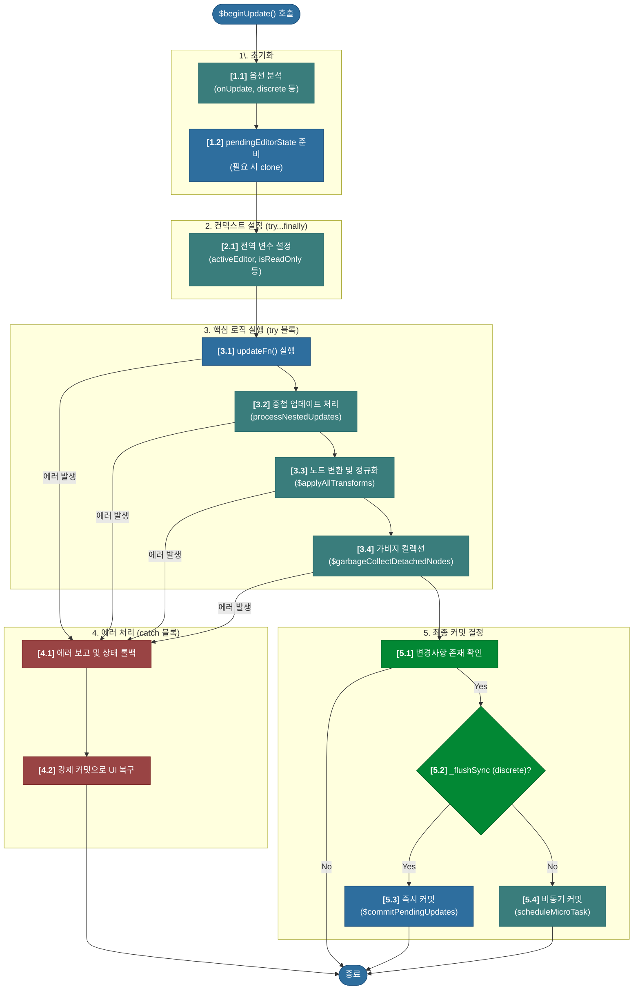

# 심층 분석 4.3: $beginUpdate 트랜잭션

**문서 상태**: `v1.1`
**변경 이력**:
- `v1.0`: 문서 초안 작성
- `v1.1`: `$beginUpdate` 함수의 단계별 상세 분석 및 핵심 로직 설명 보강.

이 문서는 업데이트의 **트랜잭션을 관리**하고, 변경 사항을 적용하며, 최종 커밋 시점을 결정하는 컨트롤 타워인 `$beginUpdate` 함수와 그 내부에서 호출되는 핵심 함수들을 심층적으로 분석합니다.

-   **실제 코드 위치**: `packages/lexical/src/LexicalUpdates.ts`

---

## 1. 개요: 업데이트의 컨트롤 타워

`$beginUpdate` 함수는 Lexical 업데이트 트랜잭션의 시작이자, 모든 변경을 조율하는 '컨트롤 타워'입니다. 이 함수는 무엇을 어떻게 변경할지 결정하고 준비하는 '두뇌' 역할을 수행합니다.

이 함수는 크게 5개의 명확한 단계로 구성됩니다.
1.  **초기화 및 `pendingEditorState` 준비**: 트랜잭션의 작업 공간을 준비합니다.
2.  **실행 컨텍스트 설정**: `$` 함수들이 올바르게 동작하도록 전역 상태를 설정합니다.
3.  **핵심 로직 실행**: 사용자가 요청한 변경사항을 적용하고, 데이터를 정규화합니다.
4.  **에러 처리 및 복구**: 로직 실행 중 에러 발생 시, 에디터를 안정적인 상태로 복구합니다.
5.  **최종 커밋 결정**: 모든 작업 완료 후, 변경사항을 최종 커밋할지, 언제 할지를 결정합니다.

---

## 2. 상세 워크플로우 (다이어그램)



---

## 3. 상세 분석 (코드 기반)

### 3.1. 1단계: 초기화 및 `pendingEditorState` 준비

가장 먼저, 전달받은 `options`를 처리하고, 이번 트랜잭션에서 사용할 '임시 작업 공간'인 `pendingEditorState`를 준비합니다.

```typescript
// packages/lexical/src/LexicalUpdates.ts -> $beginUpdate
function $beginUpdate(
  // ...
  options?: EditorUpdateOptions,
): void {
  // ...
  if (options !== undefined) {
    onUpdate = options.onUpdate;
    // ...
  }
  if (onUpdate) {
    editor._deferred.push(onUpdate);
  }
  // ...
  let pendingEditorState = editor._pendingEditorState;
  if (pendingEditorState === null || pendingEditorState._readOnly) {
    pendingEditorState = editor._pendingEditorState = cloneEditorState(
      pendingEditorState || currentEditorState,
    );
  }
  pendingEditorState._flushSync = discrete;
```

-   **`options` 처리**: `onUpdate` 콜백은 `_deferred` 배열에 저장되고, `discrete` 값은 `_flushSync` 플래그에 할당됩니다.
-   **`pendingEditorState` 준비**: **(핵심)** `pendingEditorState`가 없거나(`null`) 이미 커밋된 상태(`_readOnly`)이면, 현재 공식 상태(`currentEditorState`)를 복제하여 새로운 `pendingEditorState`를 만듭니다. **이것이 새로운 트랜잭션의 시작을 의미합니다.**

### 3.2. 2단계: 실행 컨텍스트 설정 (`try...finally`)

`updateFn`과 내부 함수들이 안전하게 실행될 수 있도록, 전역(module-level) 변수들을 설정합니다.

```typescript
// packages/lexical/src/LexicalUpdates.ts -> $beginUpdate
  // ... (previousActiveEditorState 등 컨텍스트 변수 백업)
  activeEditorState = pendingEditorState;
  isReadOnlyMode = false;
  editor._updating = true;
  activeEditor = editor;
  // ...
  try {
    // ... (실제 로직 실행)
  } finally {
    activeEditorState = previousActiveEditorState;
    // ... (모든 컨텍ċ스트 변수 복원)
  }
```

-   **컨텍스트 설정**: `activeEditorState`, `activeEditor` 등 전역 변수들을 이 트랜잭션에 맞게 설정합니다. 이 과정을 통해 `updateFn` 내부에서 `$getRoot()`와 같은 `$` 함수들이 올바른 `EditorState`에 접근할 수 있게 됩니다.
-   **`finally` 블록**: 성공하든 실패하든, `finally` 블록에서 백업해 둔 이전 값으로 모든 전역 변수를 완벽하게 복원하여 컨텍스트가 "오염"되는 것을 막습니다.

### 3.3. 3단계: 핵심 로직 실행 (`try` 블록 내부)

사용자 코드 실행, 내부 데이터 정규화, 가비지 컬렉션 등 모든 실제 작업이 이 안에서 순차적으로 일어납니다.

```typescript
// packages/lexical/src/LexicalUpdates.ts -> $beginUpdate
  try {
    if (editorStateWasCloned) {
      // ... (새로운 Selection 생성)
    }
    updateFn();
    skipTransforms = processNestedUpdates(editor, skipTransforms);
    applySelectionTransforms(pendingEditorState, editor);

    if (editor._dirtyType !== NO_DIRTY_NODES) {
      // ...
      $applyAllTransforms(pendingEditorState, editor);
      // ...
      processNestedUpdates(editor);
      $garbageCollectDetachedNodes(/* ... */);
    }
```

1.  **Selection 생성**: 새로운 트랜잭션일 경우, DOM으로부터 현재 선택(커서 위치 등)을 읽어와 새로운 `Selection` 객체를 생성합니다.
2.  **`updateFn()` 실행**: **(핵심)** 개발자가 작성한 `updateFn()`이 여기서 호출되어 모든 노드 변경이 발생합니다.
3.  **중첩 업데이트 처리**: `processNestedUpdates()`를 호출하여, `updateFn` 안에서 호출된 다른 `editor.update()`들을 처리합니다. ([상세 분석: 06_process_nested_updates.md](./06_process_nested_updates.md))
4.  **노드 변환 및 정규화**: `applySelectionTransforms()`, `$applyAllTransforms()`를 호출하여 Lexical 엔진이 내부적으로 데이터를 일관성 있게 만듭니다. ([상세 분석: 07_apply_all_transforms.md](./07_apply_all_transforms.md))
5.  **가비지 컬렉션**: `processNestedUpdates`와 `$applyAllTransforms`가 모두 완료된 후, `$garbageCollectDetachedNodes`를 호출하여 트리에서 분리된 노드를 메모리에서 정리합니다. 이 함수는 `node.isAttached()`를 사용해 노드가 루트에 연결되어 있는지 확인하고, 분리된 노드와 그 자손들을 `_nodeMap`에서 제거하여 메모리 누수를 방지합니다.

### 3.4. 4단계: 에러 처리 및 복구 (`catch` 블록)

`try` 블록에서 에러가 발생했을 때, 에디터가 깨지지 않고 이전의 안정적인 상태로 돌아가도록 보장합니다.

```typescript
// packages/lexical/src/LexicalUpdates.ts -> $beginUpdate
  } catch (error) {
    editor._onError(error);
    // ... (내부 상태를 이전 상태로 롤백)
    editor._pendingEditorState = currentEditorState;
    editor._dirtyType = FULL_RECONCILE;
    // ...
    $commitPendingUpdates(editor);
    return;
  }
```
-   **에러 보고**: `editor._onError`를 통해 에러를 외부에 보고합니다.
-   **상태 롤백 및 강제 커밋**: `_pendingEditorState`를 에러가 나기 전의 `currentEditorState`로 되돌리고, `_dirtyType`을 `FULL_RECONCILE`(전체 재조정)로 설정한 뒤, 즉시 `$commitPendingUpdates`를 호출하여 UI를 안정적인 상태로 강제 복구합니다.

### 3.5. 5단계: 최종 커밋 결정

모든 로직이 성공적으로 끝난 후, 이 트랜잭션의 결과를 최종적으로 커밋할지, 언제 할지를 결정합니다.

```typescript
// packages/lexical/src/LexicalUpdates.ts -> $beginUpdate
  const shouldUpdate = /* ... */;
  if (shouldUpdate) {
    if (pendingEditorState._flushSync) {
      $commitPendingUpdates(editor);
    } else if (editorStateWasCloned) {
      scheduleMicroTask(() => {
        $commitPendingUpdates(editor);
      });
    }
  } else {
    // ... (변경사항이 없으면 pendingEditorState 폐기)
  }
```

-   **`shouldUpdate`**: 실제 노드 변경, `onUpdate` 콜백, 또는 선택 영역 변경 중 하나라도 있으면 커밋이 필요하다고 판단합니다.
-   **동기 커밋**: `_flushSync`가 `true`이면(`{ discrete: true }` 옵션), `$commitPendingUpdates`를 **즉시 호출**합니다.
-   **비동기 커밋**: `_flushSync`가 `false`이고 새로운 트랜잭션이었다면, `$commitPendingUpdates`를 **마이크로태스크로 예약**합니다. (일반적인 경우)
-   **변경 없음**: 아무런 변경이 없었다면, 불필요한 커밋을 막고 생성했던 `pendingEditorState`를 폐기합니다. 