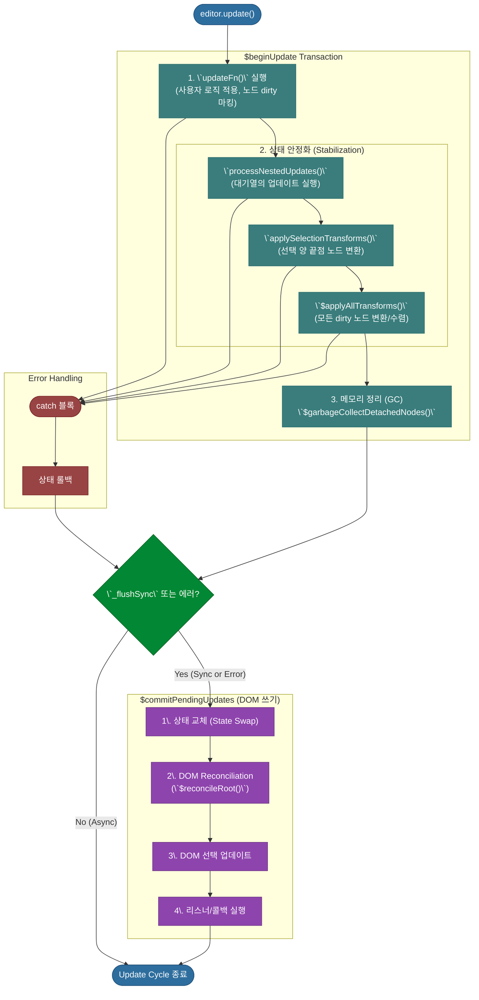
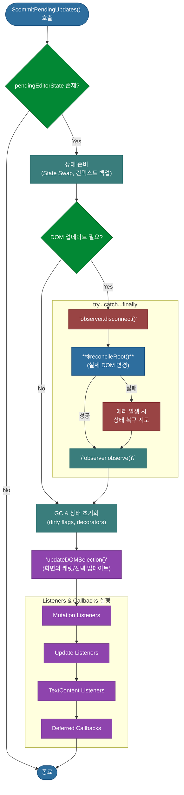

# 심층 분석 4.4: 최종 커밋 및 DOM 반영

**문서 상태**: `v1.0`

이 문서는 `$beginUpdate` 트랜잭션의 결과를 실제 DOM에 반영하고, 변경 사항을 외부에 전파하는 최종 단계인 `$commitPendingUpdates` 함수와 전체 워크플로우를 상세히 분석합니다.

-   **실제 코드 위치**: `packages/lexical/src/LexicalUpdates.ts`

---

## 1. 통합 워크플로우: `$beginUpdate` & `$commitPendingUpdates`

아래 다이어그램은 업데이트의 시작부터 DOM 반영까지 모든 함수들이 어떻게 하나의 거대한 트랜잭션으로 통합되어 동작하는지 보여줍니다.

---

## 2. 심장부: `$commitPendingUpdates`

모든 가상적 변경사항을 실제 DOM에 반영하고, 변경 사실을 외부에 전파하는 최종 단계입니다. 이 함수는 크게 **1) 상태 준비, 2) DOM 조작(Reconciliation), 3) 후속 처리(Listeners/Callbacks)** 3단계의 명확한 파이프라인으로 구성됩니다.

### 2.1. 상세 분석 (코드 기반)

**1단계: 상태 준비 및 사전 검사**
- 함수가 호출되면, 가장 먼저 처리할 `pendingEditorState`가 있는지 확인하고 없으면 즉시 종료합니다.
- `headless` 모드 여부 등을 판단하여 DOM 조작을 건너뛸지(`shouldSkipDOM`) 결정합니다.
- **핵심 동작**: `editor._pendingEditorState`를 `null`로 만들고, 그 값을 `editor._editorState`로 옮겨, `pending` 상태를 공식적인 현재 상태로 **승격**시킵니다.
- 이후의 모든 DOM 조작은 이 새로운 `_editorState`와 커밋 직전의 `currentEditorState`를 비교하여 이루어집니다.

**2단계: DOM 조작 (Reconciliation)**
- 이 단계는 `!shouldSkipDOM`이고, 실제로 변경된 노드(`needsUpdate`)가 있을 때만 실행됩니다.
- **`try...catch...finally`** 블록으로 안전하게 감싸여 있습니다.
  - **`try`**:
    - 가장 먼저, Lexical의 DOM 변경을 감지하는 `MutationObserver`를 `disconnect()`하여 DOM 조작 중 불필요한 이벤트 발생을 막습니다.
    - **`$reconcileRoot()` 함수를 호출**합니다. 이 함수가 실질적인 DOM 렌더링을 담당하며, `currentEditorState`와 새로운 `_editorState`를 비교하여 변경이 필요한 최소한의 노드만 생성/수정/삭제합니다.
  - **`catch`**: `reconcile` 과정에서 에러가 발생하면, Lexical은 이전의 안정적인 상태(`currentEditorState`)로 에디터를 복구하려고 시도합니다. 이 복구마저 실패하면, 무한 루프를 방지하기 위해 에러를 던집니다.
  - **`finally`**: 성공하든 실패하든, `MutationObserver`를 다시 `observe()`하여 에디터가 다음 변경을 감지할 수 있도록 합니다.

**3단계: 후속 처리 (Listeners, Callbacks, GC)**
- 모든 DOM 작업이 완료된 후, 마무리 작업들을 수행합니다.
- **상태 초기화**: 다음 업데이트 사이클을 위해 `_dirtyType`, `_dirtyLeaves` 등 'dirty' 관련 상태를 모두 깨끗하게 초기화합니다.
- **가비지 컬렉션(GC)**: `$garbageCollectDetachedDecorators`를 호출하여 더 이상 사용되지 않는 데코레이터 노드를 메모리에서 정리합니다.
- **DOM 선택 업데이트**: `updateDOMSelection()`을 통해 가상의 선택 정보를 실제 브라우저의 파란색 하이라이트(캐럿)에 반영합니다.
- **리스너 실행**: 모든 변경이 완료되었음을 시스템의 다른 부분에 알리기 위해, 아래 순서로 각종 리스너와 콜백을 트리거합니다.
  1.  **Mutation Listeners**: DOM 노드의 직접적인 추가/제거/변경을 감지합니다.
  2.  **Update Listeners**: 에디터 상태 객체(`EditorState`) 자체가 변경되었음을 알립니다.
  3.  **TextContent Listeners**: 에디터의 텍스트 콘텐츠가 변경되었을 때 호출됩니다.
  4.  **Deferred Callbacks**: `editor.update()`의 `onUpdate` 콜백처럼, 모든 작업이 끝난 후 실행되도록 예약된 함수들을 실행합니다.

### 2.2. 시각 자료

