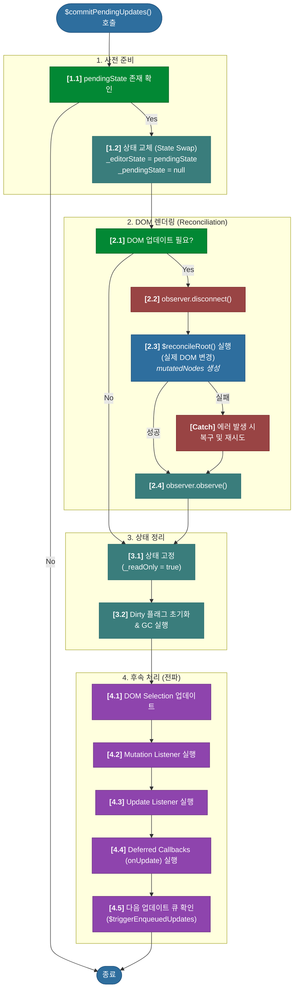

# 심층 분석 4.4: 최종 커밋 및 DOM 반영

**문서 상태**: `v1.2`
**변경 이력**:
- `v1.0`: 문서 초안 작성
- `v1.1`: `$commitPendingUpdates` 함수의 단계별 상세 분석 및 핵심 로직 설명 보강.
- `v1.2`: 상세 워크플로우를 시각화한 Mermaid 다이어그램 추가.

이 문서는 `$beginUpdate` 트랜잭션의 결과를 실제 DOM에 반영하고, 변경 사항을 외부에 전파하는 최종 단계인 `$commitPendingUpdates` 함수와 전체 워크플로우를 상세히 분석합니다.

-   **실제 코드 위치**: `packages/lexical/src/LexicalUpdates.ts`

---

## 1. 개요: 업데이트 사이클의 심장부

`$commitPendingUpdates` 함수는 Lexical 업데이트 사이클의 "심장부"입니다. `editor.update()`를 통해 메모리 상에서 계산된 모든 변경사항(`_pendingEditorState`)을 실제 DOM에 반영하고, 이 변경 사실을 시스템의 다른 부분에 알리는 역할을 합니다.

이 함수는 크게 4개의 명확한 단계로 구성됩니다.
1.  **사전 준비 및 상태 교체 (State Swap)**: 업데이트를 진행할지 결정하고, 임시 상태를 공식 상태로 승격시킵니다.
2.  **DOM 렌더링 (Reconciliation)**: 변경된 내용을 실제 DOM에 렌더링합니다.
3.  **상태 고정 및 내부 정리**: 새로운 상태를 불변(immutable)으로 만들고, 다음 업데이트를 위해 내부 상태를 정리합니다.
4.  **후속 처리 (Listeners & Callbacks)**: 모든 변경이 완료되었음을 리스너와 콜백을 통해 외부에 전파합니다.

---

## 2. 상세 워크플로우 (다이어그램)



---

## 3. 상세 분석 (코드 기반)

### 3.1. 1단계: 사전 준비 및 상태 교체 (State Swap)

가장 먼저, 커밋을 진행할 조건이 되는지 확인하고, 업데이트의 핵심 단계인 "상태 교체"를 수행합니다.

```typescript
// packages/lexical/src/LexicalUpdates.ts -> $commitPendingUpdates

export function $commitPendingUpdates(
  editor: LexicalEditor,
  recoveryEditorState?: EditorState,
): void {
  const pendingEditorState = editor._pendingEditorState;
  const rootElement = editor._rootElement;
  const shouldSkipDOM = editor._headless || rootElement === null;

  if (pendingEditorState === null) {
    return;
  }
// ...
  const currentEditorState = editor._editorState;
  // ...
  const needsUpdate = editor._dirtyType !== NO_DIRTY_NODES;
  // ...
  editor._pendingEditorState = null;
  editor._editorState = pendingEditorState;
```

-   **`recoveryEditorState?`**: (선택적) 렌더링 과정에서 오류가 발생했을 때, 리스너들에게 `prevEditorState`로 전달할 복구용 상태입니다. 평소에는 `undefined`입니다.
-   **사전 검사**: `pendingEditorState`가 없으면 아무 작업도 하지 않고 즉시 함수를 종료합니다. `headless` 모드이거나 루트 요소가 없으면 DOM 관련 작업을 건너뜁니다.
-   **상태 교체 (State Swap)**:
    - `editor._editorState`(현재 공식 상태)를 `currentEditorState` 변수에 백업합니다.
    - **(핵심)** `editor._pendingEditorState`를 `null`로 만들어, 이제부터 들어오는 `editor.update()`는 새로운 트랜잭션을 시작하도록 합니다.
    - **(핵심)** 임시 상태였던 `pendingEditorState`를 공식 `editor._editorState`로 승격시킵니다. 이제 이 함수의 목표는 실제 DOM을 이 새로운 `_editorState`와 똑같이 만드는 것입니다.

### 3.2. 2단계: DOM 렌더링 (Reconciliation)

실제로 DOM을 조작하는 가장 중요하고 위험한 단계입니다. `try...catch...finally`로 안전하게 보호되어 있습니다.

```typescript
// packages/lexical/src/LexicalUpdates.ts -> $commitPendingUpdates

  if (!shouldSkipDOM && needsUpdate && observer !== null) {
    // ...
    editor._updating = true;
    try {
      observer.disconnect();

      mutatedNodes = $reconcileRoot(/* ... */);
    } catch (error) {
      if (!isAttemptingToRecoverFromReconcilerError) {
        // ...
        $commitPendingUpdates(editor, currentEditorState);
      }
      // ...
    } finally {
      observer.observe(rootElement, observerOptions);
      // ...
    }
  }
```

-   **`editor._updating = true`**: 이 플래그는 DOM 렌더링 과정이 다른 동기적 업데이트에 의해 중단되지 않도록 보호합니다.
-   **`observer.disconnect()`**: **(핵심)** `MutationObserver`를 일시 중지합니다. Lexical이 스스로 DOM을 변경하는 동안, 그 변경을 스스로 감지하여 또 다른 업데이트를 유발하는 **무한 루프를 방지**하기 위한 필수적인 안전장치입니다.
-   **`$reconcileRoot()`**: **(핵심)** 이 함수가 이전 상태(`currentEditorState`)와 새로운 공식 상태(`_editorState`)를 비교하여, 변경이 필요한 최소한의 DOM 노드만 수정/추가/삭제하는 **실제 렌더링**을 수행합니다. 변경된 노드 정보는 `mutatedNodes`에 저장됩니다.
-   **`catch` 블록**: 렌더링 중 에러가 발생하면, 에디터를 초기화하고 다시 커밋을 시도(`$commitPendingUpdates(editor, currentEditorState)`)하여 에디터를 복구하려고 시도합니다. 이때 `recoveryEditorState`에 이전 상태를 넘겨주어, 리스너들이 올바른 `prevEditorState`를 받을 수 있도록 보장합니다.
-   **`finally` 블록**: 에러 발생 여부와 상관없이, 다시 `observer.observe()`를 호출하여 에디터가 다음 사용자 입력을 감지할 수 있도록 `MutationObserver`를 재활성화합니다.

---

### **3.3. 핵심 동작 원리: DOM Reconciliation 심층 분석**

`$commitPendingUpdates`의 심장부인 `$reconcileRoot`는 `EditorState`의 변경사항을 실제 DOM에 반영하는 렌더링 엔진의 시작점입니다.

이 과정은 '지휘관' 역할을 하는 `$reconcileRoot`와 '실행자' 역할을 하는 `$reconcileNode`의 긴밀한 협력을 통해, **"변경되지 않은 것은 건드리지 않는다"**는 핵심 원칙하에 최소한의 비용으로 수행됩니다.

> 더 상세한 Reconciliation 동작 원리와 코드 분석은 **[09_dom_reconciliation_deep_dive.md](./09_dom_reconciliation_deep_dive.md)** 문서를 참고하세요.

---

### 3.4. 3단계: 상태 고정 및 내부 정리

DOM 렌더링이 끝나면, 새로운 상태를 불변(immutable)으로 만들고 다음 업데이트를 위해 내부 상태를 정리합니다.

```typescript
// packages/lexical/src/LexicalUpdates.ts -> $commitPendingUpdates

  if (!pendingEditorState._readOnly) {
    pendingEditorState._readOnly = true;
    if (__DEV__) {
      // ... (Object.freeze로 객체를 얼려 불변성 강제)
    }
  }
// ...
  if (needsUpdate) {
    editor._dirtyType = NO_DIRTY_NODES;
    // ... (모든 dirty* 상태를 깨끗하게 초기화)
  }
  $garbageCollectDetachedDecorators(editor, pendingEditorState);
```

-   **`_readOnly = true`**: 새로운 `_editorState`가 된 `pendingEditorState`의 `_readOnly` 플래그를 `true`로 설정하여, 이 상태는 더 이상 수정될 수 없음을 공식화합니다. 개발 모드에서는 `Object.freeze`를 통해 이를 더욱 강력하게 강제합니다.
-   **내부 상태 초기화**: 다음 업데이트 사이클을 위해 모든 'dirty' 관련 상태(어떤 노드가 변경되었는지 표시하는 플래그)를 깨끗하게 초기화합니다.
-   **가비지 컬렉션**: 더 이상 DOM 트리에 붙어있지 않은 데코레이터 노드를 메모리에서 정리합니다.

### 3.5. 4단계: 후속 처리 - 리스너 및 콜백 실행

모든 상태와 DOM 변경이 완료되었음을 시스템의 다른 부분에 전파하는 마지막 단계입니다.

```typescript
// packages/lexical/src/LexicalUpdates.ts -> $commitPendingUpdates

  // ... (DOM Selection 업데이트 로직) ...

  if (mutatedNodes !== null) {
    triggerMutationListeners(/* ... */);
  }
  // ...
  triggerTextContentListeners(/* ... */);

  triggerListeners('update', editor, true, { /* ... */ });
  
  triggerDeferredUpdateCallbacks(editor, deferred);
  
  $triggerEnqueuedUpdates(editor);
```
-   **DOM Selection 업데이트**: 사용자의 커서 위치나 하이라이트 등 시각적인 선택 영역을 실제 DOM에 반영합니다.
-   **리스너/콜백 호출 순서**:
    1.  **`triggerMutationListeners`**: `registerMutationListener`로 등록된 리스너들을 호출합니다.
    2.  **`triggerTextContentListeners`**: `registerTextContentListener`로 등록된 리스너들을 호출합니다.
    3.  **`triggerListeners('update', ...)`**: **(핵심)** 가장 일반적인 `registerUpdateListener`의 콜백들을 여기서 실행합니다. 이때 `prevEditorState`로는 `recoveryEditorState`나 `currentEditorState`를, `editorState`로는 새로운 공식 상태인 `pendingEditorState`를 전달합니다.
    4.  **`triggerDeferredUpdateCallbacks`**: **(핵심)** `registerUpdateListener`까지 모두 실행된 후, `editor.update`의 `onUpdate` 옵션으로 전달되었던 콜백들(`deferred` 배열)을 가장 마지막에 실행합니다.
    5.  **`$triggerEnqueuedUpdates`**: 이 커밋이 진행되는 동안 `editor._updates` 큐에 새로 쌓인 업데이트가 있다면, 다음 업데이트 사이클을 여기서 시작합니다. 