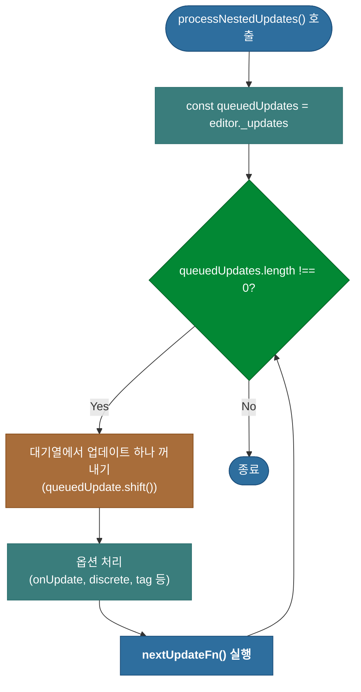

# 심층 분석 4.5: 중첩 업데이트 처리 (`processNestedUpdates`)

**문서 상태**: `v1.0`

이 문서는 `$beginUpdate` 트랜잭션 진행 중에 추가로 요청된 업데이트(중첩 업데이트)들을 처리하는 핵심 함수 `processNestedUpdates`의 내부 동작을 심층적으로 분석합니다.

-   **실제 코드 위치**: `packages/lexical/src/LexicalUpdates.ts`

---

## 1. 개요: 업데이트 병합기

`processNestedUpdates` 함수는 `editor.update()` 트랜잭션이 실행되는 도중에 추가로 `editor.update()`가 호출될 경우, 이 요청들을 즉시 실행하지 않고 `editor._updates`라는 대기열(Queue)에 쌓아둡니다. `processNestedUpdates`는 이 대기열을 순차적으로 비우면서, 쌓여있던 모든 업데이트 함수를 현재 진행 중인 트랜잭션 내에서 실행하여 **하나의 원자적 업데이트로 병합**하는 역할을 합니다.



---

## 2. 상세 분석 (코드 기반)

### 2.1. 1단계: 초기화 및 루프 시작

대기열(`_updates`)을 가져와서, 이 대기열이 완전히 비워질 때까지 `while` 루프를 실행합니다.

```typescript
// packages/lexical/src/LexicalUpdates.ts -> processNestedUpdates
function processNestedUpdates(
  editor: LexicalEditor,
  initialSkipTransforms?: boolean,
): boolean {
  const queuedUpdates = editor._updates;
  // ...
  while (queuedUpdates.length !== 0) {
    // ...
  }
  // ...
}
```
-   **`const queuedUpdates = editor._updates`**: `editor._updates`에 저장된 업데이트 대기열(배열)의 참조를 가져옵니다.
-   **`while (queuedUpdates.length !== 0)`**: 대기열이 완전히 빌 때까지 루프를 계속합니다. 루프 실행 중에 새로운 중첩 업데이트가 대기열에 추가될 수 있으므로, 이 조건은 모든 중첩 작업이 처리됨을 보장합니다.

### 2.2. 2단계: 대기열에서 작업 꺼내기 및 처리

루프의 각 반복마다, 대기열의 가장 앞에 있는 작업을 하나씩 꺼내서 처리합니다.

```typescript
// packages/lexical/src/LexicalUpdates.ts -> processNestedUpdates
    const queuedUpdate = queuedUpdates.shift();
    if (queuedUpdate) {
      const [nextUpdateFn, options] = queuedUpdate;

      if (options !== undefined) {
        if (options.discrete) {
          pendingEditorState._flushSync = true;
        }
        if (onUpdate) {
          editor._deferred.push(onUpdate);
        }
        addTags(editor, options.tag);
      }

      nextUpdateFn();
    }
```
-   **`queuedUpdates.shift()`**: 대기열의 첫 번째 작업(`[nextUpdateFn, options]`)을 꺼냅니다.
-   **`options` 처리**: `options`가 존재하면, `discrete`, `onUpdate`, `tag` 등 관련 옵션을 현재 트랜잭션에 반영합니다. 예를 들어, `discrete: true`가 하나라도 포함되어 있었다면, 전체 트랜잭션은 동기적으로 커밋됩니다.
-   **`nextUpdateFn()` 실행**: **(핵심)** 꺼내온 업데이트 함수 `nextUpdateFn()`을 **그 자리에서 직접 호출**합니다. 이 호출을 통해 중첩된 업데이트의 로직이 현재 진행 중인 트랜잭션에 즉시 병합됩니다. 이는 새로운 트랜잭션을 시작하는 것이 아니라, 기존 트랜잭션의 일부가 되는 것입니다.

### 2.3. 3단계: 최종 값 반환

루프가 모두 끝나면, 최종적으로 결정된 `skipTransforms` 값을 반환합니다.

```typescript
// packages/lexical/src/LexicalUpdates.ts -> processNestedUpdates
  return skipTransforms;
}
```
-   처리된 모든 중첩 업데이트 중 하나라도 `skipTransforms: true` 옵션을 가지고 있었다면, 최종적으로 `true`가 반환되어 `$beginUpdate`의 `$applyAllTransforms` 단계 실행 여부에 영향을 줍니다. 