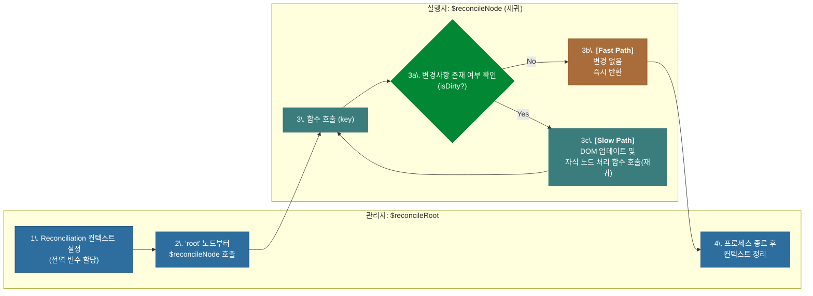
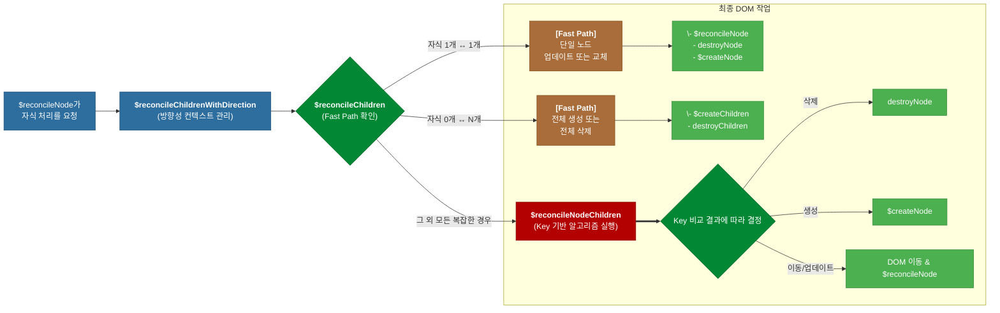

# 심층 분석 4.8: DOM Reconciliation 심층 분석

**문서 상태**: `v1.3` (비유 제거 및 기술용어 중심으로 수정)

이 문서는 Lexical의 **렌더링 엔진** 핵심인 Reconciliation(조정) 프로세스를 심층적으로 분석합니다. `$commitPendingUpdates`가 커밋을 결정하면, 실제로 어떻게 `EditorState`의 변경사항이 최소한의 비용으로 실제 DOM에 반영되는지를 설명합니다.

-   **핵심 관련 파일**: `packages/lexical/src/LexicalReconciler.ts`

---

## 1. 개요: 계층적 Reconciliation 모델

Lexical의 Reconciliation은 최상위 관리 함수인 `$reconcileRoot`와 재귀적으로 실행되는 `$reconcileNode`의 명확한 역할 분담을 통해 동작합니다.

-   **`$reconcileRoot`**: 실제 DOM을 직접 조작하지 않습니다. 대신, Reconciliation에 필요한 모든 전역 상태(컨텍스트)를 설정하고, 루트 노드부터 `$reconcileNode`를 호출하여 전체 프로세스를 시작하며, 모든 작업이 끝난 후 컨텍스트를 정리하는 **관리자(Manager)** 역할을 합니다.
-   **`$reconcileNode`**: 특정 노드(`key`) 하나를 책임지며, 이전 상태와 새 상태를 비교하여 실제 DOM을 수정하고, 해당 노드가 자식을 가질 경우 자식 노드 처리를 위한 함수들(`$reconcileChildrenWithDirection` 등)을 호출하는 **실행자(Executor)** 역할을 합니다.



---

## 2. `$reconcileRoot`: Reconciliation 컨텍스트 관리자

`$reconcileRoot`의 모든 코드는 `$reconcileNode`가 최적의 환경에서 임무를 수행할 수 있도록 지원하는 데 초점이 맞춰져 있습니다.

### 2.1. 1단계: 컨텍스트 설정

> **논리**: 이어지는 모든 `$reconcileNode` 함수 호출에서 공통적으로 사용될 상태(이전/다음 NodeMap, dirty 정보 등)를 모듈 범위의 전역 변수에 할당하여 컨텍스트를 공유합니다.

```typescript
// packages/lexical/src/LexicalReconciler.ts -> $reconcileRoot

// Reconciliation 과정에서 공유될 전역 변수(컨텍스트)를 설정합니다.
subTreeTextContent = '';
treatAllNodesAsDirty = dirtyType === FULL_RECONCILE;
activeEditor = editor;
activePrevNodeMap = prevEditorState._nodeMap; // 이전 상태 NodeMap
activeNextNodeMap = nextEditorState._nodeMap; // 새 상태 NodeMap
activeDirtyElements = dirtyElements; // dirty 엘리먼트 목록
activeDirtyLeaves = dirtyLeaves;     // dirty 리프 목록

// 변경된 노드를 기록할 mutatedNodes 맵을 초기화합니다.
const currentMutatedNodes = new Map();
mutatedNodes = currentMutatedNodes;
```

### 2.2. 2단계: 프로세스 시작

> **논리**: 'root' 노드부터 `$reconcileNode`를 호출하여 전체 DOM 트리 순회 및 Reconciliation 프로세스를 시작합니다.

```typescript
$reconcileNode('root', null);
```

### 2.3. 3단계: 컨텍스트 정리

> **논리**: Reconciliation이 끝난 후, 전역 변수에 할당된 모든 참조를 해제하여 메모리 누수를 방지하고 다음 프로세스와의 충돌을 막습니다.

```typescript
// 사용했던 모든 전역 변수의 참조를 해제합니다.
// @ts-ignore
activeEditor = undefined;
// ... (다른 모든 active* 변수들도 동일하게 정리) ...
```

---

## 3. `$reconcileNode`: 개별 노드 실행자

`$reconcileNode`는 특정 `key`의 노드를 책임지며, **"상태 비교 → DOM 조작 → 자식 노드 처리 위임"** 흐름을 따릅니다.

### 3.1. 1단계: 상태 비교

> **논리**: 내가 처리할 노드(`key`)의 이전 상태와 다음 상태를 가져오고, 이 노드가 변경 대상(`isDirty`)인지 확인합니다.

```typescript
// ...
const prevNode = activePrevNodeMap.get(key);
let nextNode = activeNextNodeMap.get(key);

const isDirty =
  treatAllNodesAsDirty ||
  activeDirtyLeaves.has(key) ||
  activeDirtyElements.has(key);

const dom = getElementByKeyOrThrow(activeEditor, key);
```

### 3.2. 2단계: 빠른 경로 최적화 (Bail-out)

> **논리**: 노드 인스턴스가 동일하고 dirty로 표시되지도 않았다면, 아무 변경도 필요 없으므로 즉시 함수를 종료하여 불필요한 연산을 막습니다.

```typescript
if (prevNode === nextNode && !isDirty) {
  // ... (캐시 업데이트) ...
  return dom; // 기존 DOM을 그대로 반환하며 종료.
}
```

### 3.3. 3단계: DOM 조작

> **논리**: 변경이 필요하면, `updateDOM` 메서드를 호출하여 최소한의 DOM 변경을 적용하고, 그 결과를 `mutatedNodes`에 기록합니다.

```typescript
if (prevNode !== nextNode && isDirty) {
  setMutatedNode(mutatedNodes, ..., nextNode, 'updated');
}

if (nextNode.updateDOM(prevNode, dom, activeEditorConfig)) {
  const replacementDOM = $createNode(key, null);
  parentDOM.replaceChild(replacementDOM, dom);
  // ...
  return replacementDOM;
}
```

### 3.4. 4단계: 자식 노드 처리 위임

> **논리**: 현재 노드가 자식을 가질 수 있는 `ElementNode`이고 변경이 필요한 경우, 자식 목록을 처리하는 전문 함수(`$reconcileChildrenWithDirection`)를 호출합니다.

```typescript
if ($isElementNode(prevNode) && $isElementNode(nextNode)) {
  // ... (자체 DOM 상태 업데이트) ...
  if (isDirty) {
    $reconcileChildrenWithDirection(prevNode, nextNode, dom);
  }
}
```

---

## 4. 자식 노드 Reconciliation 엔진

`ElementNode`의 자식 목록을 처리하는 작업은 3단계의 계층적 함수 호출을 통해 효율적으로 수행됩니다.

### 4.1. 3단계 계층 구조 다이어그램



### 4.2. 함수별 역할

1.  **`$reconcileChildrenWithDirection`**: Reconciliation을 위한 격리된 실행 컨텍스트를 제공합니다. 실제 비교 로직을 직접 수행하기보다는, 텍스트 방향성(RTL/LTR) 계산에 필요한 전역 변수를 초기화하고 정리하는 역할을 합니다.

2.  **`$reconcileChildren`**: 가장 빈번하게 발생하는 간단한 시나리오들(자식 1개 변경, 전체 추가/삭제)을 먼저 처리하는 **빠른 경로(Fast Path)** 를 제공하여, 비용이 비싼 전체 비교 알고리즘의 실행을 최소화합니다.

3.  **`$reconcileNodeChildren`**: 추가, 삭제, 이동이 복잡하게 얽힌 자식 목록의 변경을 처리하는 핵심 **Diffing 알고리즘**입니다. 각 노드의 `key`를 기반으로 두 목록을 비교하여 최소한의 DOM 조작(삭제, 생성, 이동)을 계산합니다.

    ```mermaid
    graph LR
        classDef decision fill:#028834,stroke:#015F24,color:#fff;
        classDef action fill:#A86D3A,stroke:#884D1A,color:#fff;
        classDef pointer fill:#2E6E9E,stroke:#1C4E7A,color:#fff;
        classDef process fill:#607D8B,stroke:#455A64,color:#fff;
    
        Start("<b>두 포인터(prev, next)가<br/>각 배열의 시작점에 위치</b>") --> Loop{"<b>While</b> (두 포인터가 모두<br/>배열 범위 내에 있는가?)"};
        
        Loop -- "<b>No<br/>(루프 종료)</b>" --> PostLoop{"후처리: 남은 노드가<br/>있는가?"};
        PostLoop -- "새 목록에 남음" --> CreateRest["[일괄 생성]<br/>$createChildren"];
        PostLoop -- "이전 목록에 남음" --> DestroyRest["[일괄 파괴]<br/>destroyChildren"];
        CreateRest --> End(["완료"]);
        DestroyRest --> End(["완료"]);
    
        Loop -- "<b>Yes<br/>(루프 계속)</b>" --> Q1{"1\. 두 포인터가 가리키는<br/><b>Key가 일치</b>하는가?"};
        
        Q1 -- "<b>Yes</b>" --> A1["<b>[수정]</b><br/>$reconcileNode"];
        A1 --> P1["양쪽 포인터 이동<br/>(prev++, next++)"];
    
        Q1 -- "<b>No</b>" --> Q2{"2\. 이전 Key가<br/><b>'새 목록 전체'</b>에 없는가?"};
        
        Q2 -- "<b>Yes</b>" --> A2["<b>[삭제]</b><br/>destroyNode"];
        A2 --> P2["'이전' 포인터만 이동<br/>(prev++)"];
        
        Q2 -- "<b>No</b>" --> Q3{"3\. 다음 Key가<br/><b>'이전 목록 전체'</b>에 없는가?"};
    
        Q3 -- "<b>Yes</b>" --> A3["<b>[생성]</b><br/>$createNode"];
        A3 --> P3["'다음' 포인터만 이동<br/>(next++)"];
        
        Q3 -- "<b>No</b>" --> A4["<b>[이동]</b><br/>DOM을 현재 위치로 이동"];
        A4 --> P1;
    
        P1 --> Loop;
        P2 --> Loop;
        P3 --> Loop;
    
        class Start,End process;
        class Q1,Q2,Q3,Loop,PostLoop decision;
        class A1,A2,A3,A4,CreateRest,DestroyRest action;
        class P1,P2,P3 pointer;
    ```

#### 4.2.4. Key 기반 알고리즘 심층 탐구: 4가지 핵심 동작 예시

`$reconcileNodeChildren`의 핵심 알고리즘은 실제로는 여러 단계를 거쳐 최소한의 DOM 조작을 계산합니다. 단순한 두 포인터 비교 방식은 `이동(Move)`이 없는 간단한 경우에 유효하지만, 실제 복잡한 변경을 처리하기 위해서는 다음과 같이 더 정교한 **3단계 접근법**을 사용합니다.

-   **1단계: 선형 비교 (Linear Scan):** 목록의 시작 부분에서 키가 일치하는 노드들을 찾아 업데이트합니다. 불일치가 발생하는 즉시 중단합니다.
-   **2단계: 이동 및 생성 (Move & Create):** 남은 이전 노드들을 `Map`에 저장해 빠르게 찾을 수 있도록 준비합니다. 그 후, 남은 새 노드 목록을 순회하며, `Map`에 키가 존재하면 **이동**으로, 존재하지 않으면 **생성**으로 처리합니다.
-   **3단계: 삭제 (Deletion):** 2단계가 끝난 후에도 `Map`에 여전히 남아있는 노드는 새 목록에 없다는 의미이므로, 모두 **삭제**합니다.

이 알고리즘이 어떻게 4가지 핵심 동작(수정, 생성, 이동, 삭제)을 모두 처리하는지 6개의 아이템을 가진 예시로 살펴보겠습니다. 각 단계에서 포인터가 가리키는 항목은 **굵은 글씨**로 표시합니다.

---
##### **시작 상태**
-   `이전 목록`: `[ A, B, C, D, E, F ]`
-   `새로운 목록`: `[ A, G, C, B, H ]`

---
##### **1단계: 선형 비교 (Linear Scan)**
-   **비교 1: `A` vs `A`**
    -   `이전`: [ **A**, B, C, D, E, F ]
    -   `새로운`: [ **A**, G, C, B, H ]
    -   **결과:** ✅ **일치**. `A` 노드를 **[수정]** 하고 양쪽 포인터를 다음으로 이동합니다.

-   **비교 2: `B` vs `G`**
    -   `이전`: [ A, **B**, C, D, E, F ]
    -   `새로운`: [ A, **G**, C, B, H ]
    -   **결과:** ❌ **불일치**. 선형 비교를 **중단**하고 2단계로 넘어갑니다.

---
##### **2단계: 이동 및 생성 (Move & Create)**
1단계에서 처리되지 않은 이전 노드 [ B, C, D, E, F ]로 `Map`을 만듭니다. 이제 `새로운 목록`의 나머지 [ G, C, B, H ]를 순회합니다.

1.  **처리 대상: `G`**
    -   `새로운`: [ A, **G**, C, B, H ]
    -   **결과:** 🗺️ `Map`에 `G`가 없음. **[생성]** 작업을 수행합니다.
    -   *DOM 상태: [ A, G ]*

2.  **처리 대상: `C`**
    -   `새로운`: [ A, G, **C**, B, H ]
    -   **결과:** 🗺️ `Map`에 `C`가 있음. **[이동]** 작업을 수행하고 `Map`에서 `C`를 제거합니다.
    -   *DOM 상태: [ A, G, C ]*

3.  **처리 대상: `B`**
    -   `새로운`: [ A, G, C, **B**, H ]
    -   **결과:** 🗺️ `Map`에 `B`가 있음. **[이동]** 작업을 수행하고 `Map`에서 `B`를 제거합니다.
    -   *DOM 상태: [ A, G, C, B ]*

4.  **처리 대상: `H`**
    -   `새로운`: [ A, G, C, B, **H** ]
    -   **결과:** 🗺️ `Map`에 `H`가 없음. **[생성]** 작업을 수행합니다.
    -   *DOM 상태: [ A, G, C, B, H ]*

---
##### **3단계: 삭제 (Deletion)**
2단계가 끝난 후 `Map`에 남아있는 모든 노드는 새 목록에 없으므로 삭제합니다.
-   `Map에 남은 노드`: `{ D, E, F }`
-   **결과:** 🗑️ **[삭제]**. `D`, `E`, `F` 노드를 모두 삭제합니다.

---
##### **완료**
-   **최종 DOM:** [ A, G, C, B, H ]`
-   **수행된 작업:** 수정 1회, 생성 2회, 이동 2회, 삭제 3회

이렇게 3단계 접근법을 통해, Lexical은 복잡한 변경 사항도 최소한의 DOM 조작으로 처리하여 높은 성능을 유지합니다.

---

## 5. 노드 생명주기 관리 함수 (헬퍼 함수)

위의 모든 Reconciliation 함수들은 공통된 '헬퍼 함수'들을 사용하여 실제 노드를 생성, 수정, 파괴합니다.

### 5.1. 함수 상세 설명

#### 5.1.1. 조회: `getElementByKeyOrThrow`
> **논리**: 노드의 `key`를 이용해 `editor._keyToDOMMap`에서 실제 DOM 요소를 찾아 반환합니다.

#### 5.1.2. 생성: `$createNode`
> **논리**: `nextNode.createDOM()`을 호출하여 새 DOM을 만들고, 속성을 설정한 후 `mutatedNodes`에 'created'로 기록합니다.
>
> **호출 위치**: 주로 `$reconcileNodeChildren`에서 '생성'이 결정되었을 때 호출됩니다.

#### 5.1.3. 수정: `node.updateDOM`
> **논리**: 이전 노드와 새 노드를 비교하여 변경된 부분만 최소한으로 기존 DOM에 적용합니다.
>
> **호출 위치**: 주로 `$reconcileNode`에서 노드 인스턴스가 다르거나 dirty일 때 호출됩니다.

#### 5.1.4. 파괴: `destroyNode`
> **논리**: DOM 트리에서 노드를 제거하고, 자식들을 재귀적으로 정리하며, `_keyToDOMMap`에서 해당 키를 삭제하여 메모리 누수를 방지합니다.
>
> **호출 위치**: 주로 `$reconcileNodeChildren`에서 '삭제'가 결정되었을 때 호출됩니다.

#### 5.1.5. 특수 처리: `reconcileDecorator`
> **논리**: `DecoratorNode`의 뷰 렌더링을 직접 처리하지 않고, `_pendingDecorators` 맵에 변경사항을 기록하여 외부 렌더러(React 등)에 위임합니다.
