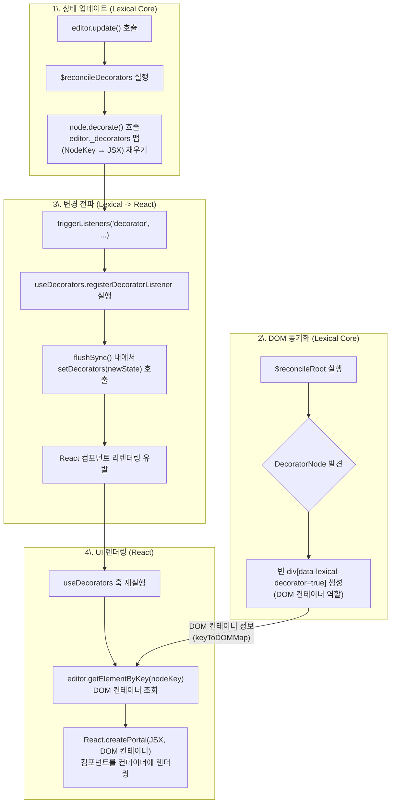

# Lexical 데코레이터 노드 렌더링 파이프라인 심층 분석

**문서 요약**: 이 문서는 `DecoratorNode`가 Lexical의 내부 상태에서 실제 React 컴포넌트로 렌더링되기까지의 전 과정을 추적합니다. `Reconciler`, `useDecorators` 훅, 그리고 `React Portal`의 정교한 상호작용을 단계별로 설명하여 Lexical의 핵심 렌더링 아키텍처를 명확히 이해하는 것을 목표로 합니다.

---

## 개요: DecoratorNode란?

`DecoratorNode`는 Lexical 에디터 내부에 이미지, 비디오, Excalidraw 캔버스와 같이 편집 불가능한 복잡한 UI 컴포넌트를 삽입할 수 있도록 설계된 특수한 노드 타입입니다. 이 노드는 Lexical의 핵심 상태 관리와 특정 UI 프레임워크(예: React)의 렌더링 시스템을 분리하는 중요한 역할을 수행합니다.

## 4단계 렌더링 파이프라인

`DecoratorNode`의 렌더링은 Lexical의 내부 로직과 React의 렌더링 시스템이 정교하게 협력하는 4단계 파이프라인을 통해 이루어집니다.

### 1단계: 상태 업데이트와 데코레이터 준비 (`editor.update`)

모든 것은 `editor.update()` 호출로부터 시작됩니다.

1.  **`$reconcileDecorators`**: 상태 변경이 발생하면, Lexical은 이 함수를 호출하여 현재 EditorState에 존재하는 모든 `DecoratorNode`를 순회합니다.
2.  **`decorate()` 호출**: 각 `DecoratorNode` 인스턴스의 `decorate()` 메서드를 실행합니다. 이 메서드는 해당 노드를 렌더링할 React 컴포넌트(JSX)를 반환해야 합니다.
3.  **`_decorators` 맵 업데이트**: `decorate()`가 반환한 JSX는 노드의 고유 키(`NodeKey`)와 함께 `editor._decorators`라는 내부 맵에 `{ [nodeKey]: <JSX /> }` 형태로 저장됩니다. 이 맵은 '렌더링 대기 목록'과 같습니다.

### 2단계: DOM 컨테이너 생성 (DOM Reconciliation)

다음으로, Lexical의 DOM 조정자(`Reconciler`)가 실제 DOM을 업데이트합니다.

1.  **`$reconcileRoot`**: 이 함수는 EditorState를 기반으로 실제 DOM 트리를 생성하거나 업데이트합니다.
2.  **컨테이너 생성**: 조정자가 `DecoratorNode`를 만나면, 노드의 콘텐츠를 직접 렌더링하지 않습니다. 대신, 비어 있는 `
` 요소를 생성하고 `data-lexical-decorator="true"`라는 특별한 속성을 부여합니다. 이 `div`는 나중에 React 컴포넌트가 렌더링될 '자리 표시자' 또는 '컨테이너' 역할을 합니다.
3.  **DOM 매핑**: 생성된 `div` DOM 요소는 해당 `DecoratorNode`의 `NodeKey`와 매핑되어(`editor._keyToDOMMap`), 나중에 쉽게 조회할 수 있게 됩니다.

### 3단계: 변경 감지 및 React에 전파 (`useDecorators`)

DOM 업데이트가 완료되면, Lexical은 React 세계에 "변경 사항이 있다"고 알립니다.

1.  **`triggerListeners('decorator', ...)`**: `_decorators` 맵에 변경이 발생했음을 모든 리스너에게 알립니다.
2.  **`registerDecoratorListener`**: `lexical-react` 패키지의 `useDecorators` 훅은 이 리스너를 미리 등록해두었습니다. 이 리스너의 콜백 함수가 새로운 `_decorators` 맵과 함께 실행됩니다.
3.  **`setDecorators` 호출**: 리스너는 `setDecorators(nextDecorators)`를 호출하여 React의 `useState`로 관리되는 상태를 업데이트합니다. 이 호출은 `flushSync`로 감싸여 있어, React의 렌더링이 비동기적으로 지연되지 않고 즉시, 동기적으로 발생하도록 보장합니다. 이는 UI 깜빡임이나 데이터 불일치를 방지하는 데 매우 중요합니다.

### 4단계: React UI 렌더링 (`createPortal`)

`setDecorators` 호출로 인해 `useDecorators` 훅을 사용하는 React 컴포넌트가 리렌더링됩니다.

1.  **`useMemo` 실행**: 훅 내부의 `useMemo` 블록이 새로운 `decorators` 상태를 기반으로 실행됩니다.
2.  **DOM 컨테이너 조회**: `decorators` 맵을 순회하며 각 `nodeKey`에 대해 `editor.getElementByKey(nodeKey)`를 호출합니다. 이는 2단계에서 생성된 `div[data-lexical-decorator=true]` DOM 요소를 찾는 과정입니다.
3.  **`createPortal`**: 마지막으로, React의 `createPortal` 함수가 마법을 부립니다. `decorators` 맵에 저장된 JSX 컴포넌트를 현재 React 컴포넌트 트리 바깥에 있는, 방금 조회한 DOM 컨테이너 내부에 렌더링합니다.

## 결론: 느슨한 결합의 아키텍처

이 파이프라인은 Lexical의 핵심 상태 관리 로직과 React의 렌더링 시스템을 아름답게 분리합니다. Lexical은 데이터와 DOM 컨테이너만 관리하고, React는 UI 렌더링만 책임집니다. `useDecorators` 훅과 `React Portal`은 이 두 세계를 잇는 '다리' 역할을 수행합니다.

이러한 느슨하게 결합된 아키텍처 덕분에, 개발자는 복잡한 내부 동작을 신경 쓸 필요 없이 `decorate()` 메서드에서 익숙한 React 컴포넌트를 반환하는 것만으로도 강력한 기능을 구현할 수 있습니다. 