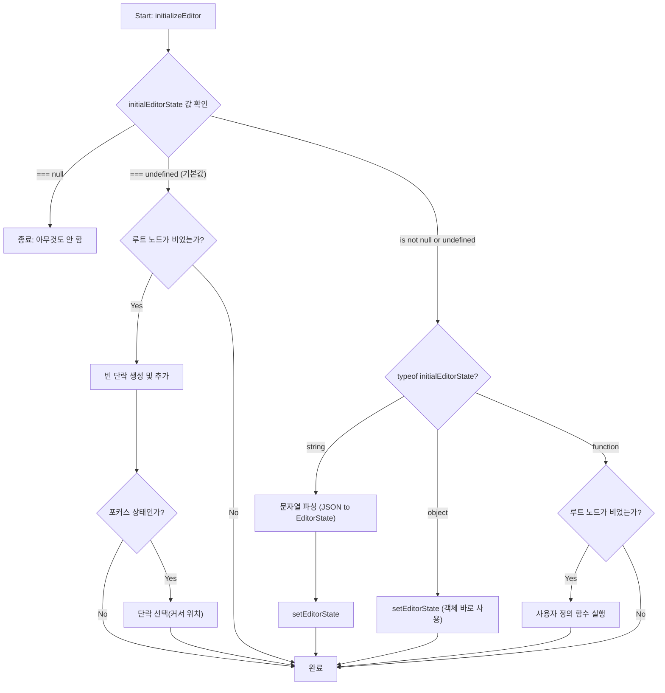
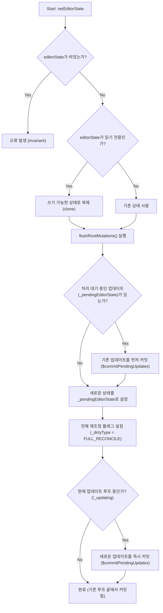

# 심층 분석 1: 에디터 생성 및 초기화

**주제**: 에디터 생성 및 초기화 과정

이 문서는 `lexical-playground` 예제를 통해 Lexical 에디터가 어떻게 생성되고 초기화되는지, 그리고 핵심 아키텍처 패턴이 실제 코드에서 어떻게 구현되어 있는지 분석합니다.

**1. 진입점: `<LexicalComposer>`**

-   **위치**: `packages/lexical-playground/src/App.tsx`
-   **역할**: 모든 Lexical 관련 기능의 최상위 Wrapper 컴포넌트입니다. `initialConfig`라는 단일 prop을 통해 에디터의 모든 초기 설정을 정의하며, 생성된 `editor` 인스턴스를 React Context를 통해 하위 컴포넌트에 제공합니다.

**2. 핵심 설정: `initialConfig` 객체**

`LexicalComposer`에 전달되는 `initialConfig` 객체는 에디터의 모든 것을 정의합니다.

-   **`editorState` (초기 콘텐츠)**: 에디터가 처음 로드될 때 표시될 내용을 정의합니다. 함수(`$prepopulatedRichText`)를 전달하여 동적으로 초기 상태를 생성할 수 있으며, 이는 '상태가 모든 것의 시작'이라는 Lexical의 [단방향 데이터 흐름](../data_flow/01_data_flow_overview.md) 철학을 보여줍니다. (관련 심층 분석: **[EditorState](../update_mechanism/01_editor_state.md)**)
-   **`namespace` (고유 식별자)**: 에디터 인스턴스를 식별하는 고유한 문자열입니다.
-   **`nodes` (커스텀 노드 등록)**
    -   **위치**: `packages/lexical-playground/src/nodes/PlaygroundNodes.ts`
    -   **분석**: `ImageNode`, `PollNode`, `ExcalidrawNode` 등 플레이그라운드에서 사용되는 모든 커스텀 노드의 클래스가 배열 형태로 등록됩니다. 이 배열을 `initialConfig`에 전달하는 것만으로 에디터는 해당 노드들을 인식하고 렌더링 및 [직렬화](../serialization/01_serialization_and_deserialization.md)할 수 있게 됩니다. 이는 Lexical의 뛰어난 확장성을 보여주는 핵심 패턴입니다. (관련 심층 분석: **[노드 시스템](../node_system/)**)
-   **`theme` (테마 및 스타일링)**
    -   **위치**: `packages/lexical-playground/src/themes/PlaygroundEditorTheme.ts`
    -   **분석**: `EditorThemeClasses` 타입의 객체로, Lexical의 각 노드 및 텍스트 포맷(`h1`, `paragraph`, `text.bold` 등)에 매핑될 CSS 클래스 이름을 정의합니다. 실제 스타일은 함께 import된 `.css` 파일에 정의되어 있으며, 이를 통해 에디터의 모든 시각적 요소를 완벽하게 제어할 수 있습니다.
-   **`editable` (읽기/쓰기 모드 설정)**: 에디터의 초기 모드를 설정합니다. `true`이면 편집 모드(기본값), `false`이면 읽기 전용 모드로 시작됩니다. 이 값은 `editor.setEditable()`을 통해 동적으로 변경할 수 있습니다.
-   **`onError` (에러 핸들링)**: 에디터 내부에서 발생하는 모든 예외를 처리하는 중앙 집중식 콜백 함수를 제공합니다.

**3. 기능 확장: 플러그인 아키텍처**

-   **위치**: `packages/lexical-playground/src/Editor.tsx`
-   **`useLexicalComposerContext()`**: `<Editor />` 컴포넌트는 이 훅을 사용하여 상위 `<LexicalComposer>`가 생성한 `editor` 인스턴스에 접근합니다. 이 인스턴스는 모든 하위 플러그인 컴포넌트에 전파되어 에디터의 상태를 읽고 수정하는 데 사용됩니다.
-   **조건부 렌더링**: `isRichText` 설정 값에 따라 `RichTextPlugin` 또는 `PlainTextPlugin`과 그에 따른 하위 플러그인들을 선택적으로 렌더링합니다. 이는 '필요한 기능만 비용을 지불한다(pay-for-what-you-need)'는 Lexical의 핵심 설계 철학을 명확히 보여주는 부분입니다.
-   **플러그인의 역할**: `<HistoryPlugin>`, `<ListPlugin>`, `<TablePlugin>` 등 각 플러그인은 하나의 독립적인 기능을 캡슐화한 React 컴포넌트입니다. 개발자는 이 컴포넌트들을 조합하는 것만으로 원하는 기능의 에디터를 손쉽게 구성할 수 있습니다. (관련 심층 분석: **[플러그인 아키텍처](../plugins/01_plugin_architecture_overview.md)**, **[HistoryPlugin](../history/01_history_and_undo_coalescing.md)**)

**결론**

Lexical의 초기화 과정은 **`<LexicalComposer>`** 와 **`initialConfig`** 를 통해 에디터의 기본 뼈대와 설정을 정의하고, 그 하위에 다양한 **플러그인 컴포넌트**들을 조합하여 실제 기능을 확장하는 명확하고 선언적인 구조를 가지고 있습니다. 이 구조는 관심사의 분리가 잘 되어 있으며, Lexical의 핵심 가치인 **확장성**과 **최적화**를 코드 수준에서 효과적으로 구현하고 있습니다. 

`createEditor` 함수는 `lexical` 패키지에서 가져와 사용하며, 선택적으로 에디터의 동작을 사용자 정의할 수 있는 설정 객체(configuration object)를 인자로 받습니다.

- **`namespace`**: 에디터 인스턴스를 식별하는 고유한 문자열입니다. 여러 에디터가 한 페이지에 있을 때 유용합니다.
- **`theme`**: 에디터에 적용할 CSS 클래스 맵입니다. 이를 통해 에디터의 모양을 커스터마이징할 수 있습니다.
- **`onError`**: 에디터 내부에서 발생하는 오류를 처리하는 콜백 함수입니다. 오류 로깅 및 처리에 사용됩니다.
- **`nodes`**: 에디터에서 사용할 커스텀 노드 목록을 등록합니다.

### 2. DOM 요소 연결 (`setRootElement`)

생성된 에디터 인스턴스는 실제 화면에 표시될 DOM 요소와 연결되어야 합니다. `editor.setRootElement(element)` 메서드를 사용하여 `contentEditable` 속성이 `true`인 `<div>`와 같은 DOM 요소를 에디터의 루트로 설정합니다. 이 연결을 해제하려면 `null`을 인자로 전달하면 됩니다.

### Vanilla JS 예제

```javascript
import {createEditor} from 'lexical';

const config = {
  namespace: 'MyEditor',
  theme: {
    // ... theme 설정 ...
  },
  onError: console.error
};

const editor = createEditor(config);

const contentEditableElement = document.getElementById('editor');
editor.setRootElement(contentEditableElement);
```

### React 환경에서의 초기화 (`@lexical/react`)

React 환경에서는 `@lexical/react` 패키지가 제공하는 컴포넌트를 사용하여 에디터를 더 선언적으로 초기화할 수 있습니다.

- **`LexicalComposer`**: 에디터의 컨텍스트를 제공하는 최상위 컴포넌트입니다. `initialConfig` prop을 통해 `createEditor`와 동일한 설정 객체를 전달받습니다.
- **`RichTextPlugin`**: 풍부한 텍스트 편집에 필요한 기본적인 플러그인들을 설정합니다.
- **`ContentEditable`**: 실제 사용자가 텍스트를 입력하는 `contenteditable` `div`를 렌더링합니다.
- **`HistoryPlugin`**: 실행 취소/다시 실행 기능을 위한 [히스토리 스택 관리](../history/01_history_and_undo_coalescing.md)를 합니다.
- **`AutoFocusPlugin`**: 에디터가 처음 렌더링될 때 자동으로 포커스를 줍니다.

### React 예제

```jsx
import {LexicalComposer} from '@lexical/react/LexicalComposer';
import {RichTextPlugin} from '@lexical/react/LexicalRichTextPlugin';
import {ContentEditable} from '@lexical/react/LexicalContentEditable';
import {HistoryPlugin} from '@lexical/react/LexicalHistoryPlugin';
import {AutoFocusPlugin} from '@lexical/react/LexicalAutoFocusPlugin';
import {LexicalErrorBoundary} from '@lexical/react/LexicalErrorBoundary';

function Editor() {
  const initialConfig = {
    namespace: 'MyEditor',
    theme: { /* ... */ },
    onError: (error) => console.error(error),
  };

  return (
    <LexicalComposer initialConfig={initialConfig}>
      <RichTextPlugin
        contentEditable={<ContentEditable />}
        placeholder={<div>Enter some text...</div>}
        ErrorBoundary={LexicalErrorBoundary}
      />
      <HistoryPlugin />
      <AutoFocusPlugin />
    </LexicalComposer>
  );
}
```

## 핵심 개념: `EditorState`

Lexical에서 **진리의 원천(source of truth)은 DOM이 아니라, 에디터가 내부적으로 관리하는 [`EditorState`](../update_mechanism/01_editor_state.md) 객체**입니다. 이 상태 모델은 에디터의 현재 콘텐츠와 [선택 영역](../selection/01_selection_and_focus_management.md) 등을 포함하는 불변(immutable) 객체입니다.

- **상태 가져오기**: `editor.getEditorState()`를 통해 최신 `EditorState`를 얻을 수 있습니다.
- **직렬화/역직렬화**: `EditorState`는 `toJSON()` 메서드를 통해 JSON 형식으로 [직렬화](../serialization/01_serialization_and_deserialization.md)할 수 있으며, `editor.parseEditorState(stringifiedJSON)`를 통해 다시 `EditorState` 객체로 변환할 수 있습니다. 이는 에디터 상태를 저장하고 불러오는 데 핵심적인 역할을 합니다. 

## 4. 심층 분석: EditorState 초기화 (`initializeEditor` & `setEditorState`)

`LexicalComposer` 내부에서는 `createEditor`가 호출되고, 이어서 에디터의 초기 상태(AST)를 설정하는 `initializeEditor` 함수가 실행됩니다. 또한, 런타임 중에 에디터 상태를 외부에서 주입하기 위해 `setEditorState` 함수가 사용됩니다. 이 두 함수는 `EditorState` 처리의 핵심적인 관문입니다.

### 4.1. `initializeEditor` (최초 상태 설정)

- **역할**: 에디터가 처음 생성될 때, `initialConfig`의 `editorState` 값을 기반으로 초기 AST를 설정합니다.
- **위치**: `packages/lexical-react/src/LexicalComposer.tsx`

#### 논리적 흐름

`initializeEditor`의 로직은 `initialEditorState` prop의 타입과 값에 따라 명확한 의사결정 트리를 따릅니다.



- **핵심 기능**:
    - **다양한 초기 상태 지원**: `undefined`(기본 단락), `null`(완전 빈 상태), `string`(JSON 직렬화 상태), `object`(`EditorState` 객체), `function`(프로그래매틱 생성) 등 다양한 형식의 초기 상태를 유연하게 처리합니다.
    - **안전성**: 이미 콘텐츠가 있는 경우 초기 상태를 덮어쓰지 않아 데이터 유실을 방지합니다.

### 4.2. `setEditorState` (외부 상태 주입)

- **역할**: 런타임 중에 현재 에디터의 내용을 완전히 새로운 `EditorState`로 교체합니다. 데이터베이스 로딩, 히스토리 복원 등 외부로부터 상태를 주입받을 때 사용됩니다.
- **위치**: `packages/lexical/src/LexicalEditor.ts`

#### 논리적 흐름

`setEditorState`는 업데이트의 안정성과 데이터 일관성을 보장하는 데 초점을 맞춥니다.



- **핵심 기능**:
    - **상태 주입(State Injection)**: 외부 데이터 소스로부터 에디터 상태를 안전하게 교체하는 공식적인 통로입니다.
    - **업데이트 안정성**: `_readOnly` 상태 처리, `_pendingEditorState` 큐 관리, `_updating` 플래그 확인 등 여러 안전장치를 통해 어떤 상황에서 호출되어도 업데이트 충돌 없이 안정적으로 동작합니다.
    - **전체 재조정(Full Reconciliation)**: `_dirtyType`을 `FULL_RECONCILE`로 설정하여, 부분 비교에서 발생할 수 있는 오류를 원천 차단하고 상태와 DOM의 완벽한 동기화를 보장합니다. 