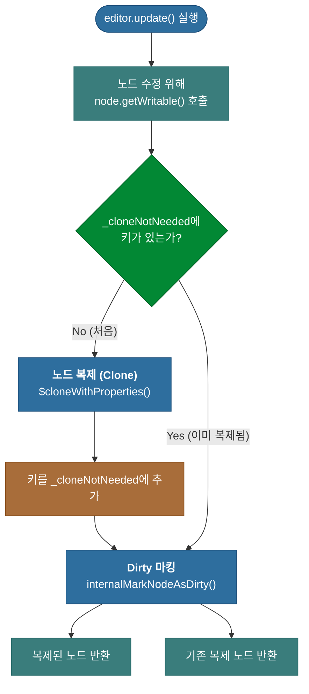
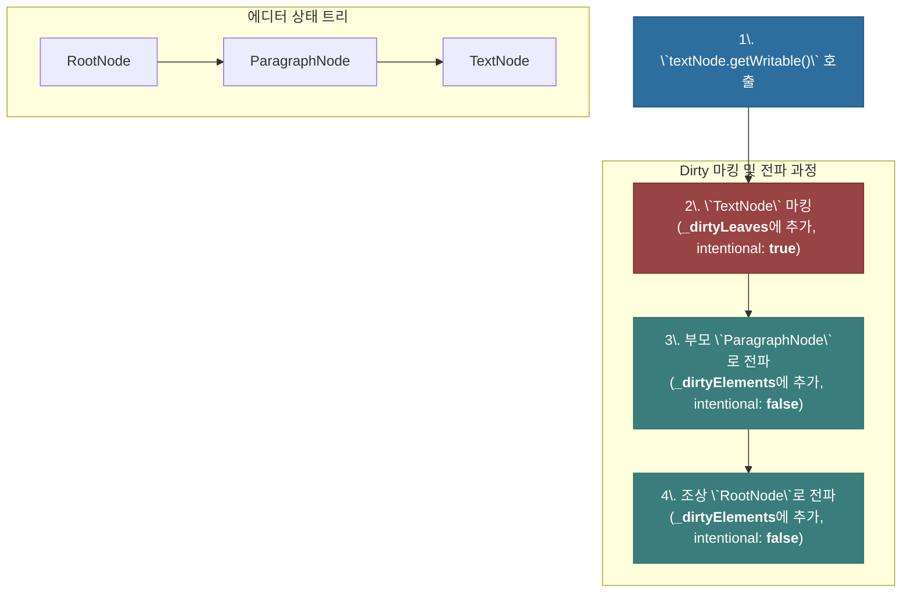

# 심층 분석 4.7: Dirty 노드 표시 및 전파 메커니즘

**문서 상태**: `v1.2`
**변경 이력**:
- `v1.0`: 문서 초안 작성
- `v1.1`: `internalMarkNodeAsDirty`가 부모 노드로 dirty 상태를 전파하는 메커니즘 상세 설명 추가.
- `v1.2`: Dirty 상태 전파 과정을 시각화한 Mermaid 다이어그램 추가.

이 문서는 Lexical 업데이트 메커니즘의 가장 근본적인 시작점인 **"노드가 어떻게 'dirty' 상태가 되는가"**에 대해 심층적으로 분석합니다. `$applyAllTransforms`가 'dirty' 노드를 처리하는 엔진이라면, 이 문서는 그 엔진의 연료가 어떻게 공급되는지를 설명합니다.

-   **핵심 관련 파일**: `packages/lexical/src/LexicalNode.ts`

---

## 1. 개요: 변경 감지의 시작점

Lexical은 어떤 노드가 변경되었는지 어떻게 알 수 있을까요? 모든 노드를 매번 비교하는 것은 매우 비효율적입니다. 대신 Lexical은 **변경이 필요한 노드에 'dirty'라는 표시**를 남기고, 엔진은 이 표시가 된 노드만 처리합니다.

이 'dirty' 표시는 개발자가 노드를 수정하려는 의도를 표현하는 바로 그 시점, 즉 **`node.getWritable()` 메서드를 호출할 때** 자동으로 이루어집니다.



---

## 2. 핵심 트리거: `getWritable()` 상세 분석

`getWritable()` 메서드는 단순한 노드 반환 함수가 아니라, **불변성을 유지하고 변경 사항을 추적**하는 핵심적인 역할을 수행합니다.

```typescript
// packages/lexical/src/LexicalNode.ts -> getWritable()
getWritable(): this {
  // 1. 최신 노드 가져오기
  const latestNode = this.getLatest();
  const cloneNotNeeded = editor._cloneNotNeeded;

  // 2. 이미 복제되었는지 확인 (최적화)
  if (cloneNotNeeded.has(key)) {
    internalMarkNodeAsDirty(latestNode);
    return latestNode;
  }

  // 3. 노드 복제
  const mutableNode = $cloneWithProperties(latestNode);
  cloneNotNeeded.add(key); // 복제되었음을 기록

  // 4. Dirty 마킹
  internalMarkNodeAsDirty(mutableNode);

  // 5. 복제된 노드로 교체
  nodeMap.set(key, mutableNode);
  return mutableNode;
}
```

1.  **`getLatest()`**: 현재 `pendingEditorState`에서 가장 최신 버전의 노드를 가져옵니다.
2.  **`cloneNotNeeded` 확인**: 이 노드가 이번 트랜잭션에서 **이미 복제되었는지 확인**합니다. 만약 그렇다면, 불필요한 복제를 건너뛰고 3단계로 바로 넘어갑니다. (상세 내용은 3번 섹션 참고)
3.  **`$cloneWithProperties()`**: 노드가 처음으로 쓰기 요청을 받았다면, 이 함수를 통해 **노드를 복제**하여 쓰기 가능한 새로운 인스턴스(`mutableNode`)를 생성합니다. 이것이 Lexical의 불변성을 유지하는 핵심입니다.
4.  **`internalMarkNodeAsDirty()`**: **(핵심)** 바로 이 내부 함수가 실제로 'dirty' 마킹과 **상태 전파**를 수행합니다.
    -   **마킹**: 먼저, `mutableNode`를 종류(리프/엘리먼트)에 따라 `editor._dirtyLeaves` 또는 `editor._dirtyElements`에 추가합니다. 이때 `intentionallyMarkedAsDirty`는 `true`로 설정됩니다.
    -   **전파**: 그 후, 부모 노드로 거슬러 올라가며 `root`에 도달할 때까지 **모든 조상(ancestor) 엘리먼트 노드를 연쇄적으로 dirty로 표시**합니다. 단, 이렇게 전파로 인해 dirty가 된 부모 노드들은 `intentionallyMarkedAsDirty`를 `false`로 설정하여, `$applyAllTransforms`에서 불필요한 변환이 실행되는 것을 방지합니다.
5.  **`nodeMap.set(...)`**: `pendingEditorState`의 노드 맵에서, 기존의 읽기 전용 노드를 방금 생성한 쓰기 가능한 `mutableNode`로 교체합니다.

## 3. 핵심 최적화: `_cloneNotNeeded`의 역할

`_cloneNotNeeded` Set은 **하나의 업데이트 트랜잭션 내에서 동일한 노드를 불필요하게 여러 번 복제하는 것을 방지**하는 성능 최적화 장치입니다.

하나의 `editor.update()` 안에서 같은 노드의 `getWritable()`이 여러 번 호출될 때, `_cloneNotNeeded`는 "이번 업데이트에서 이미 복제가 완료된 노드 목록"을 기억하는 캐시(cache) 역할을 합니다.

-   **첫 번째 호출**: 노드를 복제하고, 그 키를 `_cloneNotNeeded`에 추가합니다.
-   **두 번째 이후 호출**: `_cloneNotNeeded`에 키가 있는 것을 확인하고, **복제 과정 없이** 이전에 만들어 둔 복제본을 즉시 반환합니다.

이를 통해 하나의 트랜잭션 내에서는 각 노드가 단 한 번만 복제되도록 보장하여, **성능과 데이터의 일관성**을 모두 지킬 수 있습니다.

---

## 4. Dirty 상태 전파 (Propagation) 시각화

`internalMarkNodeAsDirty`는 단순히 하나의 노드만 마킹하는 것이 아니라, 루트까지 모든 부모 노드로 상태를 연쇄적으로 전파합니다. 아래 다이어그램은 이 과정을 시각적으로 보여줍니다.

