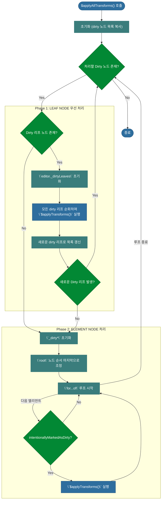

# 심층 분석 4.6: 노드 변환 엔진 (`$applyAllTransforms`)

**문서 상태**: `v1.3`
**변경 이력**:
- `v1.0`: 문서 초안 작성
- `v1.1`: 엘리먼트 노드 처리 과정 상세 분석 추가 (`root` 노드 처리, `intentionallyMarkedAsDirty` 필터링).
- `v1.2`: 엘리먼트 노드 변환 후, 새로운 dirty 노드 발생 시 루프가 다시 Phase 1부터 시작하는 동작 원리 설명 추가.
- `v1.3`: 엘리먼트 노드 처리 과정의 상세 로직(root 노드 순서 조정, intentional dirty 필터링)을 다이어그램에 반영.

이 문서는 `update` 트랜잭션의 핵심 자동화 엔진인 `$applyAllTransforms` 함수의 내부 동작을 심층적으로 분석합니다. 이 함수는 'dirty'로 표시된 노드들을 찾아, 등록된 변환(Transform) 함수들을 상태가 안정될 때까지 반복적으로 적용합니다.

-   **실제 코드 위치**: `packages/lexical/src/LexicalUpdates.ts`

---

## 1. 개요: 자동 데이터 정규화 엔진

`$applyAllTransforms`는 Lexical의 마법이 일어나는 곳입니다. 사용자가 텍스트를 입력하면 URL을 자동으로 링크로 만들거나, 마크다운 단축키를 서식이 있는 텍스트로 바꾸는 등의 작업이 모두 이 함수를 통해 이루어집니다.

이 함수의 핵심 전략은 **"리프 노드 우선 처리"** 입니다. 자식이 없는 가장 말단의 노드(Leaf Node)를 먼저 완전히 안정시킨 후, 그 부모가 되는 엘리먼트 노드(Element Node)를 처리하는 방식으로 동작하여 예측 가능성과 효율성을 높입니다.


---

## 2. 상세 분석 (코드 기반)

### 2.1. 1단계: 초기화 및 루프 시작

함수가 시작되면, 현재 'dirty' 상태인 노드들의 목록을 가져와 `while` 루프를 시작합니다. 이 루프는 처리할 dirty 노드가 하나라도 남아있는 동안 계속 반복됩니다.

```typescript
// packages/lexical/src/LexicalUpdates.ts -> $applyAllTransforms
function $applyAllTransforms(
  // ...
): void {
  const dirtyLeaves = editor._dirtyLeaves;
  const dirtyElements = editor._dirtyElements;
  // ...
  while (
    untransformedDirtyLeavesLength > 0 ||
    untransformedDirtyElementsLength > 0
  ) {
    // ...
  }
}
```

### 2.2. 2단계: 리프 노드(Leaf Node) 우선 처리

`while` 루프의 첫 번째 부분은 항상 **리프 노드를 먼저 처리**합니다.

```typescript
// packages/lexical/src/LexicalUpdates.ts -> $applyAllTransforms
    if (untransformedDirtyLeavesLength > 0) {
      editor._dirtyLeaves = new Set();

      for (const nodeKey of untransformedDirtyLeaves) {
        // ...
        $applyTransforms(editor, node, transformsCache);
      }

      untransformedDirtyLeaves = editor._dirtyLeaves;
      untransformedDirtyLeavesLength = untransformedDirtyLeaves.size;

      if (untransformedDirtyLeavesLength > 0) {
        continue;
      }
    }
```
-   **`editor._dirtyLeaves = new Set()`**: **(핵심)** `editor._dirtyLeaves`를 새 `Set`으로 초기화합니다. 이어지는 `$applyTransforms`가 실행될 때, 이 새로운 Set에 또 다른 dirty 리프 노드가 추가될 수 있습니다.
-   **`$applyTransforms(...)`**: 노드에 등록된 모든 변환 함수를 실행합니다.
-   **`continue`**: **(핵심 제어 흐름)** 만약 리프 노드를 처리하는 과정에서 **새로운 dirty 리프가 하나라도 생겼다면**, `continue`를 통해 `while` 루프의 처음으로 돌아가 **리프 노드 처리 단계를 다시 시작합니다.**

### 2.3. 3단계: 엘리먼트 노드 처리 (상세)

더 이상 처리할 dirty 리프 노드가 없을 때만 이 단계로 넘어옵니다. 엘리먼트 노드 처리 페이즈는 **두 가지 핵심 원칙(최적화 및 `root` 노드 후처리)**에 따라 동작합니다.

#### 2.3.1. `root` 노드 특별 대우: "업데이트 파이널라이저"

엘리먼트 순회 `for` 루프가 시작되기 직전에, 코드는 `root` 노드를 특별히 먼저 처리하여 순회의 가장 마지막으로 보냅니다.

```typescript
// packages/lexical/src/LexicalUpdates.ts -> $applyAllTransforms
    const rootDirty = untransformedDirtyElements.delete('root');
    if (rootDirty) {
      untransformedDirtyElements.set('root', true);
    }
```
JavaScript의 `Map`은 키가 추가된 순서를 기억하므로, `root`를 삭제했다가 다시 추가하는 이 트릭은 **`root` 노드를 순회의 가장 마지막 순서로 보내는 효과**를 가집니다. 이를 통해 `root` 노드의 변환 함수를 모든 다른 노드의 변환이 끝난 후 실행되는 일종의 **"업데이트 파이널라이저(update finalizer)"**처럼 사용할 수 있습니다.

#### 2.3.2. "의도된 변경"만 처리하여 최적화

`for` 루프 안에서는 각 엘리먼트 노드가 '의도적으로' dirty로 표시되었는지를 확인하는 중요한 필터링 과정이 있습니다.

```typescript
// packages/lexical/src/LexicalUpdates.ts -> $applyAllTransforms
    for (const currentUntransformedDirtyElement of untransformedDirtyElements) {
      const intentionallyMarkedAsDirty = currentUntransformedDirtyElement[1];
      if (!intentionallyMarkedAsDirty) {
        continue;
      }
      // ...
      $applyTransforms(editor, node, transformsCache);
    }
```
-   **`intentionallyMarkedAsDirty`**: `_dirtyElements` 맵의 값(`boolean`)입니다.
    -   **`true` (의도적으로 Dirty)**: `elementNode.getWritable()`이 **직접 호출**되었을 때 설정됩니다. 노드 자체의 속성 변경을 의미합니다.
    -   **`false` (전파로 인해 Dirty)**: 해당 엘리먼트의 **자식 노드가 dirty**가 되었을 때, 그 부모들도 연쇄적으로 dirty 상태가 전파될 때 설정됩니다.
-   **최적화**: `!intentionallyMarkedAsDirty`인 노드를 건너뛰는 것은, 자식 노드의 변경 때문에 '오염'만 된 부모 노드의 변환 함수를 불필요하게 실행하는 낭비를 막는 핵심적인 최적화입니다.

### 2.4. 4단계: 루프 상태 갱신 및 제어권 이전

엘리먼트 노드(`Phase 2`) 처리가 끝나면, 그 과정에서 **새로 발생했을 수 있는 dirty 노드 목록으로 루프 변수를 갱신**하고, `while` 루프의 처음으로 돌아가 제어권을 넘깁니다.

```typescript
// packages/lexical/src/LexicalUpdates.ts -> $applyAllTransforms
    untransformedDirtyLeaves = editor._dirtyLeaves;
    untransformedDirtyLeavesLength = untransformedDirtyLeaves.size;
    untransformedDirtyElements = editor._dirtyElements;
    untransformedDirtyElementsLength = untransformedDirtyElements.size;
  } // while 루프의 끝
```
-   **상태 갱신**: `untransformed...` 변수들이 엘리먼트 변환 과정에서 새로 발생한 dirty 노드 목록으로 업데이트됩니다.
-   **제어권 이전 및 핵심 동작**:
    -   **만약 새로운 Dirty 리프가 발생했다면 (`untransformedDirtyLeavesLength > 0`)**: `while` 루프의 다음 반복에서는 `Phase 1` 조건문이 `true`가 되므로, **제어권이 다시 리프 노드 처리 페이즈로 넘어갑니다.** 이는 엘리먼트 변환보다 리프 노드 안정을 항상 우선시하는 핵심 동작입니다.
    -   **만약 새로운 Dirty 엘리먼트만 발생했다면**: 다음 반복에서는 `Phase 1`을 건너뛰고 `Phase 2`가 다시 실행됩니다.
    -   **만약 새로운 Dirty 노드가 없다면**: `while` 루프의 조건이 `false`가 되어 최종적으로 변환 과정이 종료됩니다. 