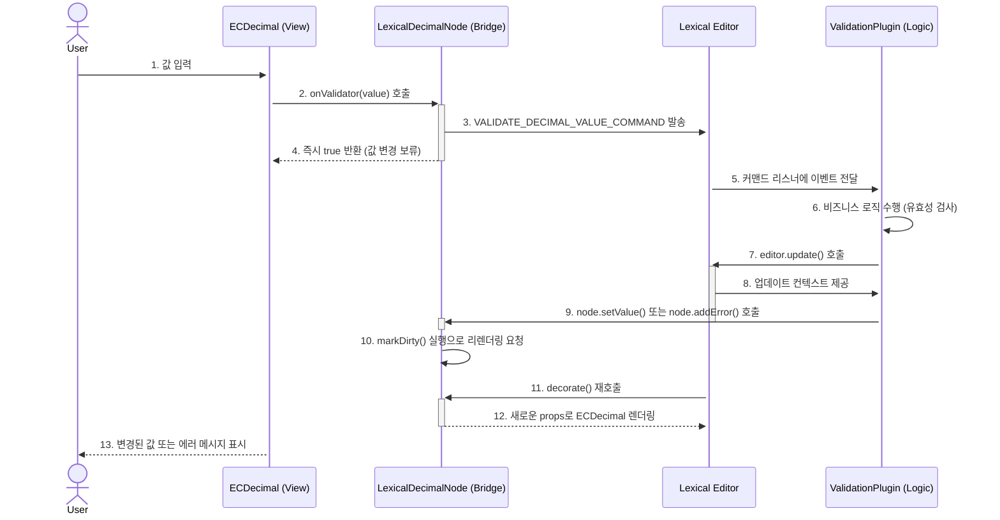

# 심층 분석: LexicalDecimalNode & 아키텍처

**파일 경로:** `packages/lexical-react/src/LexicalDecimalNode.tsx`
**분석 일자:** 2025년 7월 25일
**버전:** 1.0 (신규 생성)

---

## 1. 아키텍처 개요: 두 컴포넌트, 하나의 시스템

이 문서는 Lexical 에디터 내에서 복잡한 숫자 입력을 처리하는 아키텍처를 심층 분석하며, 특히 `LexicalDecimalNode`의 역할에 집중합니다.

이 아키텍처는 **관심사 분리(Separation of Concerns)** 원칙을 기반으로 세 가지 주요 요소로 구성됩니다.

- **`ECDecimal` (View):** 순수한 React 컴포넌트로, 사용자에게 보여지는 UI 렌더링과 원시적인 이벤트 처리에만 집중합니다. (상세 내용은 `01_ECDecimal_analysis.md` 참조)
- **`LexicalDecimalNode` (Bridge/Controller):** 이 문서의 핵심 분석 대상. Lexical의 데이터 모델과 React 뷰(`ECDecimal`)를 연결하는 다리 역할을 합니다. 모든 비즈니스 로직의 시작점이 되는 **커맨드(Command)를 발행**하여 시스템의 다른 부분(플러그인 등)과의 통신을 담당합니다.
- **외부 플러그인 (Logic/Model):** `LexicalDecimalNode`가 발행한 커맨드를 수신하여 실제 유효성 검사, 서버 통신 등의 비즈니스 로직을 수행하고, 그 결과를 다시 노드에 반영합니다.

이 구조는 `DecoratorNode`와 **커맨드 패턴**을 활용하여 UI, 에디터 상태, 비즈니스 로직을 완벽하게 분리함으로써 높은 유연성과 확장성, 테스트 용이성을 확보합니다.

---

## 2. LexicalDecimalNode - 시스템의 지휘자

`LexicalDecimalNode`는 `ECDecimal` 컴포넌트를 Lexical의 데이터 모델에 통합하고, 에디터의 다른 부분과 상호작용할 수 있게 만드는 핵심적인 '다리' 역할을 수행합니다.

### 2.1. 상호작용 시퀀스: 비동기 처리의 흐름

아래 다이어그램은 사용자의 입력이 어떻게 `ECDecimal`, `LexicalDecimalNode`, 그리고 외부 `ValidationPlugin`과 상호작용하여 비동기적으로 처리되는지를 보여줍니다.



### 2.2. 핵심 로직: 커맨드를 이용한 비동기 검증

1.  **렌더링:** `decorate()` 메서드가 `ECDecimal` 컴포넌트를 렌더링하면서, 노드의 내부 상태를 `props`로 전달하고, `onValidator`와 `onChange` 같은 이벤트 핸들러를 노드의 메서드에 연결합니다.
2.  **검증 요청:** 사용자가 값을 입력하면 `onValidator`가 실행됩니다. 이 메서드는 실제 검증을 수행하는 대신, `VALIDATE_DECIMAL_VALUE_COMMAND`를 에디터에 **발송(dispatch)**하고 **즉시 `true`를 반환**합니다.
3.  **흐름 제어:** `onValidator`가 `true`를 반환했기 때문에, `ECDecimal`은 후속 `onChange` 콜백을 실행하지 않고 값 변경을 일단 **보류**합니다.
4.  **외부 처리:** 커맨드를 수신한 외부 플러그인이 비즈니스 로직에 따라 값을 검증합니다.
5.  **상태 업데이트:** 검증 결과에 따라, 플러그인은 `editor.update()` 내에서 `LexicalDecimalNode`의 `setValue()`, `addError()` 등의 메서드를 호출하여 노드의 상태를 원격으로 변경하고, `markDirty()`를 통해 리렌더링을 요청합니다.
6.  **변경 전파:** 만약 값이 최종적으로 유효하다면, `onChange` 핸들러가 `CHANGED_DECIMAL_VALUE_COMMAND`를 발송하여 "값이 최종 확정되었다"는 사실을 시스템에 알립니다.

### 2.3. 활용 예시: ValidationPlugin 구현

아래는 `VALIDATE_DECIMAL_VALUE_COMMAND`를 수신하여 유효성 검사를 수행하고 노드 상태를 업데이트하는 플러그인의 간단한 예시입니다.

```tsx
import { useLexicalComposerContext } from '@lexical/react/LexicalComposerContext';
import { useEffect } from 'react';
import { $getNodeByKey } from 'lexical';
import { VALIDATE_DECIMAL_VALUE_COMMAND, LexicalDecimalNode } from './LexicalDecimalNode';

export function ValidationPlugin(): null {
  const [editor] = useLexicalComposerContext();

  useEffect(() => {
    // 에디터에 커맨드 리스너를 등록합니다.
    return editor.registerCommand(
      VALIDATE_DECIMAL_VALUE_COMMAND,
      (payload) => {
        // 커맨드 payload로부터 노드 키와 값을 가져옵니다.
        const { nodeKey, value } = payload;
        
        editor.update(() => {
          // 노드 키를 사용하여 실제 노드 인스턴스를 찾습니다.
          const node = $getNodeByKey<LexicalDecimalNode>(nodeKey);
          if (!node) return;

          // 비즈니스 로직: 값이 1000을 초과하면 에러 처리
          if (Number(value) > 1000) {
            node.addError({ message: '값은 1000을 초과할 수 없습니다.' });
          } else {
            // 유효하다면, 에러를 제거하고 노드의 값을 업데이트합니다.
            node.removeError();
            node.setValue(value);
          }
        });
        
        // true를 반환하여 다른 리스너가 이 커맨드를 처리하지 않도록 합니다.
        return true;
      },
      4 // 커맨드 우선순위 (0~4, 높을수록 먼저 실행)
    );
  }, [editor]);

  return null;
}
```

### 2.4. 공개 API: 외부 제어를 위한 인터페이스

`LexicalDecimalNode`는 외부(주로 플러그인)에서 상태를 제어하기 위한 다음과 같은 주요 API를 제공합니다.

| 메서드 (Method)                             | 설명 (Description)                                                                                             |
| :------------------------------------------ | :------------------------------------------------------------------------------------------------------------- |
| `setValue(value: string): void`             | 노드의 내부 `value` 상태를 변경하고, `markDirty()`를 호출하여 리렌더링을 트리거합니다.                            |
| `addError(error: { message: string }): void` | 노드에 에러 상태 객체를 추가하고, 리렌더링을 트리거합니다. 이 에러 객체는 `ECDecimal` 컴포넌트로 전달됩니다.     |
| `removeError(): void`                       | 노드의 에러 상태를 제거하고, 리렌더링을 트리거합니다.                                                          |
| `getMappingKey(): string`                   | `data_model_id:data_model_index:prop_id` 형식의 고유한 매핑 키를 반환하여, 외부 데이터 모델과 노드를 연결합니다. |

---

## 3. 종합 결론: 이 아키텍처에서 배울 점

`ECDecimal`과 `LexicalDecimalNode`의 조합은 UI, 에디터 상태, 비즈니스 로직을 분리하는 매우 정교하고 모범적인 아키텍처를 보여줍니다.

-   **명확한 관심사 분리 (SoC):**
    -   `ECDecimal`: 순수한 UI 표현과 사용자 인터랙션 담당.
    -   `LexicalDecimalNode`: 데이터 모델과 View를 연결하고, 통신 채널(커맨드)을 여는 역할.
    -   `Plugin`: 실제 비즈니스 로직(유효성 검사, API 연동 등)을 담당.

-   **높은 유연성과 확장성:**
    -   커맨드 패턴 덕분에 새로운 비즈니스 로직을 추가하더라도 `ECDecimal`이나 `LexicalDecimalNode`를 수정할 필요가 없습니다. 새로운 플러그인을 만들기만 하면 됩니다.

-   **안정적인 비동기 처리:**
    -   유효성 검사와 같은 비동기 또는 복잡한 작업을 에디터의 코어 로직과 분리하여, 시스템 전체의 복잡도를 낮추고 안정성을 높입니다.

이러한 설계는 Lexical이 지향하는 **확장 가능한(extensible) 에디터 프레임워크**라는 철학을 명확히 보여주는 훌륭한 사례입니다. 