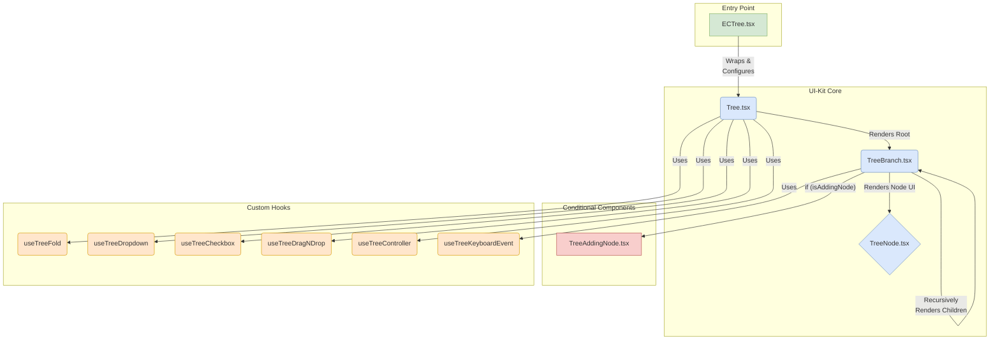

# ECTree 컴포넌트 분석 보고서

## 1. 개요

`ECTree.tsx`는 ECOUNT UI 시스템에서 트리 구조 데이터를 시각화하는 역할을 담당하는 컴포넌트입니다. `ecount.browser.uikit` 라이브러리에 포함된 `Tree` 컴포넌트를 기반으로, 애플리케이션의 특정 요구사항에 맞게 기능을 확장하고 추상화한 래퍼(Wrapper) 컴포넌트입니다.

## 2. 컴포넌트 구조 및 데이터 흐름

`ECTree`는 단일 파일이 아닌, 여러 컴포넌트와 커스텀 훅(Hook)이 유기적으로 결합하여 동작합니다. 전체적인 구조는 다음과 같습니다.

### 2.1. 컴포넌트 계층 다이어그램

### 2.2. 컴포넌트별 역할

-   **`ECTree.tsx` (Entry Point)**

    -   애플리케이션 레벨에서 사용되는 가장 바깥쪽 컴포넌트입니다.
    -   ViewModel(`ITreeViewModel`)로부터 받은 `state`, `setState`, `onDispatchActionAsync` 등의 인터페이스를 `Tree` 컴포넌트가 필요로 하는 `props` (e.g., `use_checkbox`, `use_dropdown`) 형식으로 변환하고 가공하는 역할을 담당합니다.
    -   모든 비즈니스 로직과 상태 관리는 이곳에서 처리되어 `Tree` 컴포넌트에는 렌더링에 필요한 데이터와 콜백 함수만 전달됩니다.

-   **`Tree.tsx` (UI-Kit Core)**

    -   실제 트리 구조의 뼈대를 렌더링하는 핵심 컴포넌트입니다.
    -   `<ul>`과 `<li>` 태그의 기본 구조를 생성하고, `tree.map()`을 통해 최상위 노드들을 `TreeBranch` 컴포넌트로 렌더링합니다.
    -   다양한 커스텀 훅(`useTreeFold`, `useTreeDropdown` 등)을 호출하여 트리의 복잡한 상호작용(펼치기/접기, 드래그 앤 드롭, 컨텍스트 메뉴 등)을 관리합니다.

-   **`TreeBranch.tsx` (UI-Kit Core - Recursive)**

    -   트리의 재귀적 구조를 완성하는 가장 중요한 컴포넌트입니다.
    -   하나의 '가지(Branch)' 즉, 하나의 노드(`<li>`)를 나타냅니다.
    -   자식 노드(`treeData.children`)가 있는 경우, 자식 배열을 순회하며 자기 자신(`TreeBranch`)을 다시 호출하여 하위 트리를 그려나갑니다.
    -   현재 노드의 UI는 `TreeNode` 컴포넌트에 위임하여 렌더링합니다.

-   **`TreeNode.tsx` (UI-Kit Core - Leaf Node)**
    -   트리의 가장 말단(Leaf)에서 실제 눈에 보이는 노드 UI를 그리는 컴포넌트입니다.
    -   노드의 라벨(이름), 아이콘, 체크박스, 펼침/접힘 화살표 등을 최종적으로 렌더링합니다.

### 2.3. 조건부 렌더링

-   **`TreeAddingNode.tsx`**
    -   사용자가 트리에 새로운 노드를 추가하는 동작을 할 때(`isAddingNode === true`), `TreeBranch` 내에서 일시적으로 렌더링되는 컴포넌트입니다.
    -   새 노드의 이름을 입력할 수 있는 `<input>` 필드를 포함합니다.

## 3. 핵심 동작 원리

### 3.1. 재귀적 렌더링 (Recursive Rendering)

`Tree.tsx`가 `TreeBranch.tsx`를 호출하고, `TreeBranch.tsx`가 다시 자기 자신을 호출하는 재귀적 패턴을 통해 깊이에 상관없이 모든 트리 노드를 효율적으로 렌더링합니다. 이 구조는 코드의 재사용성을 높이고 복잡성을 줄여줍니다.

### 3.2. 상태 관리와 데이터 흐름

1.  **상태 위임**: `ECTree`는 상태 관리 로직을 직접 소유하지 않고, 상위 ViewModel로부터 `state`와 `setState`를 주입받습니다.
2.  **Props 가공**: `ECTree`는 ViewModel의 상태를 기반으로 `Tree` 컴포넌트의 동작을 제어하는 상세한 설정 객체(`treeCheckboxConfig`, `treeDropdownConfig` 등)를 생성합니다.
3.  **단방향 데이터 흐름**: 데이터는 `ECTree` -> `Tree` -> `TreeBranch` -> `TreeNode` 순서로 위에서 아래로 흐릅니다.
4.  **이벤트 역전파**: 사용자 입력(클릭, 체크 등)이 발생하면 `TreeNode` 또는 하위 컴포넌트에서 이벤트가 발생하고, 이는 콜백 함수를 통해 `ECTree`까지 전달되어 `onDispatchActionAsync`를 호출, 최종적으로 ViewModel의 상태를 변경하여 화면을 다시 그리게 됩니다.

### 3.3. 커스텀 훅을 통한 기능 분리

트리의 복잡한 기능들은 각각의 역할을 담당하는 커스텀 훅으로 철저히 분리되어 있습니다.

-   `useTreeFold`: 접기/펼치기 상태 관리
-   `useTreeDropdown`: 컨텍스트 메뉴(우클릭 메뉴) 관리
-   `useTreeCheckbox`: 체크박스 상태 및 로직 관리
-   `useTreeDragNDrop`: 드래그 앤 드롭 기능 관리
-   `useTreeController`: 트리 데이터 가공 및 초기화 관리
-   `useTreeKeyboardEvent`: 키보드 탐색 기능 관리

이러한 구조는 `Tree` 컴포넌트 자체는 렌더링에만 집중하게 하고, 각 기능의 복잡한 로직은 해당 훅 내부에 캡슐화하여 코드의 유지보수성을 크게 향상시킵니다.

