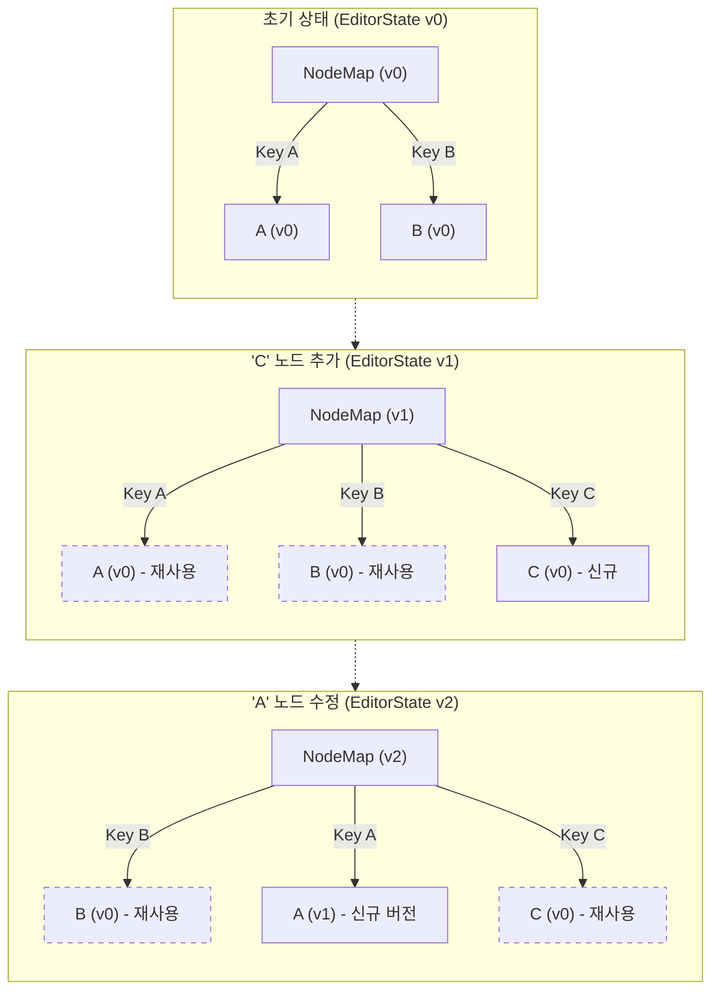
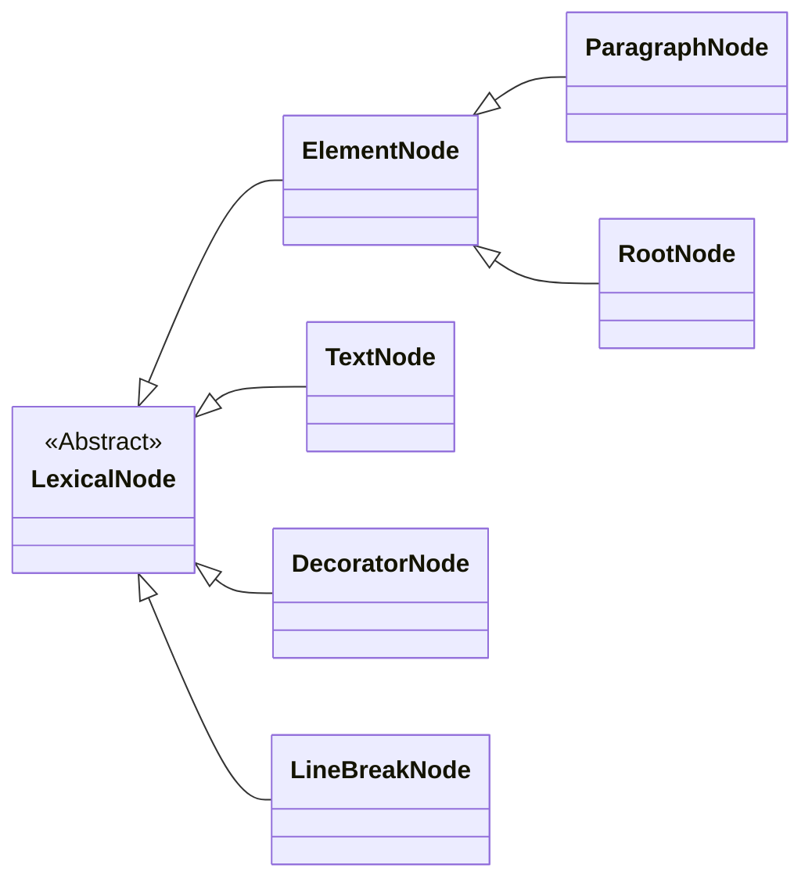

# Lexical 노드 개발 마스터 가이드

**문서 상태**: `v1.3` (핵심 내용 복원 및 심층 분석 링크 유지)

이 문서는 Lexical의 핵심 개념인 **노드(Node)** 시스템에 대한 모든 것을 다루는 통합 가이드입니다. Lexical의 노드가 무엇인지, 어떻게 동작하는지, 그리고 프로젝트의 요구사항에 맞게 자신만의 커스텀 노드를 어떻게 만들고 사용하는지에 대한 상세한 설명과 모범 사례를 제공합니다.

---

## 1. LexicalNode의 기초: 모든 노드의 시작

`LexicalNode`는 모든 노드의 기반이 되는 추상 클래스입니다. 이 클래스는 Lexical 에디터가 노드를 식별, 복제, 렌더링, 직렬화하는 데 필요한 모든 핵심 인터페이스를 정의합니다.

### 1.1. `__key`의 역할과 중요성

모든 노드는 Lexical에 의해 `__key`라는 고유 식별자를 부여받습니다. 이 키는 단순한 ID가 아니라, Lexical의 효율적인 상태 업데이트와 불변성 유지를 가능하게 하는 핵심 메커니즘입니다.

-   **자동 생성 및 불변성**: 키는 Lexical에 의해 자동으로 생성되며, 한 노드의 생명주기 동안 **절대 변하지 않습니다.**
-   **NodeMap 관리**: `EditorState`는 내부적으로 `Map<NodeKey, LexicalNode>` 형태의 `NodeMap`을 사용하여 모든 노드를 키 기반으로 관리합니다. 이를 통해 O(1) 시간 복잡도로 노드에 접근할 수 있습니다.
-   **Zero-Copy 최적화**: 업데이트 시, 변경되지 않은 노드는 `__key`를 통해 이전 `EditorState`의 노드 인스턴스를 그대로 재사용합니다. 이는 불필요한 객체 생성을 막아 성능을 극대화합니다.
-   **비직렬화 (Non-Serializable)**: **`__key`는 절대 직렬화되지 않습니다.** 에디터 상태를 JSON으로 내보냈다가 다시 불러올 때, 모든 노드들은 완전히 새로운 `__key`를 부여받습니다. 즉, `__key`는 현재 에디터 세션 내에서만 유효합니다.



> **[심층 분석]** `__key`의 생명주기, 올바른 사용법과 흔한 오용 사례(anti-patterns)에 대한 더 자세한 내용은 아래 문서를 참고하세요.
>
> -   **[Lexical 노드 키(NodeKey) 관리 심층 분석](../analysis/key_management/01_node_key_management.md)**

---

## 2. 핵심 기본 노드 타입

Lexical은 `LexicalNode`를 상속받아 미리 정의된 몇 가지 핵심 노드 타입을 제공합니다. 커스텀 노드를 만들 때는 이들을 상속받아 시작하는 것이 일반적입니다.

- **`RootNode`**: 에디터 상태(`EditorState`)에서 단 하나만 존재하는 최상위 노드입니다.
- **`ElementNode`**: 다른 노드들을 자식으로 포함할 수 있는 컨테이너 노드입니다. (e.g., `ParagraphNode`, `HeadingNode`)
- **`TextNode`**: 실제 텍스트 콘텐츠를 담는 가장 기본적인 리프(leaf) 노드입니다.
- **`DecoratorNode`**: React 컴포넌트나 복잡한 위젯(예: 이미지)을 에디터 내에 삽입할 때 사용되는 특별한 노드입니다.
- **`LineBreakNode`**: `\n` (개행 문자)를 나타내는 노드입니다.



---

## 3. 커스텀 노드 생성하기

Lexical의 진정한 강력함은 개발자가 자신만의 노드를 정의하여 에디터의 기능을 무한히 확장할 수 있다는 점에 있습니다.

### 3.1. 커스텀 노드의 필수 구현 사항

어떤 커스텀 노드를 만들든, Lexical이 해당 노드를 이해하고 처리할 수 있도록 몇 가지 핵심 메서드를 구현해야 합니다.

- **`static getType(): string`**: 노드의 고유한 문자열 타입을 반환합니다.
- **`static clone(node)`**: 노드를 복제하는 로직을 정의합니다.
- **`createDOM()`**: 노드에 해당하는 실제 DOM 요소를 생성합니다.
- **`updateDOM()`**: 노드의 상태가 변경되었을 때 DOM을 어떻게 업데이트할지 정의합니다.

### 3.2. 노드 상태의 안전한 관리: `getWritable()`과 `getLatest()`

노드의 내부 속성을 안전하게 수정하고 조회하기 위해 다음 두 메서드를 반드시 사용해야 합니다.

- **`getWritable()` (수정 시)**: 노드의 상태를 **수정**하기 전에, 수정 가능한(mutable) 노드 인스턴스를 얻기 위해 호출합니다.
- **`getLatest()` (조회 시)**: `update` 블록 내에서 항상 최신 상태의 노드를 **조회**하기 위해 사용합니다.

```typescript
// 올바른 사용 예시
class MyCustomNode extends ElementNode {
  __foo: string;
  setFoo(foo: string): this {
    const self = this.getWritable();
    self.__foo = foo;
    return self;
  }
  getFoo(): string {
    const self = this.getLatest();
    return self.__foo;
  }
}
```

> **[심층 분석]** 커스텀 노드의 직렬화/역직렬화(`exportJSON`/`importJSON`, `exportDOM`/`importDOM`) 방법에 대한 더 상세한 가이드는 아래 문서를 참고하세요.
>
> -   **[직렬화 및 역직렬화 심층 분석](../analysis/serialization/01_serialization_and_deserialization.md)**

### 3.3. 에디터에 등록하기

커스텀 노드를 만들었다면, `createEditor`의 `initialConfig` 객체 안에 있는 `nodes` 배열에 커스텀 노드 클래스를 추가하여 에디터에 등록해야 합니다.

---

## 4. 고급 노드 개발 기법

Lexical은 커스텀 노드의 기능을 더욱 강력하게 확장할 수 있는 다양한 고급 API를 제공합니다.

### 4.1. 노드 교체 (Node Replacement)

Lexical의 핵심 노드(e.g., `ParagraphNode`)를, 프로젝트의 특정 요구사항에 맞게 직접 만든 커스텀 노드로 전면 교체하는 기능입니다.

> **[심층 분석]** `replace`와 `with` 속성을 사용하여 노드 교체를 설정하는 방법은 아래 문서를 참고하세요.
>
> -   **[코어 노드 교체 심층 분석](../analysis/node_system/node_replacement.md)**

### 4.2. NodeState API

노드 클래스를 직접 수정하지 않고, **어떤 노드에든 동적으로 데이터를 추가**할 수 있게 해주는 매우 강력한 API입니다. 추가된 데이터는 히스토리, 직렬화 등 Lexical의 모든 핵심 기능에 자동으로 통합됩니다.

> **[심층 분석]** `createState`, `$setState`, `$getState` API를 사용하여 노드에 동적 메타데이터를 주입하는 방법은 아래 문서를 참고하세요.
>
> -   **[NodeState API 심층 분석](../analysis/node_system/node_state_api.md)**

### 4.3. 노드 순회 (Node Traversal)

복잡한 플러그인을 개발하다 보면, 특정 조건에 맞는 노드를 찾거나, 특정 범위의 노드들을 순회해야 할 때가 많습니다. Lexical은 이를 위해 `NodeCaret`이라는 안정적인 저수준 순회 API를 제공합니다.

> **[심층 분석]** `NodeCaret`을 사용하여 복잡한 엣지 케이스 없이 예측 가능하게 노드 트리를 탐색하는 방법은 아래 문서를 참고하세요.
>
> -   **[NodeCaret을 이용한 노드 순회 심층 분석](../analysis/node_system/node_traversal_with_nodecaret.md)**

``` 