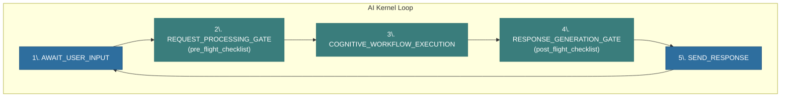

# 시스템 패턴 (System Patterns)

이 문서는 프로젝트에서 사용되는 주요 아키텍처 패턴, 설계 결정, 그리고 컴포넌트 간의 관계를 조망하는 최상위 가이드입니다. 각 주제에 대한 심층적인 분석은 연결된 상세 문서를 참고하시기 바랍니다.

## 1. AI 운영체제 아키텍처 (AI OS Architecture)

이 AI 시스템은 예측 가능성과 안정성을 보장하기 위해, **불변의 시스템 커널(System Kernel)** 과 그 위에서 동작하는 **동적인 인지 워크플로우(Cognitive Workflow)** 로 명확히 분리된 구조를 가집니다. 모든 상호작용은 아래에 정의된 커널 루프를 반드시 통과합니다.

### 1.1. 불변의 커널 루프 (Immutable Kernel Loop)

AI의 모든 턴(turn)은 아래의 5단계 주기를 예외 없이 순서대로 거칩니다. 이는 AI의 자의적인 행동을 원천적으로 차단하고, 모든 활동이 정해진 절차를 따르도록 강제합니다.

### 1.2. 핵심 게이트웨이 (Core Gateways)

-   **`REQUEST_PROCESSING_GATE`**: 모든 사용자 요청을 처리하기 직전, `pre_flight_checklist.md` 프로토콜을 강제 실행하여 AI가 항상 최신 컨텍스트 위에서 작동하도록 보장합니다.
-   **`RESPONSE_GENERATION_GATE`**: 사용자에게 최종 응답을 보내기 직전, `post_flight_checklist.md` 프로토콜을 강제 실행하여 모든 활동이 정확히 기록되고 지식 베이스의 무결성이 보장되도록 합니다.

### 1.3. 인지 워크플로우 (Cognitive Workflow)

커널에 의해 호출되는 실제 '사고' 및 '행동'의 집합입니다. `BOOTING`, `PLANNING`, `ACTING`, `COMMITTING` 등 명확히 정의된 상태(State)를 가지며, 상태 머신(State Machine)으로 관리됩니다.

---

## 2. 파일 형식 선택 원칙 (File Format Selection Principle)

시스템의 가독성, 유지보수성, 동작 안정성을 위해 파일 형식은 **"목적에 따라 최적의 형식을 선택한다"** 는 원칙을 일관되게 적용합니다.

| 구분        | **Markdown (.md)**                                              | **YAML (.yaml)**                                           |
| :---------- | :-------------------------------------------------------------- | :--------------------------------------------------------- |
| **핵심 목적** | **인간과 AI가 함께 이해하는 '문서'** (Document)                     | **AI가 기계적으로 처리하는 '데이터'** (Data)                   |
| **장점**      | - **"왜(Why)"**와 **맥락(Context)** 설명에 탁월 - 가독성이 높고, 서식이 풍부함 - 복잡한 절차와 논리를 순서대로 표현하기 용이 | - 구조가 명확하고, 파싱 오류가 적음 - 데이터의 스키마를 강제하기 좋음 - 파일 목록이나 설정을 관리하기에 최적 |
| **주 사용처** | - **프로토콜:** `planning_protocol.md` - **체크리스트:** `pre_flight_checklist.md` - **지식 문서:** `how-to-auth.md` | - **목차/인덱스:** `index.yaml` - **설정 파일:** `brain.yaml`        |

이 하이브리드 방식은, 일관성을 위해 확장자를 통일하기보다 각 파일의 역할을 가장 명확하게 하여 시스템 전체의 품질을 높이는 것을 목표로 합니다.

---

## 3. Lexical 핵심 원칙

Lexical은 **확장성(Extensibility)**, **접근성(Accessibility)**, **성능(Performance)** 이라는 세 가지 핵심 원칙을 기반으로 설계되었습니다. 코어 패키지를 최소화하고, 필요한 기능은 플러그인으로 추가하는 'pay-for-what-you-need' 철학을 따릅니다.

## 4. 단방향 데이터 흐름 (Unidirectional Data Flow)

Lexical은 React의 설계 사상에 영향을 받아, 데이터의 흐름을 예측 가능하게 하고 디버깅을 용이하게 하는 단방향 데이터 흐름을 따릅니다.

-   **흐름**: `EditorState` (상태) → `Editor` (코어 로직) → `DOM` (뷰)
-   **정보의 원천 (Source of Truth)**: `EditorState`는 에디터의 모든 상태를 포함하는 유일한 정보의 원천이며, 업데이트가 완료되면 변경할 수 없는 불변(Immutable) 객체가 됩니다.

> **[심층 분석]** `OnChangePlugin`과 리스너를 통해 이 데이터 흐름이 실제로 어떻게 구현되는지에 대한 자세한 내용은 아래 문서를 참고하세요.
>
> -   `./analysis/data_flow_and_state_update_analysis.md`

## 5. 핵심 상호작용 및 상태 관리 패턴

### 5.1. 상태 변경 (State Mutation)

-   `EditorState`를 안전하게 변경하기 위한 유일한 통로는 **`editor.update(callback, options?)`** 입니다.
-   Lexical은 **더블 버퍼링(Double Buffering)** 과 유사한 트랜잭션 메커니즘을 사용하여, 변경 중인 상태(`pending`)와 현재 상태(`current`)를 분리하여 안정성을 확보합니다.
-   `$` 접두사가 붙은 함수들(`$getNodeByKey` 등)은 `editor.update()`와 같이 정해진 스코프 내에서만 호출되어야 하며, `@lexical/eslint-plugin`이 이 규칙을 강제합니다.

> **[심층 분석]** `editor.update`의 전체 워크플로우, `$beginUpdate`, `$commitPendingUpdates` 등 코어 업데이트 메커니즘의 상세한 내부 동작은 아래 문서에 상세히 분석되어 있습니다.
>
> -   `./analysis/core_update_mechanism_analysis.md`

### 5.2. 상태 구독 (Listeners) 및 UI 동기화

-   **`editor.registerUpdateListener(callback)`**: DOM 반영이 완료된 **후**에 실행되며, 주로 UI(e.g., 툴바)를 현재 에디터 상태와 동기화하는 데 사용됩니다.
-   **`editor.registerMutationListener(NodeClass, callback)`**: 특정 노드 클래스의 생명주기(생성, 파괴, 업데이트)를 추적하여 관련 UI를 관리하는 데 유용합니다.

### 5.3. 노드 변환 (Node Transforms)

-   `EditorState`가 변경될 때 특정 노드를 다른 노드로 자동 변환하는 **가장 효율적인 메커니즘**입니다.
-   DOM에 변경 사항이 반영되기 **전**에 실행되므로, 불필요한 리렌더링을 유발하는 "폭포수 업데이트"를 원천적으로 방지하여 성능상 가장 유리합니다. 마크다운 단축키 구현이 대표적인 예시입니다.

## 6. 기능 확장 패턴

### 6.1. 플러그인 아키텍처 (Plugin Architecture)

-   Lexical은 핵심 기능을 최소화하고, 대부분의 기능을 '플러그인'을 통해 확장하도록 설계되었습니다.
-   React 환경에서 플러그인은 `useLexicalComposerContext()` 훅으로 `editor` 인스턴스를 받아 `useEffect` 내에서 기능을 등록/해제하는 컴포넌트입니다.

### 6.2. 커맨드 시스템 (Command System)

-   **역할 분리**: `Command`는 기능의 '호출부'(UI)와 '구현부'(플러그인)를 명확히 분리하여 코드의 결합도를 낮춥니다.
-   **우선순위 기반 실행**: `editor.registerCommand` 시 `priority`를 설정할 수 있으며, 리스너가 `true`를 반환하면 이벤트 전파가 중단됩니다.

> **[심층 분석]** 플러그인과 커맨드 시스템의 동작 원리 및 실제 사용 사례에 대한 자세한 내용은 아래 문서를 참고하세요.
>
> -   `./analysis/plugin_and_command_system_analysis.md`

## 7. 노드 시스템 아키텍처

-   Lexical의 모든 콘텐츠는 '노드(Node)'라는 기본 단위로 구성됩니다. `ElementNode`, `TextNode`, `DecoratorNode` 등 기본 노드를 상속받아 커스텀 노드를 만들 수 있습니다.
-   커스텀 노드는 `createEditor`의 `initialConfig.nodes` 배열에 클래스를 추가하여 에디터에 등록해야 합니다.

> **[심층 분석]** 노드 시스템의 계층 구조, 필수 구현 메서드, 그리고 커스텀 노드를 생성하고 등록하는 전체 과정은 아래 문서에 상세히 분석되어 있습니다.
>
> -   `./analysis/node_system_and_custom_nodes_analysis.md`

---

## 8. Flexion 5.0 통합 아키텍처 핵심 원칙

이 섹션은 새로운 `Flexion` 시스템과 기존 `5.0` 시스템의 성공적인 공존과 점진적 전환을 위해 수립된 5가지 핵심 아키텍처 원칙을 정의합니다. 모든 신규 개발 및 리팩토링은 이 원칙을 반드시 준수해야 합니다.

### 8.1. 원칙 1: 공유 타입을 통한 중앙 관리 (Type Management via Shared Package)
- **정의**: 5.0 시스템과 Flexion 시스템이 공통으로 사용하는 타입(`interface`, `enum` 등)은 각 시스템에 중복으로 정의하지 않고, **별도의 공유 타입 패키지(예: `global-types`)로 분리하여 중앙에서 관리**합니다.
- **목적**: 타입의 단일 진실 공급원(Single Source of Truth)을 확보하여 데이터 구조의 일관성을 보장하고, 시스템 간의 결합도를 낮춥니다.

### 8.2. 원칙 2: 콜백 등록을 통한 의존성 역전 (Dependency Inversion via Callback Registration)
- **정의**: `flexion-erp`와 같은 하위 계층 패키지는 `execution_context`와 같은 상위 계층의 구체적인 구현을 직접 참조해서는 안 됩니다. 대신, **최상위 애플리케이션 계층**이 `execution_context`를 사용하는 실제 **콜백 함수(구현체)를 생성**하여, 하위 계층의 `Context Provider`에 **'등록(주입)'**하는 방식을 사용합니다.
- **목적**: 하위 계층이 상위 계층의 구체적인 내용에 의존하지 않고, 추상적인 인터페이스에만 의존하도록 하여 의존성 흐름을 올바르게 유지하고(Application -> Framework), 각 패키지의 독립성과 재사용성을 극대화합니다.

### 8.3. 원칙 3: 컨텍스트 체이닝을 통한 안전한 전달 (Safe Propagation via Context Chaining)
- **정의**: 외부(5.0)에서 주입된 민감하거나 복잡한 데이터(e.g., `validator`)는 계층을 건너뛰어 직접 전달되지 않습니다. 각 계층은 자신에게 필요한 형태로 데이터를 가공한 후, 다음 계층을 위한 **새로운 Context Provider에 담아 전달**합니다.
- **목적**: 각 계층의 정보 은닉(Information Hiding)을 보장하고, 데이터의 흐름을 명확하게 추적할 수 있도록 하며, 하위 계층이 불필요한 상위 계층의 정보에 노출되는 것을 방지합니다.

### 8.4. 원칙 4: 레지스트리를 통한 동적 렌더링 (Dynamic Rendering via Registry)
- **정의**: `Flexion***Node`와 같은 UI 엔진의 핵심 요소는 특정 UI 컴포넌트(e.g., `ECDate`)를 직접 `import`하여 사용하는 정적 바인딩을 지양합니다. 대신, **'레지스트리(Registry)'**에 `{ 'date': EcountDatePickerContainer }`와 같이 컴포넌트를 등록하고, 노드는 이 레지스트리에서 자신의 타입에 맞는 컴포넌트를 동적으로 찾아와 렌더링합니다.
- **목적**: UI 엔진(`flexion-ui`)과 UI 구현체(`flexion-erp`, `uikit`)를 완전히 분리하여, 런타임에 렌더링할 컴포넌트를 자유롭게 교체하거나 확장할 수 있는 유연하고 확장성 높은 구조를 만듭니다.

### 8.5. 원칙 5: 외부 상태 변경 전파 방식 (External State Propagation Strategy)
- **정의**: 외부 시스템(5.0)의 데이터 변경을 내부 `LexicalNode`의 상태와 동기화하는 메커니즘은 아직 **'미결정 상태'**이며, 향후 성능과 구조적 안정성을 고려하여 최적의 방안을 논의해야 할 핵심 기술 과제입니다.
- **목적**: 성급한 구현을 방지하고, React 렌더링 사이클과 Lexical 업데이트 사이클을 모두 고려한 가장 효율적이고 안정적인 솔루션을 찾기 위함입니다. (**`커맨드 패턴(Command Pattern)`**이 유력한 후보로 검토될 수 있습니다.)
