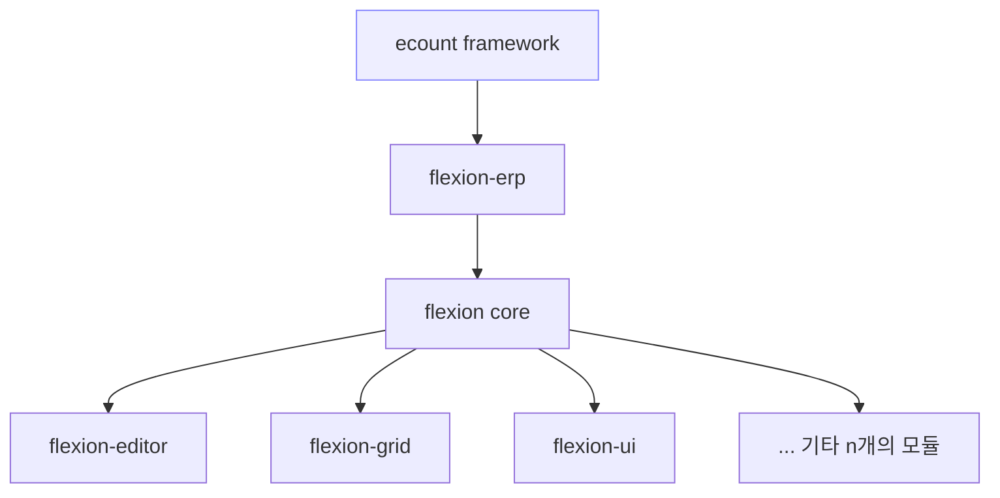
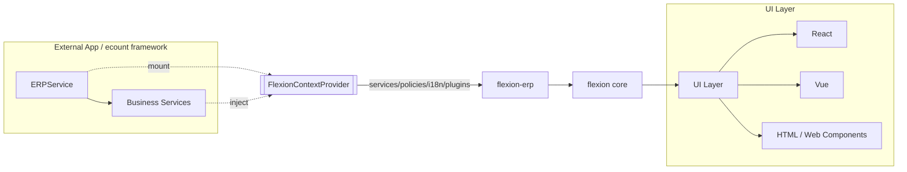

# Flexion Overview

## 1. 🚀 비전과 철학

Flexion은 **사용자 중심의 ERP UI/업무 플랫폼**을 목표로 합니다.
**어원**은 라틴어 *flectere*에서 유래해 "구부리다, 굽히다"를 뜻하며, 생물학적으로는 관절을 굽히는 동작을 의미합니다.
프로젝트 철학적으로는 "유연성(Flexibility) + 액션(Action)"을 결합해, 다양한 요구사항에 맞춰 형태를 자유롭게 바꾸고 즉시 실행 가능한 ERP 프레임워크를 지향합니다.

> **핵심 가치**: 변화에 쉽게 적응하고, 이를 빠르게 실현한다.

---

## 2. 🧱 아키텍처 개요

Flexion은 **ecount framework → flexion-erp → flexion core**의 3계층으로 구성됩니다.

* **ecount framework**: 외부 환경 및 표준 제공
* **flexion-erp**: ERP 모듈 집약, ContextProvider 제공, ERPService와의 연결을 통해 외부 비즈니스 로직과 자원 주입,  DefinitionNormalization, LayoutComposition 등
* **flexion core**: AST, 렌더링 엔진, 상태 동기화 등 핵심 로직. 하위 모듈 예시:
  * **flexion-editor**: 화면·양식 편집기 엔진
  * **flexion-grid**: 대용량 데이터 그리드 엔진
  * **flexion-ui**: 공통 UI 컴포넌트, 테마, 어댑터
  * **... 기타 다수의 모듈**: 상태 관리, 데이터 액세스, Command 처리, 플러그인 시스템,

### 2.1 계층 구조 (Mermaid)

### 2.2 데이터/제어 흐름 (Mermaid)

---

### 
