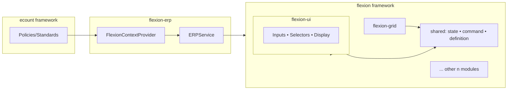
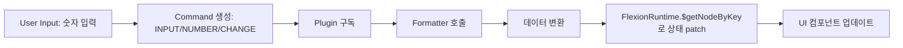
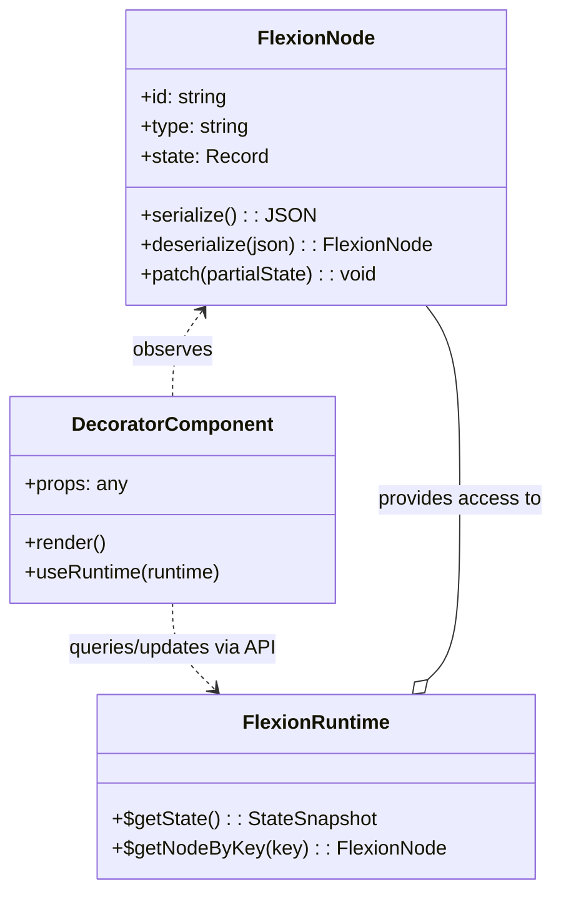

# Flexion Core

## 1. Overview

Flexion은 ERP UI를 위한 **유연하고 확장 가능한 프레임워크**로, ‘구부리다’라는 어원처럼 다양한 환경과 요구사항에 맞춰 형태를 바꿀 수 있도록 설계되었습니다.

핵심 가치는 다음과 같습니다:

* **유연성**: React/Vue/순수 HTML 등 다양한 UI 스택 지원
* **확장성**: 외부 비즈니스 로직/플러그인/데이터 모델을 안전하게 주입
* **모듈성**: 독립 모듈 조합으로 빠른 변화 대응


## 2. 핵심 모듈 구성

### flexion-ui

ERP 업무에 특화된 **입력/표시 컴포넌트**(숫자/텍스트/날짜/선택 등)를 제공.

### flexion-grid

대규모 데이터 표시·편집을 위한 **그리드 엔진**. 가상 스크롤, Lazy Rendering, 셀 단위 편집/검증 지원.

### shared

공통 로직(**State API, Command 버스, Definition(AST)** 등)을 제공하는 레이어.

> 위 3개 외에도 편집기, 레이아웃, 테마 등 **n개의 모듈**이 존재합니다.


### 2-1. **shared** 모듈

**shared** 모듈은 Flexion ERP 전반에서 공통적으로 사용되는 **핵심 인프라 레이어**를 제공합니다. 이는 `flexion-ui`, `flexion-grid`, 그리고 편집기·레이아웃·테마 등 모든 모듈에서 **동일한 상태·명령·정의 구조**를 일관성 있게 활용하도록 합니다.

#### 📌 주요 구성

| 구성 요소                  | 설명                                                                                       |
| ---------------------- | ---------------------------------------------------------------------------------------- |
| **State API**          | MobX 기반의 상태 관리 API로, UI와 데이터 모델 간의 동기화를 지원                                               |
| **Command Bus**        | 전역 명령 디스패처로, 모듈 간 이벤트/명령 전달 및 처리 흐름 제어                                                   |
| **Definition (AST)**   | UI 및 데이터 모델 정의를 AST 형태로 관리하고, Definition Normalization → AST Conversion 파이프라인의 핵심 데이터 구조 |
| **Validation & Rules** | 필드 단위, 폼 단위, 그리드 단위의 입력 검증 로직과 비즈니스 규칙 공통화                                               |
| **Utilities & Types**  | 모듈 간 공유되는 유틸 함수, 공용 타입, 상수 정의 등                                                          |


## 3. 아키텍처 개요




## 4. 데이터 및 제어 흐름

Flexion은 **ERPService를 통해 외부 비즈니스 로직**(플러그인/포맷터/데이터 모델 연동)을 주입받아 동작합니다.

**숫자 입력 → 플러그인 → Formatter → UI 업데이트 (부가 설명 도식화)**



### 4.1 FlexionNode(Component)

FlexionNode(Component)는 **노드 단위의 데이터/상태**와 이를 시각화하는 **Decorator Component**(React/Vue/HTML)의 결합입니다.

* **역할 분리**: 노드는 데이터/직렬화, 컴포넌트는 렌더/상호작용 담당
* **상태 접근**: 별도 스토어 노출 없이 **State API**(`$getState`, `$getNodeByKey`)로 조회/갱신
* **다중 UI 스택**: 동일 노드를 다양한 UI 기술로 데코레이션 가능




### 4.2 Command

Command는 Flexion의 **데이터·이벤트 흐름을 표준화**하는 핵심 단위입니다. 모든 이벤트/변경은 `type + payload(+ meta)` 형태의 Command로 버스를 통해 전달됩니다.

#### 4.2.1 Command 버스(Command Bus)

퍼블리시 → 미들웨어 → 핸들러/플러그인 → 상태 갱신 → UI 업데이트.


* **Publisher**: UI/플러그인/서비스 등 명령 발행 주체
* **Middleware**: 로깅·검증·정책·스로틀 등 전/후 처리
* **Handlers/Plugins**: Command 처리 후 State API 갱신

#### 4.2.2 Command 스키마(권장)

```ts
export type Command<P = any, M = any> = {
  type: string;                     // 예: 'INPUT/NUMBER/CHANGE'
  payload: P;                       // 직렬화 가능한 순수 데이터
  meta?: M & {                      // (선택) 트레이싱/정책용 공통 메타
    correlationId?: string;
    causationId?: string;
    ts?: number | string;
    userId?: string;
    source?: 'ui' | 'plugin' | 'service';
    idempotencyKey?: string;
  };
};
```

#### 4.2.3 라이프사이클

1. 생성 → 2) 발행 → 3) 미들웨어 → 4) 핸들러/플러그인 → 5) **State API 갱신** → 6) UI 리렌더 → 7) 결과 이벤트(`.../SUCCEEDED|REJECTED`).

#### 4.2.4 검증/정책 훅

```ts
bus.use('INPUT/NUMBER/CHANGE', [schemaValidate, domainValidate, policyGuard]);
```

#### 4.2.5 순서/중복 처리

* 동일 `path` 스트림 내 **FIFO** 보장 권장
* `idempotencyKey`로 중복 안전 처리
* 멀티 스트림은 **최종적 일관성** 허용

#### 4.2.6 예시 스펙(발췌)

```ts
export type NumberChangeCmd = Command<{
  path: string; raw: string; locale?: string; formatKey?: string; options?: Record<string, unknown>;
}>;
export type GridCellUpdateCmd = Command<{
  gridId: string; rowKey: string; colKey: string; value: unknown;
}>;
```

#### 4.2.7 예시: 숫자 입력 컴포넌트에서 Command 발행

```tsx
import { useState } from 'react';

type Props = { bus: { publish: (cmd: any) => void }; nodeId: string; locale?: string; formatKey?: string };
export function NumberInput({ bus, nodeId, locale = 'ko-KR', formatKey = 'number.currency' }: Props) {
  const [value, setValue] = useState('');
  const onChange = (e: React.ChangeEvent<HTMLInputElement>) => {
    const raw = e.target.value; setValue(raw);
    bus.publish({ type: 'INPUT/NUMBER/CHANGE', payload: { path: nodeId, raw, locale, formatKey }, meta: { source: 'ui' } });
  };
  return <input value={value} onChange={onChange} inputMode="decimal" placeholder="숫자를 입력하세요" />;
}
```


### 4.3 Plugin

플러그인은 **React 기반의 헤드리스 확장 컴포넌트**로, Command 흐름을 구독하고 ERPService/State API와 상호작용해 상태를 갱신합니다.

#### 4.3.1 숫자 입력 포맷 플러그인 예시

```tsx
function NumberFormatPlugin({ bus, erp, flex }) {
  useEffect(() => {
    const off = bus.on('INPUT/NUMBER/CHANGE', async (cmd) => {
      const { path, raw, locale, formatKey = 'number.currency', options } = cmd.payload;
      const formatter = erp.getFormatter?.(formatKey);
      try {
        const display = formatter ? await formatter.format(raw, { locale, options }) : raw;
        flex.$getNodeByKey(path)?.patch({ display, numeric: Number(raw) });
      } catch {
        flex.$getNodeByKey(path)?.patch({ display: raw, numeric: Number(raw) });
      }
    });
    return () => off();
  }, [bus, erp, flex]);
  return null; // headless
}
```


### 4.4 State API

Flexion은 별도 스토어를 노출하지 않고 **함수형 런타임 API**로 상태를 다룹니다.

#### 4.4.1 설계 원칙

* `$getState()` 스냅샷은 **읽기 전용**
* 갱신은 `$getNodeByKey(key)`로 핸들을 얻어 `patch()`로만 수행
* `patch()` 후 관련 UI 자동 리렌더, 외부 원시 객체 직접 변형 금지

#### 4.4.2 API 표면(권장)

```ts
interface FlexionRuntime {
  $getState(): unknown; // Readonly snapshot
  $getNodeByKey<T = any>(key: string): FlexionNodeHandle<T> | null;
}
interface FlexionNodeHandle<T = any> {
  value: Readonly<T>;
  patch(delta: Partial<T>): void;
}
```

#### 4.4.3 기본 사용 패턴

```ts
const snap = flex.$getState(); // 읽기 전용
const node = flex.$getNodeByKey<{ numeric: number; display: string }>('form.items[0].price');
if (node) node.patch({ display: node.value.numeric.toLocaleString('ko-KR') });
```

#### 4.4.4 파생 값 동기화

```ts
function syncAmount({ priceKey, qtyKey, amountKey }: { priceKey: string; qtyKey: string; amountKey: string }) {
  const price = flex.$getNodeByKey<{ numeric: number }>(priceKey)?.value.numeric ?? 0;
  const qty   = flex.$getNodeByKey<{ numeric: number }>(qtyKey)?.value.numeric ?? 0;
  flex.$getNodeByKey<{ numeric: number; display: string }>(amountKey)?.patch({ numeric: price * qty, display: String(price * qty) });
}
```

#### 4.4.5 비동기 포맷/검증 경쟁 상태 방지

```ts
let lastToken = 0;
bus.on('INPUT/NUMBER/CHANGE', async (cmd) => {
  const token = ++lastToken;
  const { path, raw, locale, formatKey = 'number.currency' } = cmd.payload;
  const node = flex.$getNodeByKey<{ display: string; numeric: number }>(path);
  if (!node) return;
  const formatter = erp.getFormatter?.(formatKey);
  const display = formatter ? await formatter.format(raw, { locale }) : raw;
  if (token !== lastToken) return; // 최신 입력만 반영
  node.patch({ display, numeric: Number(raw) });
});
```

#### 4.4.6 성능/테스트 팁

* 고빈도 입력은 120–200ms **디바운스** 권장
* 동일 값이면 `patch()` 생략
* 테스트: `$getNodeByKey` 목/스파이로 **patch 호출** 단언, 경쟁 상태 시나리오 포함


## 부록 A. (엄격 버전) 스키마/미들웨어/컴포넌트 예시

정수부·소수부 자릿수/부호 허용/값 범위까지 통제하는 **Zod 스키마**, **타입드 비동기 미들웨어**, 그리고 이를 활용하는 **NumberInput/플러그인** 예시입니다.

### A.1 Zod 스키마 (구성 가능한 제약)

```ts
import { z } from 'zod';
export type NumberConstraints = {
  maxIntegerDigits: number;
  maxFractionDigits: number;
  allowNegative?: boolean;
  min?: number;
  max?: number;
};
export const makeRawNumberSchema = (c: NumberConstraints) => z
  .string()
  .min(1, '값이 비어있습니다')
  .max(64, '입력 길이가 너무 깁니다')
  .regex(/^[-]?\d*(?:\.\d*)?$/, '숫자 형식이 아닙니다')
  .refine(v => (c.allowNegative ?? false) || !v.startsWith('-'), '음수는 허용되지 않습니다')
  .refine(v => { const [i = ''] = v.split('.'); return i.replace(/^[-]/,'').length <= c.maxIntegerDigits; }, '정수부 자릿수 초과')
  .refine(v => (v.split('.')[1]?.length ?? 0) <= c.maxFractionDigits, '소수부 자릿수 초과')
  .refine(v => { const n = Number(v); if (Number.isNaN(n)) return false; if (typeof c.min==='number' && n<c.min) return false; if (typeof c.max==='number' && n>c.max) return false; return true; }, '허용 범위를 벗어났습니다');
export const NumberChangeSchema = (c: NumberConstraints) => z.object({
  type: z.literal('INPUT/NUMBER/CHANGE'),
  payload: z.object({ path: z.string().min(1), raw: makeRawNumberSchema(c), locale: z.string().optional(), formatKey: z.string().optional(), options: z.record(z.any()).optional() }),
  meta: z.object({ source: z.enum(['ui','plugin','service']).optional(), correlationId: z.string().optional(), ts: z.union([z.number(), z.string()]).optional() }).optional(),
});
```

### A.2 타입드 미들웨어 & 버스 인터페이스

```ts
export type TypedMiddleware<T> = (cmd: T, next: (cmd: T) => Promise<void>) => Promise<void>;
export interface CommandBus {
  publish<T>(cmd: T): void;
  on<T>(type: string, handler: (cmd: T) => void | Promise<void>): () => void;
  use<T>(type: string, mws: TypedMiddleware<T>[]): void;
}
const constraints: NumberConstraints = { maxIntegerDigits: 12, maxFractionDigits: 2, allowNegative: false, min: 0, max: 100_000_000 };
const schemaValidate: TypedMiddleware<any> = async (cmd, next) => {
  const parsed = NumberChangeSchema(constraints).safeParse(cmd);
  if (!parsed.success) { console.warn('Invalid command', parsed.error.flatten()); return; }
  await next(parsed.data);
};
const policyGuard: TypedMiddleware<any> = async (cmd, next) => { if (!hasAccess(cmd.payload.path)) return; await next(cmd); };
const auditLog: TypedMiddleware<any> = async (cmd, next) => { logCmd(cmd); await next(cmd); };
bus.use('INPUT/NUMBER/CHANGE', [schemaValidate, policyGuard, auditLog]);
```

### A.3 타입 강화된 NumberInput (UI 단계 방어)

```tsx
import { useState } from 'react';
import { makeRawNumberSchema, NumberConstraints } from './schemas';

type Props = { bus: { publish: (cmd: any) => void }; nodeId: string; locale?: string; formatKey?: string; constraints?: NumberConstraints };
export function NumberInput({ bus, nodeId, locale = 'ko-KR', formatKey = 'number.currency', constraints = { maxIntegerDigits: 12, maxFractionDigits: 2, allowNegative: false } }: Props) {
  const [value, setValue] = useState('');
  const RawNumberSchema = makeRawNumberSchema(constraints);
  const onChange = (e: React.ChangeEvent<HTMLInputElement>) => {
    const raw = e.target.value; setValue(raw);
    const res = RawNumberSchema.safeParse(raw.replace(/,/g, ''));
    if (!res.success) return; // UI단에서 즉시 차단
    bus.publish({ type: 'INPUT/NUMBER/CHANGE', payload: { path: nodeId, raw: res.data, locale, formatKey, options: { constraints } }, meta: { source: 'ui' } });
  };
  return <input value={value} onChange={onChange} inputMode="decimal" placeholder={`최대 ${constraints.maxIntegerDigits}자리 / 소수 ${constraints.maxFractionDigits}자리`} />;
}
```

### A.4 플러그인 핸들러 (스키마 재검증 + 포맷 + patch)

```ts
import { NumberChangeSchema, NumberConstraints } from './schemas';

bus.on('INPUT/NUMBER/CHANGE', async (cmd) => {
  const constraints: NumberConstraints | undefined = cmd.payload?.options?.constraints;
  const schema = constraints ? NumberChangeSchema(constraints) : NumberChangeSchema({ maxIntegerDigits: 12, maxFractionDigits: 2, allowNegative: false });
  const parsed = schema.safeParse(cmd);
  if (!parsed.success) return; // 미들웨어에서 이미 차단되었어도 2중 방어
  const { path, raw, locale, formatKey = 'number.currency', options } = parsed.data.payload;
  const node = flex.$getNodeByKey<{ display: string; numeric: number }>(path);
  if (!node) return;
  try {
    const display = erp.getFormatter?.(formatKey) ? await erp.getFormatter(formatKey)!.format(raw, { locale, options }) : raw;
    node.patch({ display, numeric: Number(raw) });
  } catch {
    node.patch({ display: raw, numeric: Number(raw) });
  }
});
```
