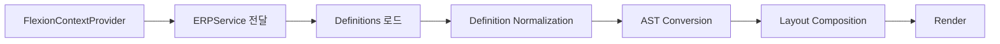

# Flexion ERP Overview

본 문서는 **React의 Context API**를 활용한 **FlexionContextProvider**를 통해 **ERPService**를 주입하는 방식과, 화면 정의가 실제 UI로 렌더되기까지의 **Definition Normalization → AST Conversion → Layout Composition** 파이프라인을 설명합니다. 또한 FlexionDefinition, FlexionViewContainer, FlexionWidget 등의 주요 타입 구조를 포함합니다.

---

## 1. 목적 및 범위

* 외부 프레임워크에서 ERPService를 안전하게 주입하고 버전 호환을 유지
* Definition을 수용 가능한 표준 형태로 정규화하고(AST 변환 전 단계) 스키마 검증 강화
* AST 변환을 통해 런타임이 이해하는 노드 그래프로 치환
* 레이아웃 합성으로 최종 UI 트리 구성 및 렌더 성능 확보

---

## 2. FlexionContextProvider를 통한 ERPService 주입

**FlexionContextProvider는 React의 Context API 기반**입니다. 외부(예: ecount framework)에서 제공하는 ERPService/정의(definitions) 등을 **React Context로 주입**하고, Flexion 런타임과 컴포넌트/플러그인이 `useContext` 훅을 통해 접근합니다.

### 2.1 역할

* ERPService 주입 및 수명 주기 관리
* 정책, 표준, 권한, 플러그인 Provider 등 외부 자원 연결
* Definition 공급원 등록과 버전 협상
* 런타임 초기화 시 Context 값 단일 진입점 제공

### 2.2 타입 구조

```ts
export interface FlexionDefinition {
    view_container: FlexionViewContainer;
    data_model: FlexionDataModel[];
}

export interface FlexionDataModel {
    [key: string]: any;
}

export interface FlexionViewContainer {
    containers: FlexionContainer[];
}

export interface FlexionContainer {
    title?: string;
    openInPopup: boolean;
    movable: boolean;
    useSearch: boolean;
    widgets: FlexionWidget[];
    commands: FlexionCommand[];
}

export interface FlexionWidget<TFlexionLayoutRule = FlexionBaseLayoutRule> {
    type: 'form' | 'grid' | 'kanban' | 'editor' | 'xtemplate' | 'flexion-ast';
    items: FlexionItemNode[];
    attribute: {
        layout: TFlexionLayoutRule;
        focus: FlexionFocusBindings;
    };
}
```

### 2.3 React 구현 스케치

```tsx
export function FlexionContextProvider({ value, children }:{ value: FlexionContextValue; children: React.ReactNode }){
  return <FlexionReactContext.Provider value={value}>{children}</FlexionReactContext.Provider>;
}

export function useFlexion(){
  const ctx = useContext(FlexionReactContext);
  if (!ctx) throw new Error('FlexionContextProvider 하위에서만 useFlexion을 호출하세요.');
  return ctx;
}
```

---

## 3. Definition Normalization

Definition은 팀, 시스템, 버전에 따라 포맷이 다를 수 있습니다. Normalization은 **공용 스키마**로 변환해 AST 변환 입력을 안정화합니다.

### 3.1 인터페이스 예시

```ts
export class ISetupDefinitionNormalizer implements DefinitionNormalizer<ISetup, IExecutionContext> {
    normalize(input: ISetup, context: IExecutionContext): NormalizedDefinition {
        return {} as NormalizedDefinition;
    }
}
```

---

## 4. AST Conversion

NormalizedDefinition을 Flexion 런타임이 이해하는 \*\*노드 그래프(AST)\*\*로 변환합니다.

### 4.1 변환기 인터페이스

```ts
export interface ASTConverter {
  toAST(def: NormalizedDefinition): FlexionAST;
}
```

---

## 5. Layout Composition

AST를 기반으로 UI 레이아웃을 계산하고, React/Vue/HTML 어댑터로 컴포넌트를 배치합니다.

---

## 6. End to End 파이프라인



---

## 8. Definition/Widget 스키마 (제공 사양 반영)

아래 타입들은 제공해 준 스펙을 기준으로 정리/정규화한 **런타임 전(Pre-AST)** 스키마입니다. Normalization 단계의 입력/출력 스키마로 사용하고, 이후 AST Conversion에서 Flexion AST로 치환됩니다.

```ts
/* eslint-disable @typescript-eslint/no-explicit-any */

// ============================================================
//  FlexionDefinition (문서 루트)
// ============================================================
export interface FlexionDefinition {
  view_container: FlexionViewContainer;
  data_model: FlexionDataModel[];
}

// ============================================================
//  DataModel
// ============================================================
export interface FlexionDataModel {
  [key: string]: unknown;
}

// ============================================================
//  Base Types
// ============================================================
export type FlexionItemId = string;
export type FlexionKeyEvent = 'Tab' | 'Shift+Tab' | 'ArrowDown' | 'ArrowUp';

// 페이지/스크롤
export interface FlexionPageNation { // 그대로 유지 (오탈자 시 Pagination으로 리네이밍 고려)
  totalSize: number;     // 전체 항목 수
  pageSize: number;      // 페이지당 항목 수
  currentPage: number;   // 현재 페이지 (0-based 또는 1-based)
}

export interface FlexionPageEvent {
  type: 'goTo' | 'next' | 'prev';
  targetPage: number;
  pageSize?: number;
}

export interface FlexionScrollOptions {
  scrollBehavior?: 'auto' | 'smooth';
  autoScrollToTop?: boolean;
  axis?: 'vertical' | 'horizontal' | 'both';
  virtualized?: boolean;
  scrollAnchorId?: string;
}

export interface FlexionCommand<TPayload = any> {
  id: string;
  payload?: TPayload;
  priority?: boolean;
}

// ============================================================
//  FlexionViewContainer
// ============================================================
export interface FlexionViewContainer {
  // pagination?: FlexionPageNation; // (위젯 레벨로 이동 고려)
  // scroll?: FlexionScrollOptions;  // (위젯 레벨로 이동 고려)
  containers: FlexionContainer[];
}

// ============================================================
//  FlexionContainer
// ============================================================
export interface FlexionContainer {
  title?: string;              // 상단 타이틀(계산식 허용 가능)
  openInPopup: boolean;
  movable: boolean;
  useSearch: boolean;
  widgets: FlexionWidget[];
  commands: FlexionCommand[];  // 컨테이너 단위 액션(푸터 버튼 등)
}

// ============================================================
//  FlexionWidget
// ============================================================
export interface FlexionWidget<TFlexionLayoutRule = FlexionBaseLayoutRule> {
  /**
   * xtemplate  : 자유형 템플릿 → HTML 렌더링
   * flexion-ast: flexion-editor 산출물을 AST로 렌더 (권장)
   */
  type: 'form' | 'grid' | 'kanban' | 'editor' | 'xtemplate' | 'flexion-ast';
  items: FlexionItemNode[];
  attribute: {
    layout: TFlexionLayoutRule;   // 배치/표시 규칙
    focus: FlexionFocusBindings;  // 포커스 이동/키 바인딩
  };
}

export interface FlexionFocusBindings {
  keys: FlexionKeyEvent[];
  order: FlexionItemId[];
  // condition?: { whenFocused?: FlexionItemId; expression?: string };
}

// ============================================================
//  Layout Rules
// ============================================================
export interface FlexionBaseLayoutRule {}

export type FlexionItemMergeSet = any; // 향후 유형 정의 (셀 병합/그룹 규칙 등)

export interface FlexionDataModelBasedLayoutRule extends FlexionBaseLayoutRule {
  category: FlexionItemId[];
  displayOrder: FlexionItemId[];
  mergeSet: FlexionItemMergeSet[];
}

export interface FlexionFormLayoutRule extends FlexionDataModelBasedLayoutRule {
  columnCount: number;
  toggleGroup: FlexionItemId[];
}

export interface FlexionGridLayoutRule extends FlexionDataModelBasedLayoutRule {
  rowDetail: {
    triggerItemNodeId: string;
    condition: string; // 예: 'row.item_id != null'
    detailDefinitionId: string;
    injectPosition: 'below' | 'up' | 'inline';
  };
}

// ============================================================
//  Item Node & 특수 노드 타입
// ============================================================
export interface FlexionItemNode<TData = unknown, TState = unknown> {
  /** 외부 정의에서 부여하는 식별자(런타임 nodeKey와 매핑) */
  nodeid: string;
  data: TData;
  state: TState;       // 렌더링 상태
}

// 데이터 태그(문자열 리터럴)로 타입 구분
export type FlexionDataTag = '$$code' | '$$date';
export type FlexionCodeState = any;
export type FlexionDateState = any;

export interface FlexionCodeNode extends FlexionItemNode<FlexionDataTag, FlexionCodeState> {
  datatype: '$$code';
  viewtype: 'code' | 'select' | 'checkbox';
}

export interface FlexionDateNode extends FlexionItemNode<FlexionDataTag, FlexionDateState> {
  datatype: '$$date';
  viewtype: 'date';
}
```

### 8.1 스키마와 파이프라인의 연결

* **Definition Normalization**: 위 스키마로 **형식/기본값/참조 무결성**을 확정합니다.
* **AST Conversion**: `FlexionWidget.items -> ASTNode[]`로 치환하고, `nodeid` ↔ `nodeKey` 색인을 생성합니다.
* **Layout Composition**: `attribute.layout` 규칙을 사용해 배치/머지/토글/rowDetail 등을 반영합니다.

> 주의: `FlexionPageNation`, `FlexionScrollOptions`는 위젯 단위로 옮기는 것이 자연스럽습니다(그리드/폼별 최적화 목적).

---

## 9. Normalizer 구현 예시 (ISetupDefinitionNormalizer)

제공한 **ISetupDefinitionNormalizer** 골격을 Normalization 단계에 맞춰 정리했습니다. 입력 사양은 메뉴/뷰 컨테이너/위젯 배치를 선언적으로 받으며, 출력은 `NormalizedDefinition`입니다.

```ts
import { DefinitionNormalizer, NormalizedDefinition } from '../DefinitionNormalizer';

// 입력 스펙(예시). 실제로는 view/widget 트리도 포함 가능
interface ISetup {
  data_model_definition: string;
}

interface IExecutionContext {}

export class ISetupDefinitionNormalizer implements DefinitionNormalizer<ISetup, IExecutionContext> {
  normalize(input: ISetup, _context: IExecutionContext): NormalizedDefinition {
    // [입력 메뉴]
    // viewcontainer
    //   - HeaderWidget
    // viewcontainer
    //   - FormWidget(상단)
    // viewcontainer
    //   - ToolbarWidget(중간툴바)
    // viewcontainer
    //   - GridWidget(하단)
    // viewcontainer
    //   - FooterWidget(하단툴바)

    // TODO: 실제 규칙
    // 1) 필수 키 보정, 2) layout 기본값, 3) data_model 매핑, 4) 위젯 타입 해석
    return {
      id: 'setup.normalized',
      layout: { kind: 'stack', direction: 'vertical' },
      fields: [],
    } as unknown as NormalizedDefinition;
  }
}
```

### 9.1 매핑 가이드(요약)

* `FlexionDefinition.view_container.containers[*].widgets[*]` → **NormalizedDefinition.fields**로 평탄화하거나 섹션 단위로 유지
* `FlexionWidget.attribute.layout` → **Normalized layout 옵션**으로 이관
* `FlexionItemNode.nodeid` → **AST nodeKey**로 매핑(색인 생성)
* `FlexionCodeNode / FlexionDateNode` → **노드 타입/뷰 타입**으로 분기해 적절한 컴포넌트에 바인딩

---

## 10. 다음 단계 제안

* `FlexionPageNation`/`FlexionScrollOptions`의 **위젯 단위 배치** 확정
* `FlexionGridLayoutRule.rowDetail`의 **조건식 DSL**(간단한 파서 or 함수 시그니처) 결정
* `FlexionItemMergeSet` 구체 타입 정의(셀 병합, 섹션 그룹 규칙 등)
* Normalization 단계의 **Zod 스키마** 도입으로 조기 오류 검출
