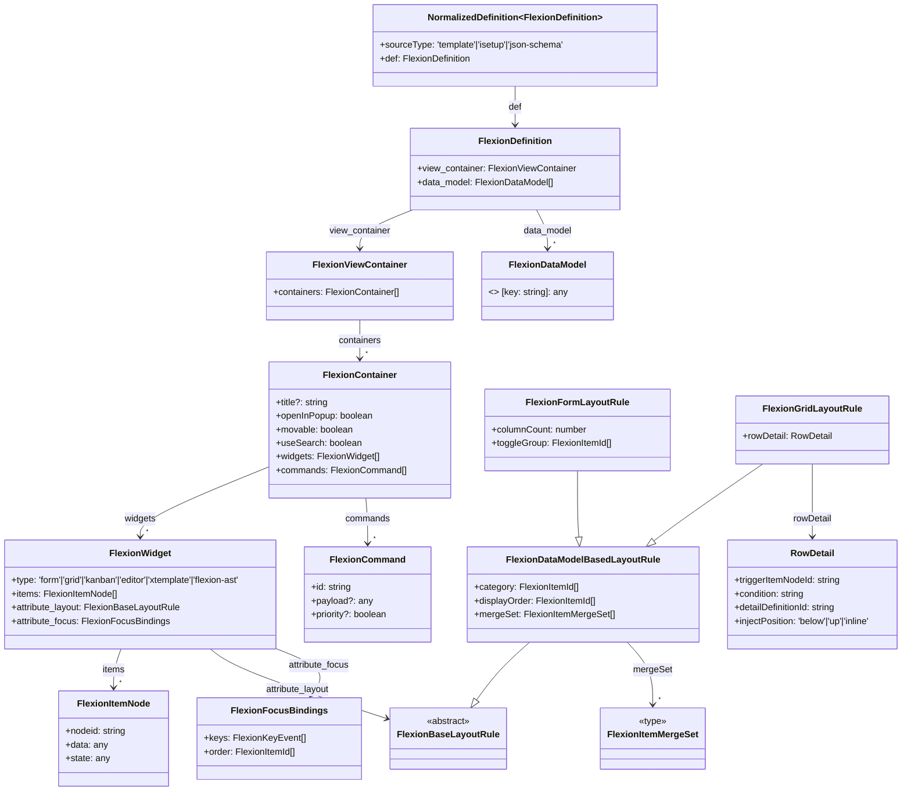

## 2. Definition Normalization (정의 정규화 단계)

### 1. 개요

Definition Normalization은 외부에서 주어진 다양한 형태의 정의(iSetup, Template JSON, JSON Schema 등)를 **Flexion 내부 표준 구조**로 변환하는 과정이다.
이 단계는 이후 Layout Composition & AST Conversion 단계가 **형식 차이로 인한 분기 없이** 일관된 데이터를 처리할 수 있도록 해준다.

* **위치**: 파이프라인의 2단계
  *(1단계: 원본 정의 로딩 → ****2단계: Definition Normalization**** → 3단계: Layout Composition & AST Conversion)*
* **목적**: 서로 다른 포맷을 단일 표준 구조(**NormalizedDefinition**)로 변환
* **효과**: 후속 렌더링 로직의 단순화 및 유지보수성 향상

---

### 2. 입력 (Sources)

* **iSetup**

  * ERP 메뉴, 데이터 모델, 뷰 설정이 포함된 사내 XML/JSON 포맷
* **Template JSON**

  * UI 템플릿 중심의 JSON 정의
* **JSON Schema**

  * 데이터 모델 중심의 정의, UI 메타 정보 일부 포함 가능
* **플러그인/확장 모듈 정의**

  * 외부 모듈에서 제공하는 UI/데이터 정의

---

### 3. 출력 (NormalizedDefinition)

```ts
interface NormalizedDefinition<TDef> {
  sourceType: 'template' | 'isetup' | 'json-schema';
  def: TDef; // Flexion 표준 레이아웃 & 데이터 모델 구조
}
```

* **sourceType**: 원본 정의의 타입
* **def**: Flexion 표준 구조(view\_container, data\_model, data\_model\_definitions 등)

NormalizedDefinition의 `def`는 **FlexionDefinition** 타입을 사용한다. FlexionDefinition은 `view_container`와 `data_model` 두 축으로 구성되며, `view_container`는 컨테이너-위젯-아이템 노드 구조를, `data_model`은 데이터 모델 필드 정의를 담는다.

```ts
interface FlexionDefinition {
  view_container: FlexionViewContainer;
  data_model: FlexionDataModel[];
}
```

아래 다이어그램은 NormalizedDefinition이 FlexionDefinition과 그 하위 구조를 어떻게 포함하는지를 나타낸다.



---

### 4. 변환 처리 흐름

1. **Source Parser 선택**

   * 원본 타입(iSetup, Template JSON, JSON Schema 등)에 맞는 파서 실행
   * 예: `ISetupParser`, `TemplateParser`, `JsonSchemaParser`
2. **메타데이터 추출**

   * 메뉴 ID, 템플릿 버전, 데이터 모델 메타 정보 수집
3. **레이아웃 구조 변환**

   * container → contents → recordset → model → field 계층 구조로 변환
4. **데이터 모델 정의 변환**

   * field type, validator, trigger, renderer 속성을 표준 스키마에 매핑
5. **후처리 및 일관성 검증**

   * 필수 필드 존재 여부 확인
   * 잘못된 참조나 순환 참조 제거
6. **NormalizedDefinition 객체 생성**

---

### 5. 장점

* 서로 다른 원본 정의를 **하나의 표준 구조**로 통합
* 후속 단계에서 분기 처리 최소화
* Source Parser 단위 테스트 가능 → 품질 및 안정성 향상
* 원본 포맷 변경 시에도 Normalization 모듈만 수정하면 전체 파이프라인 유지 가능

---

### 6. 예시 변환

**입력 (iSetup 일부 발췌)**

```json
{
  "menuId": "sales_order",
  "view": {
    "containers": [
      {
        "type": "form",
        "contents": [
          { "type": "field", "name": "order_date", "label": "Order Date" }
        ]
      }
    ]
  },
  "model": {
    "fields": [
      { "name": "order_date", "type": "date", "required": true }
    ]
  }
}
```

**출력 (NormalizedDefinition)**

```ts
{
  sourceType: 'isetup',
  def: {
    view_container: {
      type: 'form',
      contents: [
        { kind: 'field', fieldName: 'order_date', label: 'Order Date' }
      ]
    },
    data_model: [
      { fieldName: 'order_date', fieldType: 'date', required: true }
    ]
  }
}
```
