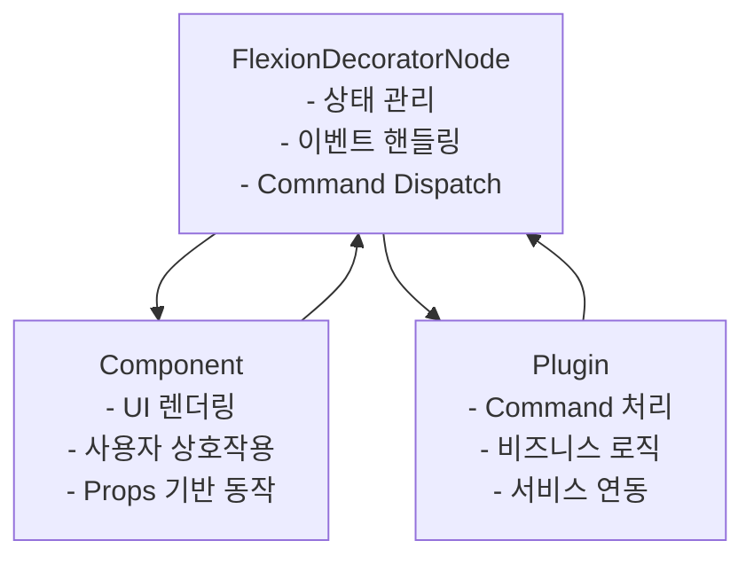
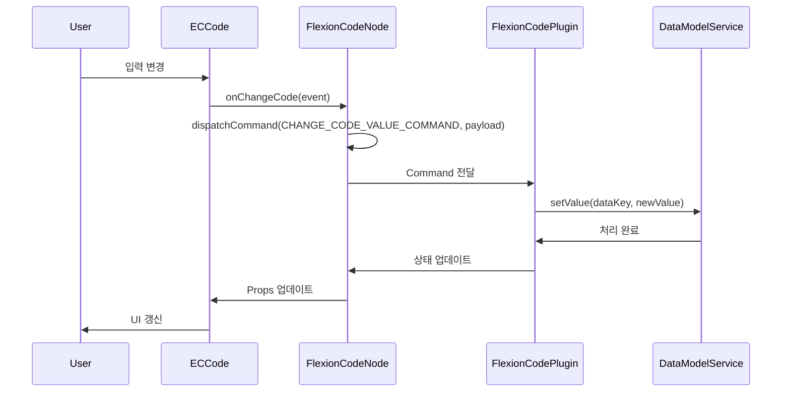

# Flexion 아키텍처 관계 분석: Node, Component, Plugin

**문서 요약**: 이 문서는 Flexion 시스템에서 FlexionDecoratorNode, Component, Plugin의 관계와 각각의 역할을 상세히 분석합니다. 특히 FlexionCodeNode, ECCode, FlexionCodePlugin을 예시로 사용하여 실제 구현 패턴을 설명합니다.

---

## 1. 전체 아키텍처 개요

Flexion 시스템은 **3계층 아키텍처**를 기반으로 설계되어 있습니다:



### 1.1 핵심 설계 원칙

1. **단일 책임 원칙**: 각 계층은 명확한 역할을 가집니다
2. **의존성 역전**: Component는 Node에 의존하지 않고, Plugin은 서비스에 의존합니다
3. **Command 패턴**: 모든 상호작용은 Command를 통해 처리됩니다
4. **상태 분리**: Node의 상태와 Component의 Props가 명확히 분리됩니다

---

## 2. FlexionDecoratorNode (기반 클래스)

### 2.1 역할과 책임

```typescript
export class FlexionDecoratorNode<
    TDataType = unknown,
    TNodeState = unknown,
    T = JSX.Element,
> extends DecoratorNode<T>
```

**주요 역할:**
- **상태 관리**: `$getData()`, `$setData()`, `$getState()`, `$setState()`
- **DataKey 관리**: `getDataKey()`, `addToUniqueKeyMap()`, `removeFromUniqueKeyMap()`
- **Command Dispatch**: `dispatchCommand()` 메서드 제공
- **Editor 참조**: `__editor` 인스턴스 관리

### 2.2 핵심 메서드

```typescript
// 상태 관리
$getData(): TDataType
$setData(valueOrUpdate: ValueOrUpdater<TDataType>): void
$getState(): TNodeState
$setState(stateOrUpdate: ValueOrUpdater<TNodeState>): void

// DataKey 관리
getDataKey(): DataKey
addToUniqueKeyMap(): void
removeFromUniqueKeyMap(): void

// Command Dispatch
protected dispatchCommand<T>(type: LexicalCommand<T>, payload: T): boolean
```

### 2.3 설계 철학

- **제네릭 기반**: 타입 안전성을 보장하면서 다양한 데이터 타입 지원
- **상태 분리**: 데이터(`TDataType`)와 뷰 상태(`TNodeState`)를 명확히 분리
- **Editor 독립성**: Editor 인스턴스를 캡슐화하여 데이터 오염 방지

---

## 3. 구체적 Node 구현 (예: FlexionCodeNode)

### 3.1 구조와 상속

```typescript
export class FlexionCodeNode extends FlexionDecoratorNode<
    ICodeNodeData,      // 데이터 타입
    ICodeNodeState,     // 상태 타입
    React.ReactElement  // 렌더링 타입
>
```

### 3.2 핵심 메서드

#### 3.2.1 `decorate()` - UI 렌더링

```typescript
decorate(): JSX.Element {
    return (
        <ECCode
            hide_code={this.$getState()?.hide_code ?? false}
            fn={this.$getState()?.fn}
            display_name={this.$getState()?.display_name ?? ''}
            data={this.$getData()}
            writable={this.$getState()?.writable}
            error={this.$getState()?.error ?? {error_message: ''}}
            onChangeCode={this.onChangeCode}
            onBlurCode={this.onBlurCode}
            // ... 기타 이벤트 핸들러들
        />
    );
}
```

**핵심 특징:**
- **Props 전달**: Node의 상태와 데이터를 Component에 전달
- **이벤트 핸들러 바인딩**: Node의 메서드를 Component의 이벤트 핸들러로 연결
- **타입 안전성**: TypeScript를 통한 Props 타입 검증

#### 3.2.2 이벤트 핸들러 - Command Dispatch

```typescript
onChangeCode = (event: React.ChangeEvent<HTMLInputElement>): void => {
    const value = event.target.value;
    console.log('onChangeCode', value);

    this.dispatchCommand(CHANGE_CODE_VALUE_COMMAND, {
        dataKey: this.getDataKey(),
        value: value,
    });
};
```

**핵심 특징:**
- **이벤트 캡처**: Component에서 발생한 이벤트를 캡처
- **Command 생성**: 이벤트 데이터를 Command payload로 변환
- **Dispatch**: 부모 클래스의 `dispatchCommand` 메서드 호출

### 3.3 설계 패턴

1. **이벤트 위임**: 모든 사용자 상호작용을 Command로 변환
2. **상태 불변성**: 직접적인 상태 변경 대신 Command를 통한 간접 변경
3. **타입 안전성**: TypeScript를 통한 컴파일 타임 검증

---

## 4. Component (UI 계층)

### 4.1 역할과 책임

```typescript
export interface IECCodeProps {
    // 상태 Props
    hide_code: boolean;
    display_name: string;
    writable?: { code: boolean; name: boolean };
    fn: any;
    error: any;
    data: any;

    // 이벤트 핸들러 Props
    onChangeCode: (event: React.ChangeEvent<HTMLInputElement>) => void;
    onBlurCode: (event: React.FocusEvent<HTMLInputElement>) => void;
    // ... 기타 핸들러들
}
```

**주요 역할:**
- **UI 렌더링**: 실제 DOM 요소 생성 및 스타일링
- **이벤트 처리**: 사용자 상호작용을 Node의 핸들러로 전달
- **Props 기반 동작**: 외부에서 주입받은 Props에 따라 동작 결정

### 4.2 핵심 특징

#### 4.2.1 순수 함수형 컴포넌트

```typescript
export const ECCode = memo(function ECCode(props: IECCodeProps) {
    const {
        hide_code,
        fn,
        display_name,
        data,
        writable,
        error,
        onChangeCode,
        // ... 기타 props
    } = props;

    // UI 렌더링 로직
    return (
        <>
            {!hide_code && (
                <Input
                    value={(data as any).code}
                    onChange={handleChangeCode}
                    // ... 기타 props
                />
            )}
            {/* ... 기타 UI 요소들 */}
        </>
    );
});
```

**핵심 특징:**
- **Props 기반**: 모든 동작이 Props에 의해 결정됨
- **비즈니스 로직 없음**: 순수한 UI 렌더링만 담당
- **재사용성**: 다양한 Node에서 동일한 Component 재사용 가능

#### 4.2.2 이벤트 브리지

```typescript
const handleChangeCode = (event: IUIEvent<string>) => {
    const originalEvent = event.nativeEvent as React.ChangeEvent<HTMLInputElement>;
    onChangeCode(originalEvent);
};
```

**핵심 특징:**
- **이벤트 변환**: UIKit의 이벤트를 React 이벤트로 변환
- **타입 안전성**: TypeScript를 통한 이벤트 타입 검증
- **위임 패턴**: 실제 처리는 Node의 핸들러에 위임

### 4.3 설계 원칙

1. **단일 책임**: UI 렌더링만 담당
2. **Props 기반**: 모든 동작이 외부 Props에 의해 결정
3. **재사용성**: 다양한 컨텍스트에서 재사용 가능
4. **테스트 용이성**: Props만 주입하면 독립적으로 테스트 가능

---

## 5. Plugin (비즈니스 로직 계층)

### 5.1 역할과 책임

```typescript
export const FlexionCodePlugin = memo(function FlexionCodePlugin({
    dataModelService,
    userActionService,
}: IProps): JSX.Element | null
```

**주요 역할:**
- **Command 처리**: Node에서 Dispatch된 Command를 수신하고 처리
- **비즈니스 로직**: 실제 애플리케이션 로직 실행
- **서비스 연동**: DataModelService, UserActionService 등과 연동
- **상태 업데이트**: 처리 결과를 Node의 상태에 반영

### 5.2 핵심 구현

#### 5.2.1 Command 등록

```typescript
useEffect(() => {
    editor.registerCommand(
        CHANGE_CODE_VALUE_COMMAND,
        ({value, dataKey}: ChangeCodeValuePayload) => {
            const codeNode = $getNodeByDataKey<FlexionCodeNode>(dataKey);
            if (!codeNode) {
                return false;
            }

            const currentValue = codeNode.$getData();
            const newValue = {
                ...currentValue,
                code: value,
            };

            dataModelService?.setValue(dataKey, newValue);
            return true;
        },
        COMMAND_PRIORITY_EDITOR,
    );
}, [editor, dataModelService, userActionService]);
```

**핵심 특징:**
- **Command 리스너**: 특정 Command에 대한 리스너 등록
- **Node 조회**: DataKey를 통해 해당 Node 인스턴스 조회
- **서비스 호출**: 비즈니스 로직을 서비스에 위임
- **상태 업데이트**: 처리 결과를 Node의 상태에 반영

#### 5.2.2 비즈니스 로직 처리

```typescript
const handleClickSearchButton = useCallback(
    async (dataKey: string) => {
        try {
            const code = await userActionService.dispatchByActionTypeAsync(
                dataKey,
                'SEARCH_BUTTON',
            );
            dataModelService.setValue(dataKey, code);
        } catch (error) {
            console.error('Failed to handle node action:', error);
        }
    },
    [dataModelService, userActionService],
);
```

**핵심 특징:**
- **비동기 처리**: Promise 기반의 비동기 로직 처리
- **서비스 위임**: 실제 비즈니스 로직을 서비스에 위임
- **에러 처리**: 예외 상황에 대한 적절한 처리
- **상태 동기화**: 처리 결과를 Node 상태에 반영

### 5.3 설계 원칙

1. **의존성 주입**: 서비스를 Props로 주입받아 결합도 낮춤
2. **단일 책임**: 특정 기능에 대한 Command 처리만 담당
3. **비동기 처리**: Promise 기반의 비동기 로직 지원
4. **에러 처리**: 예외 상황에 대한 적절한 처리

---

## 6. 전체 데이터 플로우

### 6.1 사용자 상호작용 플로우



### 6.2 상태 관리 플로우

1. **초기 상태**: Node 생성 시 초기 데이터와 상태 설정
2. **사용자 상호작용**: Component에서 이벤트 발생
3. **Command Dispatch**: Node에서 Command 생성 및 Dispatch
4. **Plugin 처리**: Plugin에서 Command 수신 및 비즈니스 로직 처리
5. **상태 업데이트**: 처리 결과를 Node의 상태에 반영
6. **UI 갱신**: Component의 Props 업데이트로 UI 갱신

---

## 7. 아키텍처의 장점

### 7.1 관심사 분리

- **Node**: 상태 관리와 이벤트 핸들링
- **Component**: UI 렌더링과 사용자 상호작용
- **Plugin**: 비즈니스 로직과 서비스 연동

### 7.2 재사용성

- **Component**: 다양한 Node에서 재사용 가능
- **Plugin**: 다양한 Node에서 동일한 비즈니스 로직 적용 가능
- **Node**: 다양한 Component와 조합 가능

### 7.3 테스트 용이성

- **Component**: Props만 주입하면 독립적으로 테스트 가능
- **Plugin**: Mock 서비스를 주입하여 비즈니스 로직 테스트 가능
- **Node**: Mock Component를 주입하여 상태 관리 테스트 가능

### 7.4 확장성

- **새로운 기능**: 새로운 Plugin 추가로 기능 확장
- **새로운 UI**: 새로운 Component 추가로 UI 확장
- **새로운 노드 타입**: 새로운 Node 추가로 노드 타입 확장

---

## 8. 실제 구현 시 고려사항

### 8.1 타입 안전성

```typescript
// Node에서 Component로 전달하는 Props 타입 정의
interface ICodeNodeProps {
    data: ICodeNodeData;
    state: ICodeNodeState;
    handlers: ICodeNodeHandlers;
}

// Plugin에서 처리하는 Command 타입 정의
interface ICodeCommandPayload {
    dataKey: DataKey;
    value?: string;
    event?: React.SyntheticEvent;
}
```

### 8.2 에러 처리

```typescript
// Plugin에서 에러 처리
try {
    await userActionService.dispatchByActionTypeAsync(dataKey, actionType);
} catch (error) {
    // 에러 상태를 Node에 반영
    codeNode.$setState({
        ...codeNode.$getState(),
        error: { error_message: error.message }
    });
}
```

### 8.3 성능 최적화

```typescript
// Component 메모이제이션
export const ECCode = memo(function ECCode(props: IECCodeProps) {
    // ...
});

// Plugin 콜백 메모이제이션
const handleClickSearchButton = useCallback(
    async (dataKey: string) => {
        // ...
    },
    [dataModelService, userActionService],
);
```

---

## 9. 결론

Flexion의 3계층 아키텍처는 **관심사 분리**, **재사용성**, **테스트 용이성**, **확장성**을 모두 만족하는 설계입니다. 각 계층이 명확한 역할을 가지면서도 유연하게 조합할 수 있어, 복잡한 에디터 기능을 체계적으로 구현할 수 있습니다.

이 아키텍처를 통해 개발자는 각 계층에 집중하여 개발할 수 있고, 전체 시스템의 복잡성을 관리할 수 있습니다.
